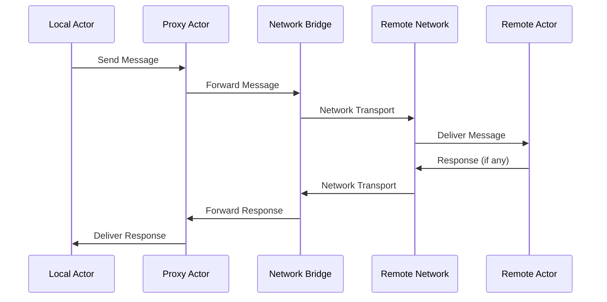

# Remote Actors

Learn how to register, manage, and interact with remote actors across distributed networks.

## Overview

Remote actors allow you to use actors from other Reflow networks as if they were local. This enables:

- **Cross-network workflows**: Chain actors across multiple networks
- **Resource distribution**: Use specialized actors on different machines
- **Load balancing**: Distribute work across multiple network instances
- **Service isolation**: Keep different services in separate networks

## Basic Remote Actor Usage

### 1. Register Remote Actors

After establishing a network connection, register remote actors:

```rust
use reflow_network::distributed_network::DistributedNetwork;

// Assume networks are already connected
let mut client_network = DistributedNetwork::new(client_config).await?;
client_network.start().await?;
client_network.connect_to_network("server:8080").await?;

// Register a remote actor
client_network.register_remote_actor(
    "data_processor",      // Remote actor ID
    "server_network"       // Remote network ID
).await?;

println!("✅ Remote actor registered as proxy");
```

### 2. Use Remote Actors in Workflows

Remote actors appear as proxy actors in your local network:

```rust
// Get local network reference
let local_network = client_network.get_local_network();
let mut network = local_network.write();

// Add remote actor to workflow (appears as local)
network.add_node("remote_processor", "data_processor@server_network", None)?;

// Create workflow with local and remote actors
network.add_node("local_generator", "data_generator", None)?;

// Connect local actor to remote actor
network.add_connection(Connector {
    from: ConnectionPoint {
        actor: "local_generator".to_string(),
        port: "Output".to_string(),
        ..Default::default()
    },
    to: ConnectionPoint {
        actor: "remote_processor".to_string(),  // This is the remote actor!
        port: "Input".to_string(),
        ..Default::default()
    },
})?;
```

### 3. Send Messages to Remote Actors

Send messages directly to remote actors:

```rust
use reflow_network::message::Message;

// Send message to remote actor
client_network.send_to_remote_actor(
    "server_network",      // Target network
    "data_processor",      // Target actor
    "Input",               // Target port
    Message::String("Hello from client!".to_string().into())
).await?;
```

## Advanced Registration

### Register with Custom Local Names

Avoid naming conflicts by using custom local names:

```rust
// Register with custom alias to avoid conflicts
let local_alias = client_network.register_remote_actor_with_alias(
    "server_data_processor",  // Custom local name
    "data_processor",         // Remote actor name
    "server_network"          // Remote network
).await?;

println!("Remote actor available as: {}", local_alias);
```

### Batch Registration

Register multiple remote actors at once:

```rust
let remote_actors = vec![
    ("data_processor", "server_network"),
    ("validator", "server_network"),
    ("transformer", "processing_network"),
];

for (actor_id, network_id) in remote_actors {
    match client_network.register_remote_actor(actor_id, network_id).await {
        Ok(_) => println!("✅ Registered {}/{}", network_id, actor_id),
        Err(e) => eprintln!("❌ Failed to register {}/{}: {}", network_id, actor_id, e),
    }
}
```

### Conditional Registration

Register actors based on availability:

```rust
// Check if network is available before registering
if client_network.is_network_connected("server_network").await {
    client_network.register_remote_actor("data_processor", "server_network").await?;
} else {
    eprintln!("Server network not available, using local fallback");
    // Use local actor instead
}
```

## Remote Actor Lifecycle

### 1. Registration Process

```rust
// 1. Network connection must be established first
client_network.connect_to_network("server:8080").await?;

// 2. Register creates a local proxy actor
client_network.register_remote_actor("remote_actor", "server_network").await?;

// 3. Proxy actor is added to local network
let local_network = client_network.get_local_network();
let network = local_network.read();
assert!(network.has_actor("remote_actor@server_network"));
```

### 2. Message Flow



### 3. Cleanup and Unregistration

```rust
// Unregister remote actor when no longer needed
client_network.unregister_remote_actor("data_processor@server_network").await?;

// Or unregister all actors from a network
client_network.unregister_all_from_network("server_network").await?;
```

## Error Handling

### Registration Errors

```rust
match client_network.register_remote_actor("processor", "server").await {
    Ok(_) => println!("✅ Registration successful"),
    Err(e) => {
        match e.to_string().as_str() {
            s if s.contains("Network not connected") => {
                eprintln!("❌ Must connect to network first");
                // Establish connection and retry
            },
            s if s.contains("Actor not found") => {
                eprintln!("❌ Remote actor 'processor' doesn't exist");
                // Check available actors or use different name
            },
            s if s.contains("Name conflict") => {
                eprintln!("❌ Actor name conflicts with local actor");
                // Use different alias or handle conflict
            },
            _ => eprintln!("❌ Registration failed: {}", e),
        }
    }
}
```

### Message Delivery Errors

```rust
match client_network.send_to_remote_actor("server", "processor", "Input", message).await {
    Ok(_) => println!("✅ Message sent"),
    Err(e) => {
        match e.to_string().as_str() {
            s if s.contains("Network disconnected") => {
                eprintln!("❌ Connection lost, attempting reconnection...");
                // Implement reconnection logic
            },
            s if s.contains("Actor not available") => {
                eprintln!("❌ Remote actor is not responding");
                // Use fallback actor or retry later
            },
            s if s.contains("Timeout") => {
                eprintln!("❌ Message delivery timed out");
                // Implement retry logic
            },
            _ => eprintln!("❌ Message delivery failed: {}", e),
        }
    }
}
```

## Performance Considerations

### Connection Pooling

```rust
// Configure connection pooling for better performance
let config = DistributedConfig {
    max_connections: 50,           // Pool multiple connections
    heartbeat_interval_ms: 30000,  // Balance between responsiveness and overhead
    // ... other settings
};
```

### Message Batching

```rust
// Send multiple messages efficiently
let messages = vec![
    ("Input", Message::String("msg1".to_string().into())),
    ("Input", Message::String("msg2".to_string().into())),
    ("Input", Message::String("msg3".to_string().into())),
];

// Batch send (if supported by future API)
// client_network.send_batch_to_remote_actor("server", "processor", messages).await?;
```

### Caching and Local Fallbacks

```rust
// Implement local caching for remote actor responses
struct CachedRemoteActor {
    network: Arc<DistributedNetwork>,
    cache: Arc<RwLock<HashMap<String, Message>>>,
    fallback_actor: Option<String>,
}

impl CachedRemoteActor {
    async fn send_with_fallback(&self, message: Message) -> Result<Message, anyhow::Error> {
        // Try remote actor first
        match self.network.send_to_remote_actor("server", "processor", "Input", message.clone()).await {
            Ok(response) => Ok(response),
            Err(_) => {
                // Fall back to local actor if available
                if let Some(fallback) = &self.fallback_actor {
                    println!("⚠️  Using local fallback actor: {}", fallback);
                    // Send to local actor instead
                    self.send_to_local_actor(fallback, message).await
                } else {
                    Err(anyhow::anyhow!("Remote actor unavailable and no fallback configured"))
                }
            }
        }
    }
}
```

## Remote Actor Discovery

### Automatic Discovery

```rust
// Discover all available actors on a remote network
let available_actors = client_network.discover_remote_actors("server_network").await?;

for actor_info in available_actors {
    println!("Available actor: {} (capabilities: {:?})", 
        actor_info.name, 
        actor_info.capabilities
    );
    
    // Register if it matches our needs
    if actor_info.capabilities.contains(&"data_processing".to_string()) {
        client_network.register_remote_actor(&actor_info.name, "server_network").await?;
    }
}
```

### Selective Registration by Capability

```rust
// Register only actors with specific capabilities
let required_capabilities = vec!["ml_training", "gpu_compute"];

let actors = client_network.discover_remote_actors("ml_cluster").await?;
for actor in actors {
    let has_required_caps = required_capabilities.iter()
        .any(|cap| actor.capabilities.contains(&cap.to_string()));
    
    if has_required_caps {
        client_network.register_remote_actor(&actor.name, "ml_cluster").await?;
        println!("✅ Registered ML actor: {}", actor.name);
    }
}
```

## Monitoring Remote Actors

### Health Checking

```rust
// Check if remote actor is responsive
async fn check_remote_actor_health(
    network: &DistributedNetwork,
    network_id: &str,
    actor_id: &str
) -> bool {
    match network.ping_remote_actor(network_id, actor_id).await {
        Ok(_) => {
            println!("✅ Remote actor {}/{} is healthy", network_id, actor_id);
            true
        },
        Err(e) => {
            eprintln!("❌ Remote actor {}/{} health check failed: {}", network_id, actor_id, e);
            false
        }
    }
}
```

### Performance Monitoring

```rust
// Monitor remote actor performance
struct RemoteActorMetrics {
    actor_id: String,
    network_id: String,
    total_messages: u64,
    successful_messages: u64,
    average_latency_ms: f64,
    last_response_time: Option<chrono::DateTime<chrono::Utc>>,
}

impl RemoteActorMetrics {
    async fn record_message_sent(&mut self) {
        self.total_messages += 1;
        // Record timing for latency calculation
    }
    
    async fn record_response_received(&mut self, latency: Duration) {
        self.successful_messages += 1;
        self.last_response_time = Some(chrono::Utc::now());
        
        // Update rolling average
        let latency_ms = latency.as_millis() as f64;
        self.average_latency_ms = (self.average_latency_ms + latency_ms) / 2.0;
    }
    
    fn success_rate(&self) -> f64 {
        if self.total_messages == 0 {
            0.0
        } else {
            (self.successful_messages as f64) / (self.total_messages as f64)
        }
    }
}
```

## Best Practices

### 1. Network Design

```rust
// Good: Organize actors by function and location
"auth_service@auth_cluster"
"data_processor@processing_cluster"  
"ml_trainer@gpu_cluster"

// Avoid: Generic names that don't indicate purpose
"actor1@server"
"service@network"
```

### 2. Error Resilience

```rust
// Implement circuit breaker pattern for remote actors
struct CircuitBreaker {
    failure_count: u32,
    failure_threshold: u32,
    timeout_duration: Duration,
    last_failure_time: Option<Instant>,
    state: CircuitState,
}

enum CircuitState {
    Closed,   // Normal operation
    Open,     // Failing, don't try
    HalfOpen, // Testing if service recovered
}

impl CircuitBreaker {
    async fn call_remote_actor(&mut self, network: &DistributedNetwork) -> Result<Message, anyhow::Error> {
        match self.state {
            CircuitState::Open => {
                if self.should_attempt_reset() {
                    self.state = CircuitState::HalfOpen;
                } else {
                    return Err(anyhow::anyhow!("Circuit breaker is open"));
                }
            },
            _ => {}
        }
        
        match network.send_to_remote_actor("server", "actor", "Input", Message::String("test".to_string().into())).await {
            Ok(response) => {
                self.on_success();
                Ok(response)
            },
            Err(e) => {
                self.on_failure();
                Err(e)
            }
        }
    }
}
```

### 3. Resource Management

```rust
// Properly clean up remote actor registrations
async fn cleanup_remote_actors(network: &mut DistributedNetwork) -> Result<(), anyhow::Error> {
    // Get list of registered remote actors
    let remote_actors = network.list_remote_actors().await?;
    
    // Unregister all remote actors
    for (actor_id, network_id) in remote_actors {
        network.unregister_remote_actor(&format!("{}@{}", actor_id, network_id)).await?;
        println!("🧹 Unregistered remote actor: {}@{}", actor_id, network_id);
    }
    
    Ok(())
}
```

## Troubleshooting

### Common Issues

1. **Remote Actor Not Found**
   ```rust
   // Verify actor exists on remote network
   let actors = client_network.list_actors_on_network("server_network").await?;
   println!("Available actors: {:?}", actors);
   ```

2. **Registration Fails**
   ```rust
   // Check network connection status
   if !client_network.is_connected_to("server_network").await {
       client_network.connect_to_network("server:8080").await?;
   }
   ```

3. **Messages Not Delivered**
   ```rust
   // Check message serialization
   let message = Message::String("test".to_string().into());
   match serde_json::to_string(&message) {
       Ok(_) => println!("✅ Message is serializable"),
       Err(e) => eprintln!("❌ Message serialization failed: {}", e),
   }
   ```

4. **High Latency**
   ```rust
   // Monitor network latency
   let start = Instant::now();
   client_network.ping_network("server_network").await?;
   let latency = start.elapsed();
   println!("Network latency: {:?}", latency);
   ```

## Next Steps

- [Discovery & Registration](discovery-registration.md) - Advanced discovery patterns
- [Conflict Resolution](conflict-resolution.md) - Handle actor name conflicts
- [Tutorial: Distributed Workflow Example](../../tutorials/distributed-workflow-example.md)

## Related Documentation

- [Setting Up Distributed Networks](setting-up-networks.md)
- [Architecture: Distributed Networks](../../architecture/distributed-networks.md)
