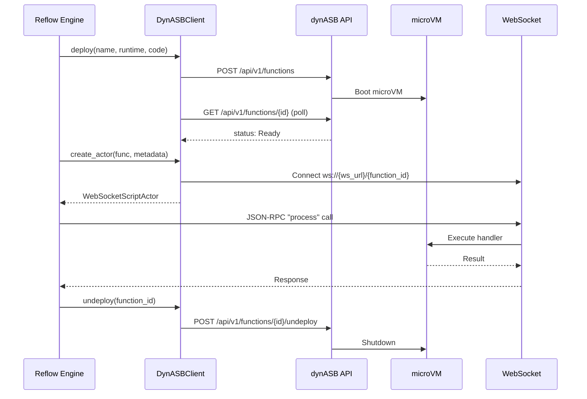

# dynASB — Lightweight Actor FaaS

Reflow integrates with [dynASB](https://github.com/nicholasgasior/dynasb) as a lightweight Function-as-a-Service (FaaS) backend for remote script actor execution. Script actors are deployed as functions into dynASB microVMs and communicate with Reflow over WebSocket JSON-RPC.

## Overview



## Configuration

```rust
pub struct DynASBConfig {
    pub api_url: String,    // e.g., "http://localhost:8080"
    pub ws_url: String,     // e.g., "ws://localhost:8080/ws"
    pub redis_url: String,  // For actor state persistence
}
```

## Deployment Lifecycle

### 1. Deploy

The `DynASBClient` deploys script code to dynASB via its REST API:

```rust
let client = DynASBClient::new(DynASBConfig {
    api_url: "http://localhost:8080".into(),
    ws_url: "ws://localhost:8080/ws".into(),
    redis_url: "redis://localhost:6379".into(),
});

let func = client.deploy(
    "my_transform",             // function name
    "javascript",               // runtime
    "export function handler(input) { ... }", // code
    "handler",                  // entry point
    None,                       // optional dependencies
    Some(30),                   // timeout_seconds
).await?;
```

This sends a `POST /api/v1/functions` request. dynASB boots a microVM for the function and returns a `DynASBFunction` handle:

```rust
pub struct DynASBFunction {
    pub function_id: String,
    pub name: String,
    pub runtime: String,
    pub status: DeploymentStatus,
    pub deployment_time_ms: u64,
    pub vm_id: Option<String>,
}
```

### 2. Health Check & Readiness

After deployment, the microVM needs time to boot. Poll until ready:

```rust
let status = client.wait_until_ready(
    &func.function_id,
    Duration::from_secs(60),   // timeout
    Duration::from_millis(500), // poll interval
).await?;
```

This calls `GET /api/v1/functions/{id}` in a loop, checking the `DeploymentStatus`:

| Status | Meaning |
|--------|---------|
| `Deploying` | Function deployed, microVM booting |
| `Ready` | VM ready, health check passed |
| `Unhealthy` | Health check failed or function errored |
| `Stopping` | Function is being undeployed |
| `Stopped` | Function has been removed |

Terminal states (`Unhealthy`, `Stopped`) cause `wait_until_ready` to return an error immediately.

### 3. Create Actor

Once ready, create a `WebSocketScriptActor` that communicates with the function over JSON-RPC 2.0:

```rust
let actor = client.create_actor(&func, script_metadata).await?;
// actor implements Actor — register it in the network
```

Under the hood this:
1. Constructs a WebSocket URL: `{ws_url}/{function_id}`
2. Creates a `WebSocketRpcClient` pointing to that URL
3. Wraps it in a `WebSocketScriptActor` with the script metadata and Redis URL for state persistence

The actor communicates with the microVM using JSON-RPC 2.0 `"process"` method calls — the same protocol used by all WebSocket script actors in Reflow.

### 4. Undeploy

When done, remove the function:

```rust
client.undeploy(&func.function_id).await?;
// or undeploy everything:
client.undeploy_all().await?;
```

This sends `POST /api/v1/functions/{id}/undeploy` to shut down the microVM.

### 5. Automatic Cleanup

The `DynASBClient` implements `Drop` — if any functions remain deployed when the client is dropped, a background task spawns to undeploy them all:

```rust
impl Drop for DynASBClient {
    fn drop(&mut self) {
        if !self.deployed.is_empty() {
            let ids: Vec<String> = self.deployed.keys().cloned().collect();
            let api_url = self.config.api_url.clone();
            let http = self.http.clone();
            tokio::spawn(async move {
                for id in ids {
                    let url = format!("{}/api/v1/functions/{}/undeploy", api_url, id);
                    let _ = http.post(&url).send().await;
                }
            });
        }
    }
}
```

## Deployment Metadata

`deployment_metadata()` produces a metadata map for injection into `GraphNode` metadata, prefixed with `dynasb.`:

```rust
let meta = client.deployment_metadata(&func.function_id);
// Keys: dynasb.function_id, dynasb.name, dynasb.runtime,
//       dynasb.status, dynasb.vm_id, dynasb.deployment_time_ms
```

This allows the execution engine and observability pipeline to track which actors are running on dynASB microVMs.

## Integration with Reflow

dynASB serves as the remote execution backend for script actors that need isolation or dedicated resources. The integration point is the `WebSocketScriptActor`, which is the same actor type used for all WebSocket-based script runtimes — dynASB simply provides the deployment and lifecycle management layer on top.

```
[Script Discovery] → [DynASBClient.deploy()] → [microVM boots]
                   → [DynASBClient.create_actor()] → [WebSocketScriptActor]
                   → [Network registers actor] → [JSON-RPC "process" calls]
                   → [DynASBClient.undeploy()] → [microVM shuts down]
```

## Next Steps

- [Distributed Networks](./distributed-networks.md) - Cross-network execution with PeerMesh
- [Architecture Overview](./overview.md) - How dynASB fits into the system
- [Standard Component Library](../components/standard-library.md) - Native actor reference
