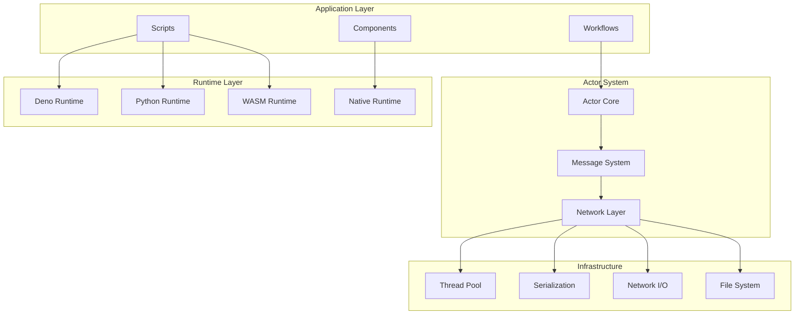
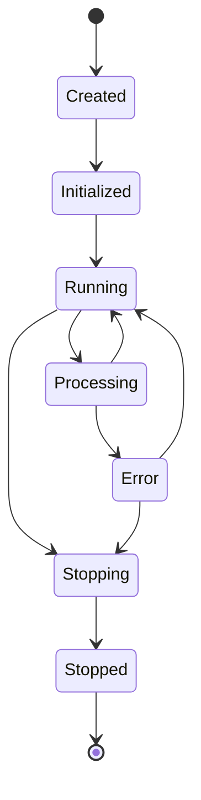
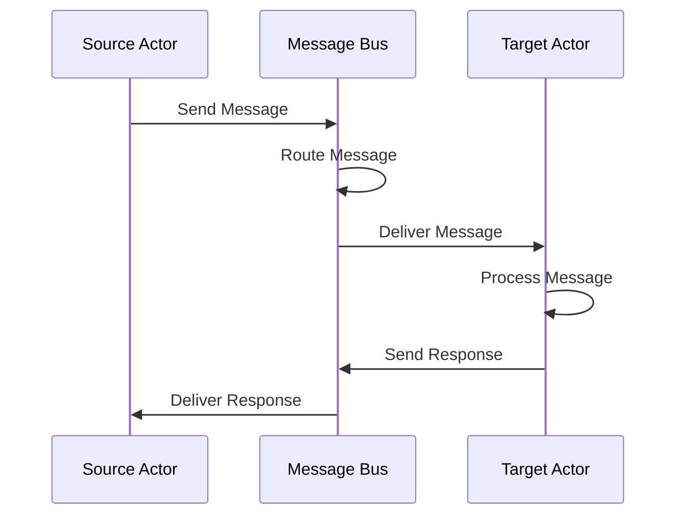
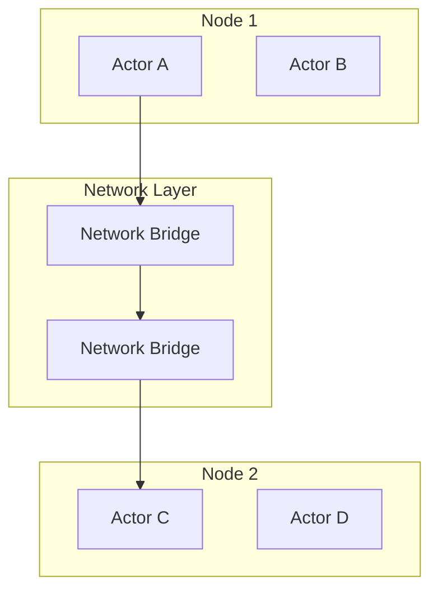
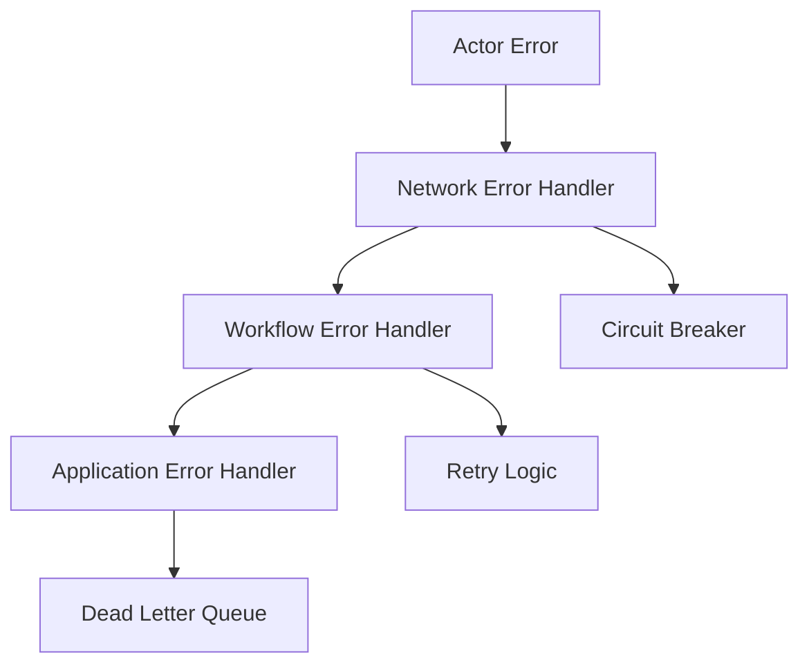

# Architecture Overview

This document provides a high-level overview of Reflow's architecture, covering its core components, design principles, and system interactions.

## System Architecture

Reflow follows a modular, actor-based architecture designed for scalability, reliability, and multi-language support.



## Core Components

### 1. Actor System (`reflow_network`)

The foundation of Reflow, implementing the actor model for concurrent computation:

- **Actors**: Isolated units of computation
- **Messages**: Immutable data passed between actors
- **Ports**: Communication channels (input/output)
- **Network**: Manages actor lifecycle and message routing

### 2. Script Runtime (`reflow_script`)

Multi-language execution environment supporting:

- **Deno Runtime**: JavaScript/TypeScript execution
- **Python Engine**: Python script execution (with optional Docker isolation)
- **WebAssembly**: WASM plugin system via Extism
- **Script Context**: Execution environment and state management

### 3. Component Library (`reflow_components`)

Pre-built, reusable workflow components:

- **Flow Control**: Conditional logic, loops, branching
- **Data Operations**: Transformations, aggregations, validation
- **Integration**: External API connectivity
- **Synchronization**: Coordination primitives

### 4. Network Layer (`reflow_network`)

Handles distributed execution and communication:

- **Message Routing**: Efficient message delivery
- **Graph Management**: Workflow topology and execution
- **Connection Management**: Inter-actor connectivity
- **Load Balancing**: Work distribution

## Design Principles

### Actor Model

Reflow is built on the **Actor Model** of computation:

```rust
pub trait Actor {
    fn get_behavior(&self) -> ActorBehavior;
    fn get_inports(&self) -> Port;
    fn get_outports(&self) -> Port;
    fn create_process(&self) -> Pin<Box<dyn Future<Output = ()> + Send + 'static>>;
}
```

**Key Properties:**
- **Isolation**: No shared state between actors
- **Concurrency**: Actors run concurrently
- **Message Passing**: Communication via immutable messages
- **Location Transparency**: Actors can be local or remote

### Immutable Messages

All communication uses immutable message types:

```rust
pub enum Message {
    String(String),
    Integer(i64),
    Float(f64),
    Boolean(bool),
    Array(Vec<Message>),
    Object(HashMap<String, Message>),
    Binary(Vec<u8>),
    Null,
    Error(String),
}
```

### Async-First Design

Built on Rust's async/await system using Tokio:

- Non-blocking I/O operations
- Efficient resource utilization
- Scalable concurrent execution
- Backpressure handling

## Execution Model

### Actor Lifecycle



1. **Creation**: Actor instance created with configuration
2. **Initialization**: Resources allocated, connections established
3. **Running**: Actor ready to process messages
4. **Processing**: Executing behavior function on incoming messages
5. **Stopping**: Graceful shutdown initiated
6. **Stopped**: All resources cleaned up

### Message Flow



### Graph Execution

Workflows are executed as directed acyclic graphs (DAGs):

- **Topological Ordering**: Ensures correct execution sequence
- **Parallel Execution**: Independent branches run concurrently
- **Backpressure**: Prevents resource exhaustion
- **Error Propagation**: Failures are handled gracefully

## Runtime Architecture

### Native Runtime (Rust)

Direct Rust implementation for maximum performance:

```rust
struct NativeActor {
    behavior: Box<dyn Fn(ActorContext) -> Pin<Box<dyn Future<Output = Result<HashMap<String, Message>, Error>> + Send>>>,
    // ... other fields
}
```

### Script Runtimes

#### Deno Runtime
- **Sandbox**: Secure execution environment
- **Permissions**: Fine-grained access control
- **TypeScript**: Full TypeScript support
- **NPM**: Package ecosystem access

#### Python Runtime
- **Isolation**: Process-level or Docker isolation
- **Libraries**: Full Python ecosystem support
- **Async**: Async/await support
- **Error Handling**: Exception propagation

#### WebAssembly Runtime
- **Portability**: Cross-platform execution
- **Security**: Sandboxed execution
- **Performance**: Near-native speed
- **Multi-language**: Support for multiple source languages

## Memory Management

### Ownership Model

Follows Rust's ownership principles:

- **Single Ownership**: Each value has a single owner
- **Borrowing**: Temporary access without ownership transfer
- **Lifetimes**: Compile-time memory safety guarantees
- **Reference Counting**: Shared ownership where needed

### Message Serialization

Efficient serialization for message passing:

```rust
// Compressed serialization for performance
let compressed = compress_message(&message)?;
let serialized = bitcode::serialize(&compressed)?;

// Network transmission
send_over_network(serialized).await?;

// Deserialization
let message = bitcode::deserialize(&received_data)?;
let decompressed = decompress_message(&message)?;
```

## Networking Architecture

### Local Communication


**Local Channels:**
- **Flume**: High-performance async channels
- **Zero-copy**: Direct memory access where possible
- **Backpressure**: Flow control mechanisms

### Distributed Communication



**Network Features:**
- **WebSocket**: Real-time communication
- **Compression**: Efficient data transfer
- **Encryption**: Secure communication
- **Discovery**: Automatic node discovery

## Error Handling

### Hierarchical Error Management



**Error Strategies:**
- **Isolation**: Errors don't affect other actors
- **Propagation**: Structured error reporting
- **Recovery**: Automatic retry and fallback
- **Monitoring**: Error tracking and alerting

## Security Model

### Sandboxing

Each runtime environment provides isolation:

- **Deno**: V8 isolates with permission system
- **Python**: Process isolation or containerization
- **WASM**: Memory-safe execution environment
- **Native**: Rust's memory safety guarantees

### Permission System

Fine-grained access control:

```rust
pub struct Permissions {
    pub file_system: FileSystemPermissions,
    pub network: NetworkPermissions,
    pub environment: EnvironmentPermissions,
}
```

## Performance Characteristics

### Throughput

- **Message Rate**: >1M messages/second (local)
- **Latency**: <1ms (local), <10ms (network)
- **Memory**: ~1KB per actor overhead
- **CPU**: Scales with core count

### Scalability

- **Horizontal**: Distribute across machines
- **Vertical**: Utilize all CPU cores
- **Elastic**: Dynamic resource allocation
- **Backpressure**: Graceful degradation under load

## Configuration

### Runtime Configuration

```toml
[actor_system]
thread_pool_size = 8
max_actors_per_node = 10000
message_buffer_size = 1000

[networking]
bind_address = "0.0.0.0:8080"
compression_enabled = true
encryption_enabled = true

[runtimes.deno]
permissions = ["--allow-net", "--allow-read"]
memory_limit = "512MB"

[runtimes.python]
use_docker = false
shared_environment = true
```

## Monitoring and Observability

### Metrics

- **Actor Performance**: Processing time, message rates
- **Network Statistics**: Bandwidth, latency, errors
- **Resource Usage**: Memory, CPU, disk I/O
- **Error Rates**: Failure frequencies and patterns

### Tracing

Distributed tracing support:

```rust
use tracing::{info, span, Level};

let span = span!(Level::INFO, "actor_processing", actor_id = %actor.id());
let _enter = span.enter();

info!("Processing message: {:?}", message);
```

## Extension Points

### Custom Actors

```rust
impl Actor for CustomActor {
    fn get_behavior(&self) -> ActorBehavior {
        Box::new(|context| {
            Box::pin(async move {
                // Custom processing logic
                Ok(HashMap::new())
            })
        })
    }
}
```

### Custom Runtimes

```rust
#[async_trait]
impl ScriptEngine for CustomEngine {
    async fn init(&mut self, config: &ScriptConfig) -> Result<()>;
    async fn call(&mut self, context: &ScriptContext) -> Result<HashMap<String, Message>>;
    async fn cleanup(&mut self) -> Result<()>;
}
```

## Next Steps

For detailed information on specific components:

- [Actor Model](./actor-model.md) - Deep dive into actor implementation
- [Message Passing](./message-passing.md) - Message system details
- [Graph System](./graph-system.md) - Workflow graph management
- [Multi-Language Support](./multi-language-support.md) - Runtime integration
- [Performance Considerations](./performance-considerations.md) - Optimization strategies
