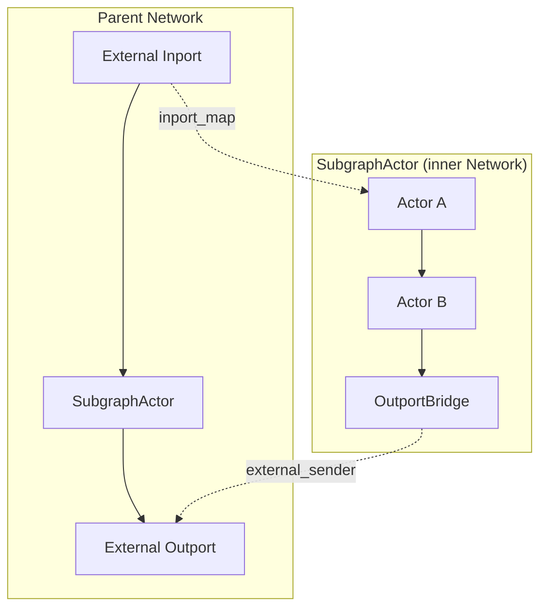

# SubgraphActor

The `SubgraphActor` wraps an entire inner `Network` as a single `Actor`, allowing a graph to be embedded inside another graph as a composable unit. This is the foundation of hierarchical workflow composition in `reflow_network`.

## Architecture



The parent network treats the SubgraphActor as an opaque actor with external inports and outports. Internally, it manages a full `Network` with its own actors, connectors, and message routing.

## SubgraphActor Struct

```rust
pub struct SubgraphActor {
    inner_network: Arc<Mutex<Network>>,
    inport_map: HashMap<String, (String, String)>,   // ext_port → (actor_id, port_name)
    outport_map: HashMap<String, (String, String)>,   // ext_port → (actor_id, port_name)
    inports: Port,
    outports: Port,
    load: Arc<ActorLoad>,
    shutdown_tx: Arc<tokio::sync::watch::Sender<bool>>,
    shutdown_rx: tokio::sync::watch::Receiver<bool>,
}
```

- `inner_network` — the wrapped `Network` containing all inner actors and connections
- `inport_map` / `outport_map` — maps external port names to `(inner_actor_id, inner_port_name)` tuples
- `inports` / `outports` — the external ports exposed to the parent network
- `shutdown_tx` / `shutdown_rx` — tokio watch channel for graceful termination

## Constructing from GraphExport

The primary constructor `from_graph_export()` builds a SubgraphActor from a serialized graph:

1. Creates a new inner `Network`
2. Registers all actors from the `actors` map
3. Adds nodes and internal connections from the graph export
4. **Inport mapping** — maps each external inport to `(inner_node_id, inner_port_name)` for direct message injection
5. **Outport bridging** — for each external outport, creates an `OutportBridge` actor inside the inner network, connected to the source actor's port via a standard `Connector`

```rust
let actors: HashMap<String, Arc<dyn Actor>> = /* component instances */;
let subgraph = SubgraphActor::from_graph_export(graph_export, actors)?;
// subgraph implements Actor — add it to a parent Network as any other actor
```

## OutportBridge

The `OutportBridge` is a lightweight internal actor that forwards messages from an inner actor's outport to the SubgraphActor's external outport channel:

```rust
struct OutportBridge {
    external_sender: flume::Sender<Packet>,  // → SubgraphActor outport
    external_port_name: String,
    inner_port_name: String,
    inports: Port,
    outports: Port,
    load: Arc<ActorLoad>,
}
```

Bridge actors are registered inside the inner network with generated IDs (`__outport_bridge_{ext_port}`) and connected to source actors via standard Connectors. The bridge's `create_process()` receives packets on its inport, extracts the message by `inner_port_name`, wraps it with `external_port_name`, and sends it via `external_sender`.

## Boundary Mapping

**Inbound flow** — The `create_process()` loop receives packets on external inports, looks up the target `(actor_id, port)` in `inport_map`, and calls `network.send_to_actor()` to inject the message into the inner network.

**Outbound flow** — Inner actors send messages through normal Connectors to OutportBridge actors. Each bridge extracts the message and sends it via `external_sender`, making it appear on the SubgraphActor's external outport.

## Actor Trait Implementation

The SubgraphActor implements `Actor`:

- `get_behavior()` — returns a no-op closure; all routing is handled in `create_process()`
- `get_inports()` / `get_outports()` — return the external port pairs
- `create_process()` — starts the inner network, then runs an inbound routing loop using `tokio::select!` with the shutdown signal
- `shutdown()` — signals the routing loop to stop and shuts down the inner network

## Lifecycle

1. `create_process()` starts the inner network (initializing all inner actors, connectors, and OutportBridge actors) and begins the inbound routing loop
2. The inner network runs its actors concurrently
3. `shutdown()` sends `true` on the watch channel, breaking the routing loop, and calls `network.shutdown()`

## Next Steps

- [Multi-Graph Composition](./multi-graph-composition.md) - Workspace discovery and distributed composition
- [Distributed Networks](./distributed-networks.md) - Cross-network execution with PeerMesh
- [Actor Model](./actor-model.md) - Actor trait and port system
