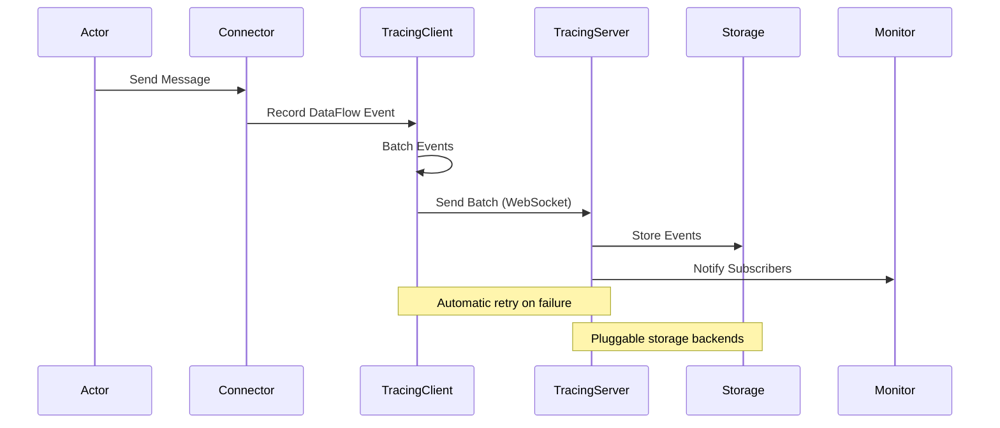
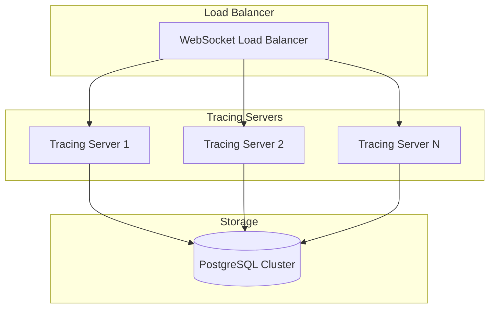

# Observability Architecture

The Reflow observability framework is built on a distributed, event-driven architecture that provides comprehensive visibility into actor networks with minimal performance impact.

## System Components

### 1. Tracing Client (`TracingClient`)

The tracing client is embedded within each Reflow network instance and is responsible for:

- **Event Collection**: Capturing trace events from actor operations
- **Event Batching**: Aggregating events for efficient transmission
- **Network Communication**: WebSocket-based communication with the tracing server
- **Retry Logic**: Robust retry mechanisms for network failures
- **Compression**: Optional compression of trace data

```rust
pub struct TracingClient {
    config: TracingConfig,
    sender: Arc<TracingSender>,
    connection: Arc<RwLock<Option<WebSocketConnection>>>,
    retry_manager: RetryManager,
}
```

### 2. Tracing Server (`reflow_tracing`)

The centralized tracing server handles:

- **Connection Management**: WebSocket connections from multiple clients
- **Event Processing**: Real-time processing of incoming trace events
- **Storage Coordination**: Routing events to configured storage backends
- **Query Interface**: Serving historical and real-time queries
- **Subscription Management**: Managing real-time event subscriptions

```rust
pub struct TracingServer {
    config: ServerConfig,
    storage: Box<dyn TraceStorage>,
    connection_pool: ConnectionPool,
    event_processor: EventProcessor,
    subscription_manager: SubscriptionManager,
}
```

### 3. Storage Layer

Pluggable storage backends with different characteristics:

#### SQLite Backend
- **Use Case**: Development, small deployments, single-instance scenarios
- **Advantages**: Zero configuration, embedded, ACID compliant
- **Limitations**: Single writer, limited concurrent access
- **Schema**: Optimized for time-series queries with proper indexing

#### PostgreSQL Backend  
- **Use Case**: Production deployments, high-concurrency scenarios
- **Advantages**: ACID compliance, concurrent access, advanced querying
- **Features**: Partitioning, indexing, full-text search capabilities
- **Scalability**: Supports connection pooling and read replicas

#### Memory Backend
- **Use Case**: Testing, temporary analysis, high-performance scenarios
- **Advantages**: Fastest performance, no I/O overhead
- **Limitations**: Data loss on restart, memory-bound capacity
- **Features**: In-memory indexes and efficient filtering

## Event Flow Architecture



## Integration Points

### Automatic Integration

The framework automatically integrates at key points in the Reflow execution flow:

#### Actor Lifecycle Integration
```rust
// Automatic tracing in Network::register_actor
pub fn register_actor(&mut self, name: &str, actor: impl Actor) -> Result<()> {
    // Register actor
    self.actors.insert(name.to_string(), Box::new(actor));
    
    // Automatic tracing
    if let Some(tracing) = &self.tracing {
        tracing.trace_actor_created(name).await?;
    }
    
    Ok(())
}
```

#### Connector-Level Tracing
```rust
// Automatic data flow tracing in connectors
impl Connector {
    pub async fn send_message(&self, message: Message) -> Result<()> {
        // Send the message
        self.channel.send(message.clone()).await?;
        
        // Automatic tracing
        if let Some(tracing) = global_tracing() {
            tracing.trace_data_flow(
                &self.from_actor, &self.from_port,
                &self.to_actor, &self.to_port,
                message.type_name(), message.size_bytes()
            ).await?;
        }
        
        Ok(())
    }
}
```

### Manual Integration

For custom events and fine-grained control:

```rust
// Manual event recording
if let Some(tracing) = global_tracing() {
    // Custom actor events
    tracing.trace_actor_started("my_actor").await?;
    tracing.trace_actor_completed("my_actor").await?;
    tracing.trace_actor_failed("my_actor", "Error message").await?;
    
    // Custom message events
    tracing.trace_message_sent("actor", "port", "MessageType", 1024).await?;
    tracing.trace_message_received("actor", "port", "MessageType", 1024).await?;
    
    // State change events
    tracing.trace_state_changed("actor", state_diff).await?;
    
    // Custom events with metadata
    let event = TraceEvent {
        event_type: TraceEventType::Custom("deployment_started".to_string()),
        actor_id: "deployment_manager".to_string(),
        data: TraceEventData {
            custom_attributes: HashMap::from([
                ("environment".to_string(), json!("production")),
                ("version".to_string(), json!("v1.2.3")),
            ]),
            ..Default::default()
        },
        ..Default::default()
    };
    tracing.record_event(trace_id, event).await?;
}
```

## Performance Architecture

### Batching Strategy

Events are batched to minimize network overhead:

```rust
pub struct BatchingStrategy {
    batch_size: usize,           // Max events per batch
    batch_timeout: Duration,     // Max time to wait for batch
    compression: CompressionType, // Optional compression
}
```

### Asynchronous Processing

All tracing operations are asynchronous and non-blocking:

```rust
// Event collection uses async channels
pub struct TracingClient {
    event_sender: mpsc::UnboundedSender<TraceEvent>,
    batch_processor: JoinHandle<()>,
}

// Background batch processing
async fn process_batches(mut receiver: mpsc::UnboundedReceiver<TraceEvent>) {
    let mut batch = Vec::new();
    let mut batch_timer = interval(batch_timeout);
    
    loop {
        select! {
            event = receiver.recv() => {
                if let Some(event) = event {
                    batch.push(event);
                    if batch.len() >= batch_size {
                        send_batch(&mut batch).await;
                    }
                }
            }
            _ = batch_timer.tick() => {
                if !batch.is_empty() {
                    send_batch(&mut batch).await;
                }
            }
        }
    }
}
```

### Memory Management

Efficient memory usage through:

- **Event Pooling**: Reuse of event objects
- **Bounded Channels**: Prevent unbounded memory growth
- **Compression**: Reduce memory footprint for large traces
- **Background Processing**: Offload processing from critical paths

## Scalability Considerations

### Horizontal Scaling

The tracing server can be scaled horizontally:



### Storage Partitioning

For large-scale deployments:

```sql
-- Time-based partitioning
CREATE TABLE trace_events_2025_01 PARTITION OF trace_events
FOR VALUES FROM ('2025-01-01') TO ('2025-02-01');

-- Actor-based partitioning  
CREATE TABLE trace_events_ml PARTITION OF trace_events
FOR VALUES IN ('ml_trainer', 'ml_evaluator', 'ml_predictor');
```

### Performance Optimizations

#### Client-Side Optimizations
- **Local Buffering**: Buffer events locally during network issues
- **Adaptive Batching**: Adjust batch sizes based on network conditions
- **Priority Queues**: Prioritize critical events over routine events
- **Sampling**: Sample high-frequency events to reduce overhead

#### Server-Side Optimizations
- **Connection Pooling**: Reuse database connections
- **Bulk Inserts**: Batch database operations
- **Indexing Strategy**: Optimize indexes for common query patterns
- **Caching**: Cache frequently accessed data

## Security Architecture

### Authentication & Authorization

```rust
pub struct TracingConfig {
    pub server_url: String,
    pub api_key: Option<String>,        // API key authentication
    pub client_cert: Option<PathBuf>,   // Client certificate
    pub ca_cert: Option<PathBuf>,       // CA certificate for verification
}
```

### Data Privacy

- **Field Filtering**: Exclude sensitive data from traces
- **Data Anonymization**: Hash or tokenize sensitive identifiers
- **Retention Policies**: Automatic cleanup of old trace data
- **Access Controls**: Role-based access to trace data

### Network Security

- **TLS Encryption**: All WebSocket connections use TLS
- **Certificate Validation**: Mutual TLS authentication
- **Rate Limiting**: Prevent abuse and DoS attacks
- **Origin Validation**: Validate client origins

## Monitoring the Monitor

### Health Metrics

The tracing system exposes its own health metrics:

```rust
pub struct TracingMetrics {
    pub events_processed: u64,
    pub events_dropped: u64,
    pub connection_count: u32,
    pub storage_latency: Duration,
    pub memory_usage: usize,
    pub error_rate: f64,
}
```

### Self-Monitoring

```rust
// The tracing system can trace itself
if let Some(tracing) = global_tracing() {
    tracing.trace_system_metric(
        "tracing_server",
        "events_processed_per_second",
        events_per_second as f64
    ).await?;
}
```

## Error Handling & Resilience

### Network Resilience

```rust
pub struct RetryConfig {
    pub max_retries: usize,
    pub initial_delay: Duration,
    pub max_delay: Duration,
    pub backoff_multiplier: f64,
}
```

### Graceful Degradation

When the tracing server is unavailable:

1. **Local Buffering**: Store events locally with size limits
2. **Sampling**: Reduce event volume to essential events only
3. **Alerting**: Notify operators of tracing system issues
4. **Recovery**: Automatic reconnection and buffer flush

### Data Consistency

- **Idempotent Operations**: Safe to retry operations
- **Transaction Management**: Atomic batch processing
- **Conflict Resolution**: Handle duplicate events gracefully
- **Validation**: Validate event integrity before storage

This architecture provides a robust, scalable foundation for comprehensive observability while maintaining the performance characteristics required for production actor networks.
