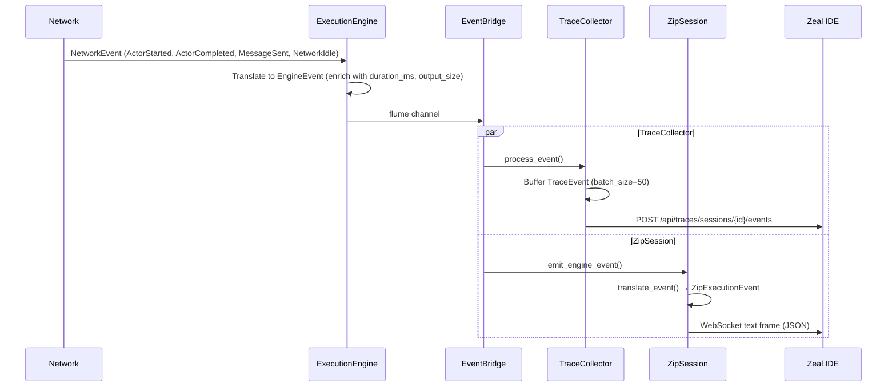
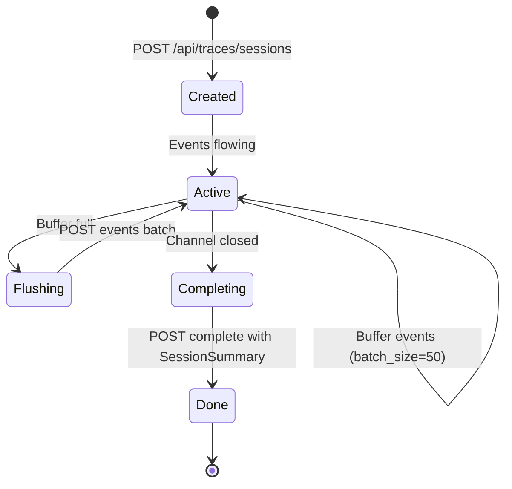

# Observability Architecture

Reflow's observability is built on an event pipeline that translates low-level network events into rich engine events and forwards them to Zeal IDE for visibility, tracing, and replay.

## System Components

### 1. ExecutionEngine

The engine creates an isolated `Network` per workflow execution and translates `NetworkEvent`s (from `reflow_network`) into enriched `EngineEvent`s with timing, size, and connection metadata.

The engine maintains a `HashMap<String, Instant>` to track per-actor start times, computing `duration_ms` when actors complete.

### 2. EventBridge

The bridge connects the engine's per-execution event channel to two consumers:

```rust
pub struct EventBridge {
    trace_collector: Option<Arc<TraceCollector>>,
    zip_session: Option<Arc<ZipSession>>,
}
```

One bridge task is spawned per execution via `bridge.attach(workflow_id, execution_id, event_rx)`. The task:

1. Begins a trace session via `TraceCollector`
2. Drains the `flume::Receiver<EngineEvent>` channel
3. Forwards each event to both `TraceCollector` and `ZipSession`
4. Tracks terminal state (success/failure based on `Completed` and `Failed` events)
5. Completes the trace session when the channel closes (sender dropped)

### 3. TraceCollector

Submits per-node execution data to Zeal's TracesAPI over HTTP. Manages trace session lifecycle:

```rust
pub struct TraceCollector {
    traces_api: tokio::sync::Mutex<TracesAPI>,
    sessions: tokio::sync::Mutex<HashMap<String, ActiveSession>>,
    batch_size: usize,  // default: 50
}
```

Each `ActiveSession` tracks:
- `session_id` — returned by Zeal on session creation
- `start_time` — for duration calculation
- `nodes_completed` / `nodes_failed` — aggregate counters
- `total_data_processed` — bytes processed across all nodes
- `pending_events` — buffered `TraceEvent`s awaiting flush

Events are flushed when the buffer reaches `batch_size` (50) or when the session completes.

### 4. ZipSession

Manages the outbound connection to Zeal IDE:

- **Template Registration**: Registers all actor templates (native + API) on startup
- **WebSocket Channel**: Opens a `tokio-tungstenite` connection to `/ws/zip`
- **Event Translation**: Converts `EngineEvent`s to `ZipExecutionEvent`s using `zeal-sdk` helpers
- **Event Emission**: Pushes ZIP events as JSON text frames over WebSocket

```rust
pub struct ZipSession {
    config: ZipSessionConfig,
    client: ZealClient,
    ws: ZipWebSocket,       // Mutex<Option<WsSink>>
    engine: Arc<ExecutionEngine>,
    shutdown: Arc<Notify>,
}
```

## Event Flow


```mermaid
sequenceDiagram
    participant N as Network
    participant E as ExecutionEngine
    participant EB as EventBridge
    participant TC as TraceCollector
    participant ZS as ZipSession
    participant Z as Zeal IDE

    N->>E: NetworkEvent (ActorStarted, ActorCompleted, MessageSent, NetworkIdle)
    E->>E: Translate to EngineEvent (enrich with duration_ms, output_size)
    E->>EB: flume channel
    par TraceCollector
        EB->>TC: process_event()
        TC->>TC: Buffer TraceEvent (batch_size=50)
        TC->>Z: POST /api/traces/sessions/{id}/events
    and ZipSession
        EB->>ZS: emit_engine_event()
        ZS->>ZS: translate_event() → ZipExecutionEvent
        ZS->>Z: WebSocket text frame (JSON)
    end
```

## NetworkEvent → EngineEvent Translation

The engine's `run_execution()` loop translates each `NetworkEvent` into an `EngineEvent`:

| NetworkEvent | EngineEventType | Enrichments |
|-------------|-----------------|-------------|
| `ActorStarted { actor_id }` | (records start time) | Stored in timing map |
| `ActorCompleted { actor_id, output }` | `ActorCompleted` | `duration_ms`, `output_size`, `output_connections` |
| `ActorFailed { actor_id, error }` | `ActorFailed` | `error`, `output_connections` |
| `MessageSent { from, to, data }` | `MessageSent` | `size` (serialized bytes) |
| `NetworkIdle` / `NetworkShutdown` | `Completed` | `duration_ms`, `nodes_executed`, `nodes_failed` |

The engine waits for `NetworkIdle` or `NetworkShutdown` before emitting the `Completed` event — it does not fire prematurely after `network.start()`.

## EngineEvent → ZIP Event Translation

The `ZipSession::translate_event()` method maps engine events to Zeal SDK types:

| EngineEventType | ZipExecutionEvent | Options |
|-----------------|-------------------|---------|
| `Started` | `ExecutionStarted` | workflow_id, execution_id |
| `NodeExecuting` | `NodeExecuting` | input connections |
| `ActorCompleted` | `NodeCompleted` | `NodeCompletedOptions { duration, output_size }` |
| `ActorFailed` | `NodeFailed` | `NodeError { message, code, stack }` |
| `Completed` | `ExecutionCompleted` | `ExecutionSummary { success_count, error_count }` |
| `Failed` | `ExecutionFailed` | `ExecutionError { message }`, `ExecutionFailedOptions { duration }` |

`MessageSent` and `NetworkIdle` have no ZIP mapping and are silently dropped.

## EngineEvent → TraceEvent Translation

The `TraceCollector::process_event()` method maps engine events to `zeal-sdk` trace types:

| EngineEventType | TraceEventType | TraceData |
|-----------------|---------------|-----------|
| `NodeExecuting` | `Input` | `data_type: "lifecycle"`, preview: `{"status": "executing"}` |
| `ActorCompleted` | `Output` | `data_type: "application/json"`, size, duration, preview |
| `ActorFailed` | `Error` | `TraceError { message }` |
| `MessageSent` | `Output` | `data_type: "message"`, size, from/to preview |

## Trace Session Lifecycle


```mermaid
stateDiagram-v2
    [*] --> Created: POST /api/traces/sessions
    Created --> Active: Events flowing
    Active --> Active: Buffer events (batch_size=50)
    Active --> Flushing: Buffer full
    Flushing --> Active: POST events batch
    Active --> Completing: Channel closed
    Completing --> Done: POST complete with SessionSummary
    Done --> [*]
```

The `SessionSummary` submitted on completion includes:
- `total_nodes` — nodes completed + failed
- `successful_nodes` / `failed_nodes`
- `total_duration` — wall clock ms
- `total_data_processed` — bytes across all nodes

## Configuration

The observability pipeline is activated when `zeal_url` is set in `ServerConfig`:

```rust
let config = ServerConfig {
    zeal_url: Some("http://localhost:3000".to_string()),
    // ...
};
```

When `zeal_url` is `None`, no `EventBridge` is created and executions run without observability forwarding. The REST API still works for headless execution.

## Graceful Degradation

- If the WebSocket connection fails during `ZipSession::start()`, a warning is logged but the session continues (traces still work via HTTP)
- If `TraceCollector` fails to begin a session, an error is logged but execution continues
- Individual event forwarding failures are logged at `debug` level and do not interrupt execution

## Next Steps

- [Event Types Reference](./event-types.md) - Detailed EngineEventType and ZIP event documentation
- [Zeal IDE Integration](../integration/zeal-ide.md) - ZIP session, template registration
- [Architecture Overview](../architecture/overview.md) - System-level architecture
