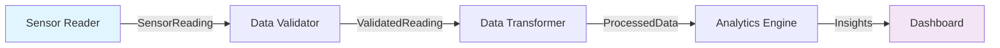

# Data Flow Tracing

Data Flow Tracing is a core component of Reflow's observability framework, providing automatic and comprehensive tracking of data movement between actors in your network. This feature gives you unprecedented visibility into how information flows through your system.

## Overview

Traditional actor monitoring focuses on individual actor behavior - creation, completion, and failures. Data Flow Tracing extends this by capturing the **connections** between actors, providing insights into:

- **Message Routing**: How messages travel through your actor network
- **Data Lineage**: Complete paths of data transformation
- **Performance Bottlenecks**: Where data flow slows down or gets congested
- **System Dependencies**: Which actors depend on which data sources

## How Data Flow Tracing Works

### Automatic Capture

Data Flow Tracing operates at the **connector level**, intercepting messages as they flow between actors:

```rust
// Automatic tracing in connector implementation
impl Connector {
    pub async fn send_message(&self, message: Message) -> Result<()> {
        // Send the actual message
        self.channel.send(message.clone()).await?;
        
        // Automatically record data flow event
        if let Some(tracing) = global_tracing() {
            tracing.trace_data_flow(
                &self.from_actor, &self.from_port,
                &self.to_actor, &self.to_port,
                message.type_name(), message.size_bytes()
            ).await?;
        }
        
        Ok(())
    }
}
```

This approach provides several advantages:

- **Zero Configuration**: Works immediately with existing actor networks
- **Complete Coverage**: Captures all message flows without missing any
- **Accurate Timing**: Records actual transmission times
- **Minimal Overhead**: Efficient implementation with batching

### Event Structure

Data Flow events contain rich metadata about the message transfer:

```rust
pub struct DataFlowEvent {
    // Standard event fields
    event_id: EventId,
    timestamp: DateTime<Utc>,
    event_type: TraceEventType::DataFlow {
        to_actor: String,    // Destination actor
        to_port: String,     // Destination port
    },
    actor_id: String,        // Source actor (from_actor)
    
    // Data flow specific information
    data: TraceEventData {
        port: Some("output".to_string()),  // Source port
        message: Some(MessageSnapshot {
            message_type: "SensorReading".to_string(),
            size_bytes: 256,
            checksum: "sha256:abc123...",
            serialized_data: vec![], // Optional data capture
        }),
        performance_metrics: PerformanceMetrics {
            execution_time_ns: 1_500_000,  // 1.5ms transfer time
            queue_depth: 3,                // Destination queue depth
            throughput_msgs_per_sec: 1000.0,
            memory_usage_bytes: 512,       // Memory for message processing
            cpu_usage_percent: 2.5,
        },
        custom_attributes: HashMap::from([
            ("source_actor", json!("sensor_reader")),
            ("source_port", json!("data")),
            ("destination_actor", json!("data_processor")),
            ("destination_port", json!("input")),
            ("message_id", json!("msg_12345")),
            ("protocol", json!("memory_channel")),
            ("compression", json!("none")),
        ]),
        ..Default::default()
    },
}
```

## Use Cases

### 1. Data Lineage Tracking

Track how data flows and transforms through your entire pipeline:



Query for complete data lineage:

```rust
// Find all data flow for a specific message
let query = TraceQuery {
    event_types: Some(vec![TraceEventType::DataFlow { 
        to_actor: "*".to_string(), 
        to_port: "*".to_string() 
    }]),
    custom_filter: Some("message_id = 'msg_12345'"),
    ..Default::default()
};

let lineage = tracing_client.query_traces(query).await?;
```

### 2. Performance Analysis

Identify bottlenecks in your data processing pipeline:

```rust
// Query for slow data transfers
let slow_transfers = TraceQuery {
    event_types: Some(vec![TraceEventType::DataFlow { 
        to_actor: "*".to_string(), 
        to_port: "*".to_string() 
    }]),
    performance_filter: Some("execution_time_ns > 10000000"), // > 10ms
    time_range: Some((Utc::now() - Duration::hours(1), Utc::now())),
    ..Default::default()
};
```

### 3. System Dependency Mapping

Understand which actors depend on which data sources:

```sql
-- Find most active data flows
SELECT 
    source_actor,
    destination_actor,
    COUNT(*) as message_count,
    AVG(execution_time_ns) as avg_transfer_time,
    SUM(size_bytes) as total_bytes
FROM data_flow_events 
WHERE timestamp > NOW() - INTERVAL '1 hour'
GROUP BY source_actor, destination_actor
ORDER BY message_count DESC;
```

### 4. Real-time Monitoring

Monitor data flow in real-time for operational awareness:

```rust
// Subscribe to data flow events for specific actors
let filters = SubscriptionFilters {
    actor_ids: Some(vec!["critical_processor".to_string()]),
    event_types: Some(vec![TraceEventType::DataFlow { 
        to_actor: "*".to_string(), 
        to_port: "*".to_string() 
    }]),
    ..Default::default()
};

tracing_client.subscribe(filters).await?;
```

## Configuration

### Enabling Data Flow Tracing

Data Flow Tracing is enabled automatically when you enable the observability framework:

```rust
let tracing_config = TracingConfig {
    server_url: "ws://localhost:8080".to_string(),
    enabled: true,                    // Enables all tracing including data flow
    batch_size: 50,                  // Batch size for data flow events
    batch_timeout: Duration::from_millis(1000),
    enable_compression: true,         // Recommended for data flow events
    ..Default::default()
};
```

### Selective Tracing

For high-throughput systems, you might want to selectively trace certain data flows:

```rust
// Custom connector with selective tracing
impl SelectiveConnector {
    pub async fn send_message(&self, message: Message) -> Result<()> {
        self.channel.send(message.clone()).await?;
        
        // Only trace certain message types or conditions
        if should_trace_message(&message) {
            if let Some(tracing) = global_tracing() {
                tracing.trace_data_flow(
                    &self.from_actor, &self.from_port,
                    &self.to_actor, &self.to_port,
                    message.type_name(), message.size_bytes()
                ).await?;
            }
        }
        
        Ok(())
    }
}

fn should_trace_message(message: &Message) -> bool {
    // Trace based on message type, size, or other criteria
    match message.type_name() {
        "CriticalAlert" => true,        // Always trace alerts
        "DebugInfo" => false,           // Never trace debug info
        "DataUpdate" if message.size_bytes() > 1024 => true, // Large updates only
        _ => rand::random::<f64>() < 0.1, // Sample 10% of other messages
    }
}
```

### Sampling Configuration

For extremely high-throughput scenarios, implement sampling:

```rust
pub struct DataFlowSampler {
    sample_rate: f64,      // 0.0 to 1.0
    always_trace: Vec<String>, // Actor names to always trace
    never_trace: Vec<String>,  // Actor names to never trace
}

impl DataFlowSampler {
    pub fn should_trace(&self, from_actor: &str, to_actor: &str) -> bool {
        if self.never_trace.contains(&from_actor.to_string()) ||
           self.never_trace.contains(&to_actor.to_string()) {
            return false;
        }
        
        if self.always_trace.contains(&from_actor.to_string()) ||
           self.always_trace.contains(&to_actor.to_string()) {
            return true;
        }
        
        rand::random::<f64>() < self.sample_rate
    }
}
```

## Advanced Features

### Message Content Capture

For debugging purposes, you can optionally capture message content:

```rust
let event = TraceEvent::data_flow_with_content(
    from_actor, from_port,
    to_actor, to_port,
    message_type, size_bytes,
    Some(message.serialize()?) // Optional content capture
);
```

⚠️ **Security Warning**: Be careful when capturing message content in production. Ensure no sensitive data is included.

### Custom Metadata

Add custom metadata to data flow events:

```rust
// Enhanced data flow tracing with custom metadata
pub async fn trace_enhanced_data_flow(
    tracing: &TracingIntegration,
    from_actor: &str, from_port: &str,
    to_actor: &str, to_port: &str,
    message: &Message,
    custom_metadata: HashMap<String, serde_json::Value>
) -> Result<()> {
    let mut event = TraceEvent::data_flow(
        from_actor.to_string(), from_port.to_string(),
        to_actor.to_string(), to_port.to_string(),
        message.type_name(), message.size_bytes()
    );
    
    // Add custom metadata
    event.data.custom_attributes.extend(custom_metadata);
    
    // Add message-specific metadata
    event.data.custom_attributes.insert(
        "message_priority".to_string(), 
        json!(message.priority())
    );
    event.data.custom_attributes.insert(
        "message_correlation_id".to_string(), 
        json!(message.correlation_id())
    );
    
    tracing.record_event(event).await
}
```

### Causality Tracking

Link data flow events to their triggering events:

```rust
pub async fn trace_causally_linked_data_flow(
    tracing: &TracingIntegration,
    triggering_event_id: EventId,
    from_actor: &str, from_port: &str,
    to_actor: &str, to_port: &str,
    message: &Message
) -> Result<()> {
    let mut event = TraceEvent::data_flow(
        from_actor.to_string(), from_port.to_string(),
        to_actor.to_string(), to_port.to_string(),
        message.type_name(), message.size_bytes()
    );
    
    // Link to triggering event
    event.causality.parent_event_id = Some(triggering_event_id);
    event.causality.dependency_chain.push(triggering_event_id);
    
    tracing.record_event(event).await
}
```

## Performance Considerations

### Overhead Analysis

Data Flow Tracing introduces minimal overhead:

- **Memory**: ~200 bytes per event
- **CPU**: ~0.1ms per event (including serialization)
- **Network**: Batched transmission reduces network calls
- **Storage**: ~1KB per event when stored

### Optimization Strategies

1. **Batching**: Use larger batch sizes for high-throughput scenarios
2. **Compression**: Enable compression for network transmission
3. **Sampling**: Sample events rather than capturing every one
4. **Filtering**: Use selective tracing based on criticality
5. **Async Processing**: All tracing operations are non-blocking

### Monitoring Performance Impact

Monitor the tracing system's own performance:

```rust
// Monitor tracing overhead
let tracing_metrics = global_tracing()
    .unwrap()
    .get_performance_metrics()
    .await?;

println!("Events per second: {}", tracing_metrics.events_per_second);
println!("Average latency: {}ms", tracing_metrics.avg_latency_ms);
println!("Memory usage: {}MB", tracing_metrics.memory_usage_mb);
```

## Visualization and Analysis

### Data Flow Diagrams

Generate visual representations of your data flow:

```rust
// Generate data flow graph for the last hour
let flow_data = tracing_client.query_data_flows(
    TraceQuery {
        time_range: Some((Utc::now() - Duration::hours(1), Utc::now())),
        ..Default::default()
    }
).await?;

let graph = DataFlowGraph::from_events(&flow_data);
graph.render_to_file("data_flow_diagram.svg")?;
```

### Real-time Dashboard

Build real-time monitoring dashboards:

```javascript
// WebSocket connection for real-time data flow monitoring
const ws = new WebSocket('ws://tracing-server:8080');

ws.onmessage = (event) => {
    const traceEvent = JSON.parse(event.data);
    if (traceEvent.event_type.DataFlow) {
        updateDataFlowVisualization(traceEvent);
    }
};
```

## Troubleshooting

### Common Issues

**No Data Flow Events Appearing**:
- Verify tracing is enabled: `enabled: true`
- Check that actors are connected via standard connectors
- Ensure global tracing is initialized before network operations

**Too Many Events**:
- Implement sampling: reduce `sample_rate`
- Use selective tracing for specific actors only
- Increase `batch_size` to reduce network overhead

**Performance Impact**:
- Enable compression: `enable_compression: true`
- Use PostgreSQL backend for better concurrent performance
- Consider async event processing

### Debugging Data Flow Issues

Use data flow tracing to debug connectivity and performance issues:

```rust
// Debug missing data flows
let missing_flows = TraceQuery {
    actor_filter: Some("source_actor".to_string()),
    event_types: Some(vec![TraceEventType::MessageSent]),
    time_range: Some((start_time, end_time)),
    ..Default::default()
};

let sent_messages = tracing_client.query_traces(missing_flows).await?;

// Check if corresponding DataFlow events exist
for sent_event in sent_messages {
    let corresponding_flow = find_data_flow_for_message(&sent_event).await?;
    if corresponding_flow.is_none() {
        println!("Missing data flow for message: {:?}", sent_event);
    }
}
```

## Best Practices

1. **Start Simple**: Begin with default settings and tune based on your needs
2. **Monitor Overhead**: Keep an eye on the performance impact of tracing
3. **Use Sampling**: For high-throughput systems, sample rather than trace everything
4. **Secure Sensitive Data**: Never trace sensitive message content
5. **Regular Cleanup**: Set up automatic cleanup of old trace data
6. **Correlate Events**: Use causality tracking to link related events
7. **Custom Metadata**: Add domain-specific metadata for better insights

Data Flow Tracing provides unprecedented visibility into your actor network's communication patterns. Use it to understand, debug, and optimize your distributed systems with confidence.
