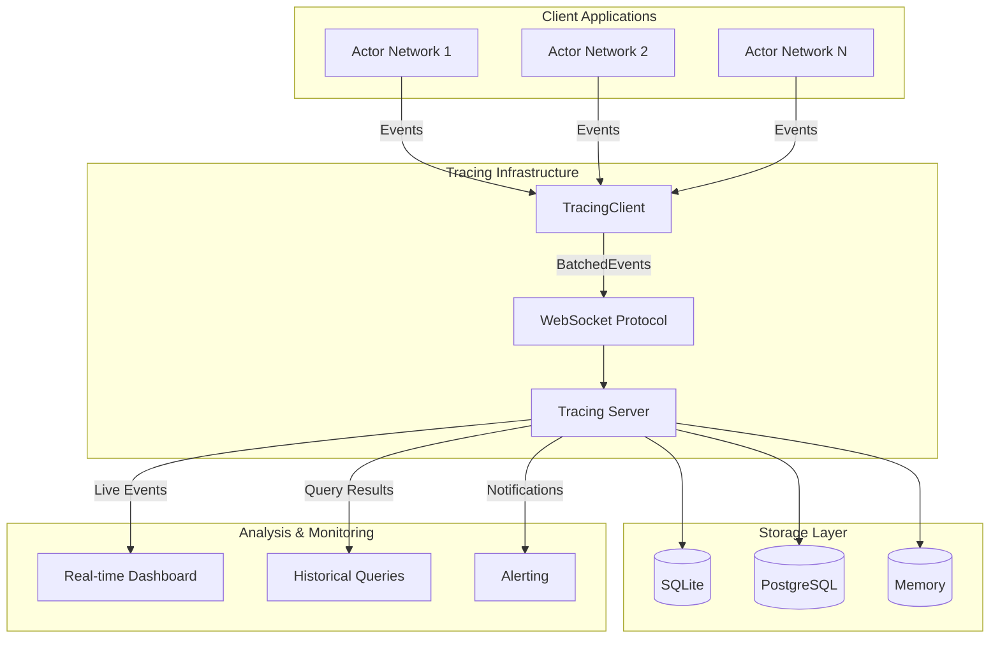

# Observability Overview

Reflow provides a comprehensive observability framework that enables deep introspection into distributed actor networks. The observability system captures detailed execution traces, performance metrics, and data flow patterns across all components in your system.

## Key Features

### 🔍 **Comprehensive Event Tracing**
- **Actor Lifecycle**: Track creation, startup, execution, completion, and failures
- **Message Flow**: Monitor all message passing between actors with detailed metadata
- **Data Flow Tracing**: NEW - Automatic tracing of data flow between connected actors
- **State Changes**: Capture state transitions with diff support for time-travel debugging
- **Network Events**: Monitor distributed network operations and health

### 📊 **Real-time Monitoring**
- **Live Event Streaming**: WebSocket-based real-time event notifications
- **Performance Metrics**: CPU usage, memory consumption, throughput measurements
- **Custom Dashboards**: Build monitoring interfaces using the WebSocket API
- **Alerting**: Set up custom alerts based on event patterns and thresholds

### 🗄️ **Flexible Storage**
- **SQLite**: Embedded database perfect for development and small deployments
- **PostgreSQL**: Production-ready backend with ACID guarantees and concurrent access
- **Memory**: High-performance in-memory storage for testing and temporary analysis

### 🌐 **Distributed Tracing**
- **Cross-Network Visibility**: Trace execution across multiple network instances
- **Causality Tracking**: Maintain event dependency chains across distributed components
- **Span Integration**: Compatible with OpenTelemetry and Jaeger for unified observability

## Architecture Overview



## Event Types

### Core Actor Events
- **`ActorCreated`**: Actor instance creation with configuration
- **`ActorStarted`**: Actor begins execution
- **`ActorCompleted`**: Successful actor completion
- **`ActorFailed`**: Actor error with detailed error information

### Communication Events  
- **`MessageSent`**: Message transmission between actors
- **`MessageReceived`**: Message reception confirmation
- **`DataFlow`**:  Automatic data flow tracing between connected actors
- **`PortConnected`**: Port connection establishment
- **`PortDisconnected`**: Port disconnection

### System Events
- **`StateChanged`**: Actor state modifications with diffs
- **`NetworkEvent`**: Distributed network operations

## Integration Patterns

### Automatic Integration
The tracing framework integrates automatically with Reflow networks:

```rust
use reflow_network::{Network, NetworkConfig};
use reflow_network::tracing::TracingConfig;

// Enable tracing with minimal configuration
let tracing_config = TracingConfig {
    server_url: "ws://localhost:8080".to_string(),
    enabled: true,
    ..Default::default()
};

let network_config = NetworkConfig {
    tracing: tracing_config,
    ..Default::default()
};

let network = Network::new(network_config);
// All actor operations are now automatically traced!
```

### Manual Event Recording
For custom events and detailed control:

```rust
use reflow_tracing_protocol::{TraceEvent, TracingIntegration};

// Record custom events
if let Some(tracing) = global_tracing() {
    tracing.trace_actor_created("custom_actor").await?;
    tracing.trace_data_flow(
        "source_actor", "output",
        "target_actor", "input",
        "CustomMessage", 1024
    ).await?;
}
```

## Data Flow Tracing

The latest enhancement to the observability framework provides automatic data flow tracing:

### Automatic Capture
- **Zero Configuration**: Works out-of-the-box with existing actor networks
- **Connector Integration**: Captures data flow at the connector level for accuracy
- **Bidirectional Tracking**: Traces both source and destination information
- **Performance Metadata**: Includes message size, type, and timing information

### Rich Context
```rust
// Data flow events automatically include:
DataFlow {
    from_actor: "data_processor",
    from_port: "output",
    to_actor: "analytics_engine", 
    to_port: "input",
    message_type: "ProcessedData",
    size_bytes: 2048,
    timestamp: "2025-01-07T06:00:00Z",
    causality_chain: [...],
    performance_metrics: {...}
}
```

## Use Cases

### Development & Debugging
- **Execution Visualization**: See exactly how data flows through your system
- **Performance Profiling**: Identify bottlenecks and optimization opportunities
- **Error Investigation**: Trace error propagation through actor networks
- **State Debugging**: Time-travel debugging with state diffs

### Production Monitoring
- **Health Monitoring**: Track system health and detect anomalies
- **Performance Monitoring**: Monitor throughput, latency, and resource usage
- **Capacity Planning**: Analyze usage patterns for scaling decisions
- **Incident Response**: Rapid diagnosis of production issues

### Analytics & Optimization
- **Usage Patterns**: Understand how your system is actually used
- **Performance Optimization**: Data-driven optimization decisions
- **Architecture Evolution**: Make informed architectural changes
- **Compliance**: Maintain audit trails for regulatory requirements

## Getting Started

1. **[Quick Start Guide](getting-started.md)** - Get tracing running in 5 minutes
2. **[Architecture Deep Dive](architecture.md)** - Understand the technical details
3. **[Configuration Guide](configuration.md)** - Customize for your environment
4. **[Deployment Guide](deployment.md)** - Production deployment patterns

## Next Steps

- Learn about [event types and their uses](event-types.md)
- Explore [storage backend options](storage-backends.md)
- Set up [production monitoring](deployment.md)
- Integrate with [existing monitoring systems](../tutorials/advanced-tracing-setup.md)
