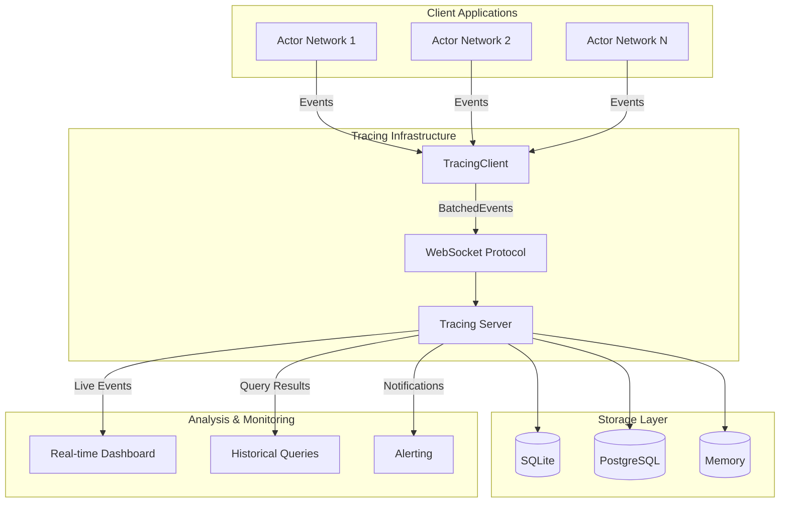

# Observability Overview

Reflow provides a comprehensive observability framework that enables deep introspection into distributed actor networks. The observability system captures detailed execution traces, performance metrics, and data flow patterns across all components in your system.

## Key Features

### 🔍 **Comprehensive Event Tracing**
- **Actor Lifecycle**: Track creation, startup, execution, completion, and failures
- **Message Flow**: Monitor all message passing between actors with detailed metadata
- **Data Flow Tracing**: Automatic tracing of data flow between connected actors, with content checksums
- **State Changes**: _Planned_ — the `StateChanged` event and `StateDiff` type exist, but state diffs are not yet captured automatically (time-travel debugging is a follow-up)
- **Network Events**: Monitor distributed network operations and health

### 📊 **Real-time Monitoring**
- **Live Event Streaming**: WebSocket-based real-time event notifications
- **Performance Metrics**: CPU usage, memory consumption, throughput measurements
- **Custom Dashboards**: Build monitoring interfaces using the WebSocket API
- **Alerting**: Set up custom alerts based on event patterns and thresholds

### 🗄️ **Flexible Storage**
- **SQLite**: Embedded database perfect for development and small deployments
- **PostgreSQL**: Production-ready backend with ACID guarantees and concurrent access
- **Memory**: High-performance in-memory storage for testing and temporary analysis

### 🌐 **Distributed Tracing (shared collector)**
- **Cross-Process Visibility**: A flow that spans multiple network instances is
  stitched into **one** end-to-end `FlowTrace`. The originating network's
  `trace_id` propagates across the bridge (on `RemoteMessage`), and each
  receiving network records its cross-process hop under that same id.
- **Unified, Jaeger-style model**: point every participating network's
  `TracingConfig.server_url` at one shared `reflow_tracing` server; it aggregates
  every process's events into the same trace.
- **Content checksums**: each traced message carries a deterministic
  `"sha256:<hex>"` content digest, identical across processes and SDK languages.

> The stack is bespoke (WebSocket protocol + server + SQLite/memory storage +
> replay), not OpenTelemetry/OTLP. An OTLP export adapter is a possible future
> addition, not a current feature.

## Architecture Overview


```mermaid
graph TB
    subgraph "Client Applications"
        A1[Actor Network 1]
        A2[Actor Network 2] 
        A3[Actor Network N]
    end
    
    subgraph "Tracing Infrastructure"
        TC[TracingClient]
        WS[WebSocket Protocol]
        TS[Tracing Server]
    end
    
    subgraph "Storage Layer"
        SQLite[(SQLite)]
        Postgres[(PostgreSQL)]
        Memory[(Memory)]
    end
    
    subgraph "Analysis & Monitoring"
        RT[Real-time Dashboard]
        HQ[Historical Queries]
        AL[Alerting]
    end
    
    A1 -->|Events| TC
    A2 -->|Events| TC
    A3 -->|Events| TC
    TC -->|BatchedEvents| WS
    WS --> TS
    TS --> SQLite
    TS --> Postgres
    TS --> Memory
    TS -->|Live Events| RT
    TS -->|Query Results| HQ
    TS -->|Notifications| AL
```

## Event Types

### Core Actor Events
- **`ActorCreated`**: Actor instance creation with configuration
- **`ActorStarted`**: Actor begins execution
- **`ActorCompleted`**: Successful actor completion
- **`ActorFailed`**: Actor error with detailed error information

### Communication Events  
- **`MessageSent`**: Message transmission between actors
- **`MessageReceived`**: Message reception confirmation
- **`DataFlow`**:  Automatic data flow tracing between connected actors
- **`PortConnected`**: Port connection establishment
- **`PortDisconnected`**: Port disconnection

### System Events
- **`StateChanged`**: Actor state modifications with diffs
- **`NetworkEvent`**: Distributed network operations

## Integration Patterns

### Automatic Integration
The tracing framework integrates automatically with Reflow networks:

```rust
use reflow_network::{Network, NetworkConfig};
use reflow_network::tracing::TracingConfig;

// Enable tracing with minimal configuration
let tracing_config = TracingConfig {
    server_url: "ws://localhost:8080".to_string(),
    enabled: true,
    ..Default::default()
};

let network_config = NetworkConfig {
    tracing: tracing_config,
    ..Default::default()
};

let network = Network::new(network_config);
// All actor operations are now automatically traced!
```

### Manual Event Recording
For custom events and detailed control. `trace_data_flow`/`trace_message_sent`
take the **message itself** as content — the integration computes the snapshot
(checksum, size, optional content) per the configured capture knobs:

```rust
use reflow_tracing_protocol::PerformanceMetrics;

// Record custom events
if let Some(tracing) = global_tracing() {
    tracing.trace_actor_created("custom_actor").await?;
    tracing.trace_data_flow(
        "source_actor", "output",
        "target_actor", "input",
        "CustomMessage",          // message type label
        &message,                  // the content (anything Serialize)
        PerformanceMetrics::default(),
    ).await?;
}
```

### Consuming traces from an SDK (no collector required)
Tracing is first-class in every SDK. Enable it in the network config and
subscribe to the **local tap** — live trace events with no server needed:

```python
# Python
net = Network({"tracing": {"server_url": "ws://localhost:8080", "enabled": True}})
traces = net.traces()
net.start()
evt = traces.recv(timeout_ms=500)   # dict: event_type, actor_id, data.message.checksum, …
```

```javascript
// Node
const net = new Network({ tracing: { server_url: "ws://localhost:8080", enabled: true } });
const traces = net.traces();
net.start();
const evt = await traces.recv();    // { event_type, actor_id, data: { message: { checksum } } }
```

Equivalent surfaces exist in Go (`net.Traces()`), C++ (`net.traces()`), and the
JVM (`network.traces()`), plus a C ABI (`rfl_network_traces`) and a
collector-client (`rfl_trace_client_connect/_query/_subscribe`) for historical
and distributed monitoring.

## Data Flow Tracing

The latest enhancement to the observability framework provides automatic data flow tracing:

### Automatic Capture
- **Zero Configuration**: Works out-of-the-box with existing actor networks
- **Connector Integration**: Captures data flow at the connector level for accuracy
- **Bidirectional Tracking**: Traces both source and destination information
- **Performance Metadata**: Includes message size, type, and timing information

### Rich Context
```rust
// Data flow events automatically include:
DataFlow {
    from_actor: "data_processor",
    from_port: "output",
    to_actor: "analytics_engine", 
    to_port: "input",
    message_type: "ProcessedData",
    size_bytes: 2048,
    timestamp: "2025-01-07T06:00:00Z",
    causality_chain: [...],
    performance_metrics: {...}
}
```

## Use Cases

### Development & Debugging
- **Execution Visualization**: See exactly how data flows through your system
- **Performance Profiling**: Identify bottlenecks and optimization opportunities
- **Error Investigation**: Trace error propagation through actor networks
- **State Debugging**: Time-travel debugging with state diffs

### Production Monitoring
- **Health Monitoring**: Track system health and detect anomalies
- **Performance Monitoring**: Monitor throughput, latency, and resource usage
- **Capacity Planning**: Analyze usage patterns for scaling decisions
- **Incident Response**: Rapid diagnosis of production issues

### Analytics & Optimization
- **Usage Patterns**: Understand how your system is actually used
- **Performance Optimization**: Data-driven optimization decisions
- **Architecture Evolution**: Make informed architectural changes
- **Compliance**: Maintain audit trails for regulatory requirements

## Getting Started

1. **[Quick Start Guide](getting-started.md)** - Get tracing running in 5 minutes
2. **[Architecture Deep Dive](architecture.md)** - Understand the technical details
3. **[Configuration Guide](configuration.md)** - Customize for your environment
4. **[Deployment Guide](deployment.md)** - Production deployment patterns

## Next Steps

- Learn about [event types and their uses](event-types.md)
- Explore [storage backend options](storage-backends.md)
- Ship traces to a dashboard via [OTLP export (Monoscope, Jaeger, Tempo, …)](otlp-export.md)
- Set up [production monitoring](deployment.md)
- Integrate with [existing monitoring systems](../tutorials/advanced-tracing-setup.md)
