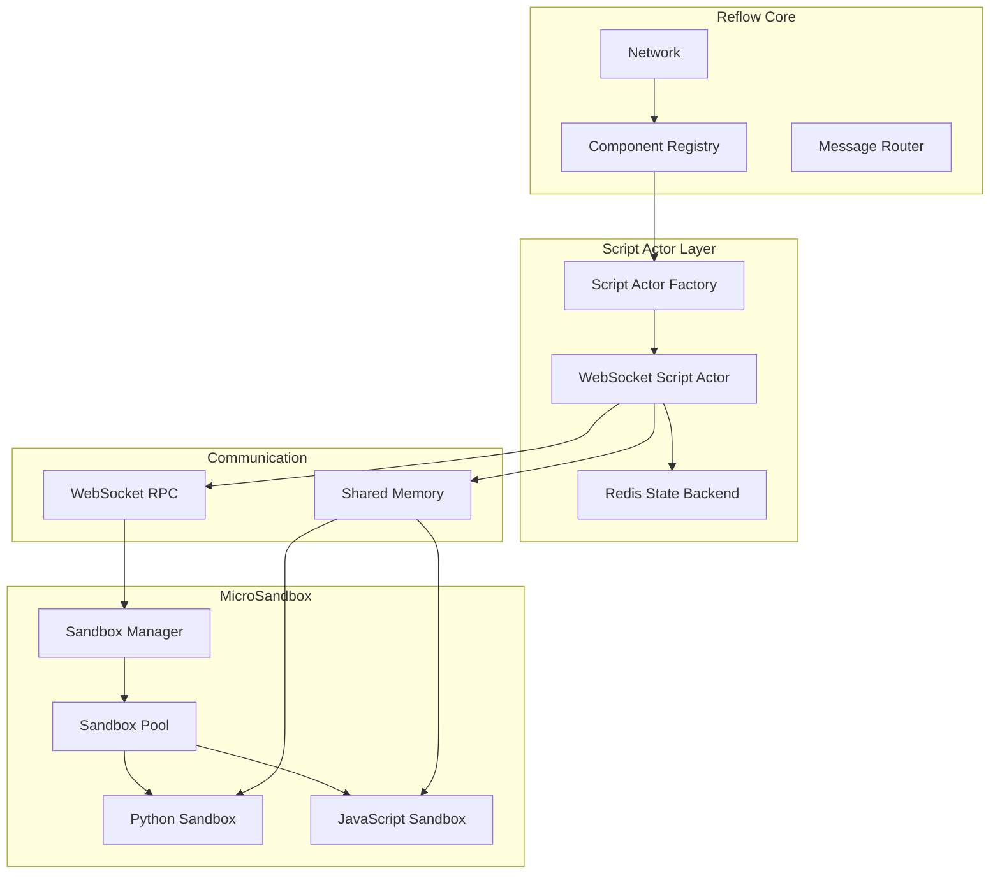

# Script Actors with MicroSandbox Integration

## Overview

This documentation covers the integration of MicroSandbox for secure script execution in Reflow, enabling Python and JavaScript actors to run alongside native Rust and WASM actors with unified APIs and state management.

## Documentation Structure

1. **[Architecture Overview](./architecture.md)** - Complete architectural design for MicroSandbox integration with Reflow
2. **[Implementation Guide](./implementation.md)** - Step-by-step implementation plan and code examples
3. **[API Reference](./api_reference.md)** - Detailed API documentation for script actors

## Quick Start

### Python Actor Example

```python
from reflow import actor, ActorContext, Message
from typing import Dict

@actor(
    name="DataProcessor",
    inports=["data", "config"],
    outports=["processed", "metrics"],
    state_backend="redis"
)
async def process_data(context: ActorContext) -> Dict[str, Message]:
    """Processes input data with configurable operations."""
    
    payload = context.get_payload()
    state = context.get_state()
    
    data = payload.get("data")
    config = payload.get("config", {})
    
    # Process data
    result = transform_data(data, config)
    
    # Update state
    count = state.increment("process_count")
    
    return {
        "processed": Message.array(result),
        "metrics": Message.object({"count": count})
    }
```

### JavaScript Actor Example

```javascript
const { actor, ActorContext, Message } = require('reflow');

@actor({
    name: "StreamAggregator",
    inports: ["stream", "window"],
    outports: ["aggregated", "stats"],
    stateBackend: "redis"
})
async function aggregateStream(context) {
    const payload = context.getPayload();
    const state = context.getState();
    
    const streamData = payload.get("stream");
    const windowSize = payload.get("window") || 10;
    
    // Aggregate data
    const buffer = state.get("buffer", []);
    buffer.push(streamData.unwrap());
    
    if (buffer.length > windowSize) {
        buffer.shift();
    }
    
    state.set("buffer", buffer);
    const avg = buffer.reduce((a, b) => a + b, 0) / buffer.length;
    
    return {
        aggregated: Message.float(avg),
        stats: Message.object({
            count: buffer.length,
            average: avg
        })
    };
}
```

## Key Features

### 1. Secure Sandbox Execution
- MicroVM-based isolation for each script
- Resource limits (CPU, memory, network)
- No direct filesystem access
- Controlled imports and dependencies

### 2. Unified Actor Context
- Consistent API across Python, JavaScript, and Rust
- Type-safe message passing
- Built-in state management
- Configuration injection

### 3. Zero-Copy Message Passing
- Shared memory for large payloads
- Bitcode encoding for efficiency
- WebSocket RPC for control messages
- Ring buffer for high throughput

### 4. Redis State Backend
- Persistent state across restarts
- Distributed state for scaling
- Atomic operations support
- TTL and expiration

### 5. Automatic Discovery
- File pattern matching (*.actor.py, *.actor.js)
- Generator-based metadata extraction
- Workspace integration
- Hot reload in development

### 6. WebSocket RPC Protocol
- Bidirectional communication
- Low latency (~5ms)
- Automatic reconnection
- Request/response correlation

## Architecture Highlights



## Performance Characteristics

- **Discovery Time**: < 500ms for 100 actors
- **Instantiation**: < 100ms with pre-warmed sandboxes
- **Message Latency**: < 5ms via WebSocket RPC
- **State Operations**: < 2ms with Redis
- **Memory Overhead**: ~50MB per sandbox
- **Throughput**: 10K+ messages/second

## Configuration

```yaml
# reflow.yaml
workspace:
  discover_scripts: true
  script_patterns:
    - "**/*.actor.py"
    - "**/*.actor.js"
  
  sandbox:
    python_image: "python:3.11"
    javascript_image: "node:20"
    preload_count: 5
    max_pool_size: 20
    memory_limit: "512MB"
    cpu_limit: 0.5
  
  redis:
    url: "redis://localhost:6379"
    namespace: "reflow"
    ttl: 3600
  
  websocket:
    port: 8080
    max_connections: 100
    ping_interval: 30
```

## Migration from Custom Runtimes

### Before (reflow_py/reflow_js)
- Complex runtime management
- In-memory state only
- JSON serialization overhead
- No sandboxing

### After (MicroSandbox)
- Secure isolation
- Redis persistent state
- Zero-copy with shared memory
- WebSocket RPC efficiency

## Next Steps

1. Review the [Architecture Overview](./architecture.md) for detailed design
2. Follow the [Implementation Guide](./implementation.md) for integration steps
3. Check the [API Reference](./api_reference.md) for complete API documentation

## Related Documentation

- [Reflow Actor Model](../../actors/README.md)
- [WASM Actors](../../wasm/README.md)
- [Network Architecture](../../network/README.md)
- [Message Passing](../../messages/README.md)