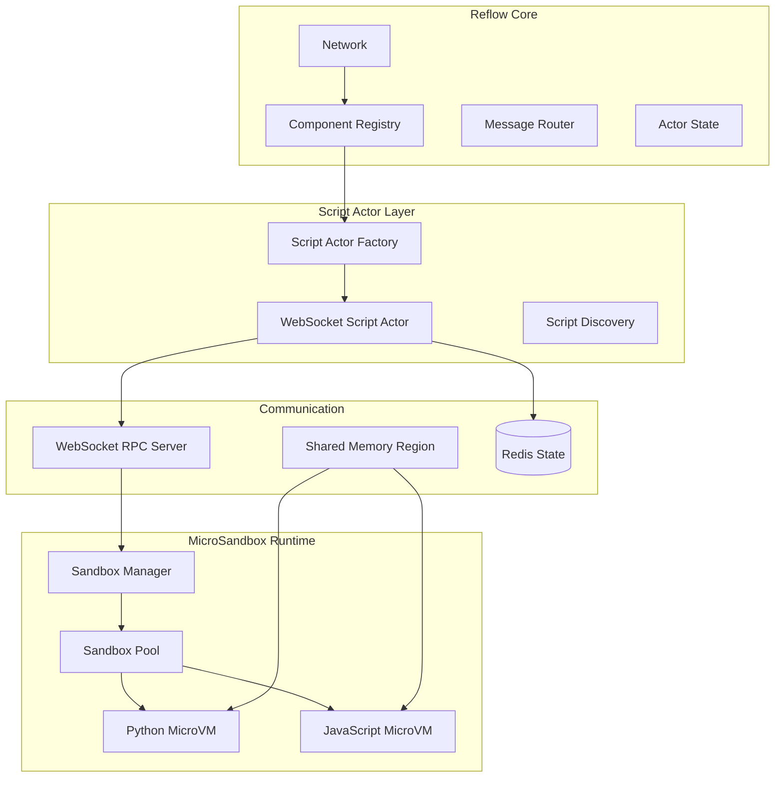
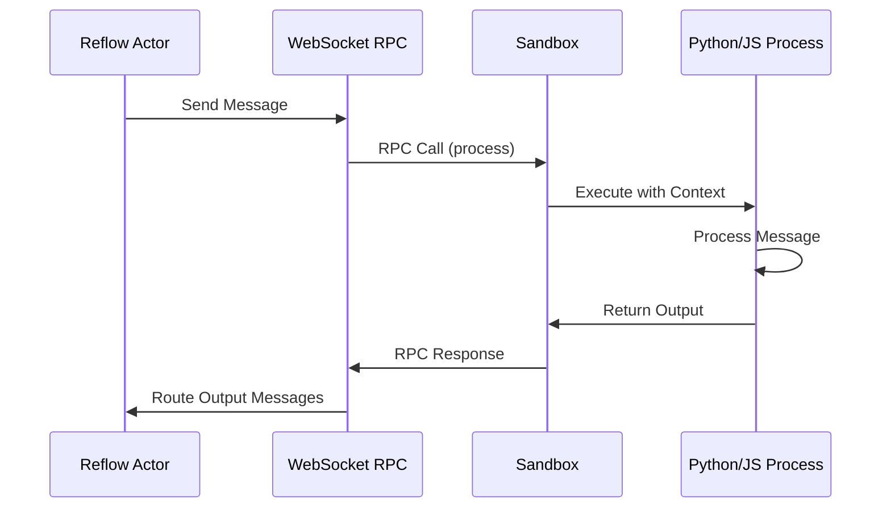
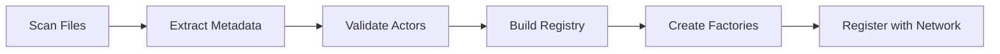

# MicroSandbox Script Actor Architecture

## Table of Contents

1. [Overview](#overview)
2. [MicroSandbox Integration](#microsandbox-integration)
3. [Communication Architecture](#communication-architecture)
4. [State Management](#state-management)
5. [Discovery System](#discovery-system)
6. [Component Integration](#component-integration)

## Overview

The MicroSandbox integration enables secure execution of Python and JavaScript actors within Reflow's actor system, providing:

- **Secure Isolation**: MicroVM-based sandboxing for untrusted code
- **Unified API**: Consistent ActorContext across all languages
- **High Performance**: Zero-copy message passing with shared memory
- **Persistent State**: Redis backend for distributed state management
- **Automatic Discovery**: File-based actor discovery with metadata generation
- **WebSocket RPC**: Real-time bidirectional communication

## MicroSandbox Integration

### Why MicroSandbox?

MicroSandbox offers significant advantages over custom runtime implementations:

| Aspect | Current (reflow_py/reflow_js) | MicroSandbox |
|--------|-------------------------------|--------------|
| **Isolation** | Process-level | MicroVM with KVM |
| **Security** | Limited sandboxing | Full isolation |
| **Performance** | JSON serialization overhead | Zero-copy shared memory |
| **Resource Control** | Basic limits | Fine-grained (CPU, memory, I/O) |
| **Language Support** | Maintenance burden | Managed environments |
| **State Management** | In-memory only | Redis backend |

### Architecture Components



## Communication Architecture

### WebSocket RPC Protocol

The WebSocket RPC provides bidirectional communication between Reflow and sandboxed scripts:

```rust
// RPC Message Format
#[derive(Serialize, Deserialize)]
struct RpcMessage {
    id: String,
    method: String,
    params: Value,
    timestamp: u64,
}

#[derive(Serialize, Deserialize)]
struct RpcResponse {
    id: String,
    result: Option<Value>,
    error: Option<RpcError>,
    timestamp: u64,
}
```

#### Protocol Flow



### Zero-Copy Message Passing

For large payloads, shared memory provides zero-copy transfer:

```rust
// Shared Memory Manager
pub struct SharedMemoryManager {
    regions: HashMap<String, SharedMemoryRegion>,
    allocator: BumpAllocator,
}

pub struct SharedMemoryRegion {
    ptr: *mut u8,
    size: usize,
    fd: RawFd,
    actor_id: String,
}

// Ring Buffer for high-throughput
pub struct MessageRingBuffer {
    buffer: Arc<SharedMemoryRegion>,
    write_pos: AtomicUsize,
    read_pos: AtomicUsize,
    capacity: usize,
}
```

#### Memory Layout

```
+------------------+
| Header (64B)     |
| - Magic: u32     |
| - Version: u8    |
| - Flags: u8      |
| - Size: u32      |
| - Checksum: u32  |
+------------------+
| Metadata (256B)  |
| - Actor ID       |
| - Message ID     |
| - Timestamp      |
| - Port Info      |
+------------------+
| Payload (var)    |
| - Bitcode Data   |
| - Raw Bytes      |
+------------------+
```

## State Management

### Redis State Backend

Script actors use Redis for persistent, distributed state:

```python
# Python State Interface
class RedisActorState:
    def __init__(self, redis_url: str, namespace: str, actor_id: str):
        self.client = redis.Redis.from_url(redis_url)
        self.namespace = namespace
        self.actor_id = actor_id
    
    def get(self, key: str) -> Any:
        redis_key = f"{self.namespace}:{self.actor_id}:{key}"
        value = self.client.get(redis_key)
        return json.loads(value) if value else None
    
    def set(self, key: str, value: Any) -> None:
        redis_key = f"{self.namespace}:{self.actor_id}:{key}"
        self.client.set(redis_key, json.dumps(value))
    
    def increment(self, key: str, amount: int = 1) -> int:
        redis_key = f"{self.namespace}:{self.actor_id}:{key}"
        return self.client.incrby(redis_key, amount)
```

### State Operations

| Operation | Description | Redis Command |
|-----------|-------------|---------------|
| `get(key)` | Retrieve value | GET |
| `set(key, value)` | Store value | SET |
| `increment(key)` | Atomic increment | INCRBY |
| `push(key, value)` | List append | RPUSH |
| `pop(key)` | List remove | LPOP |
| `expire(key, ttl)` | Set expiration | EXPIRE |

## Discovery System

### File-Based Discovery

Script actors are discovered through file patterns:

```yaml
# Discovery patterns
script_actors:
  patterns:
    - "**/*.actor.py"      # Python actors
    - "**/*.actor.js"      # JavaScript actors
    - "**/actors/*.py"     # Actors in folders
    - "**/actors/*.js"
```

### Generator-Based Metadata

Metadata is extracted from decorators/generators:

```python
# Python Actor with Generator
@actor(
    name="DataProcessor",
    inports=["data", "config"],
    outports=["processed", "metrics"],
    tags=["ml", "processing"]
)
async def process_data(context: ActorContext) -> Dict[str, Message]:
    """Processes data using ML algorithms."""
    # Implementation
    pass

# Automatically generates:
# {
#   "component": "DataProcessor",
#   "description": "Processes data using ML algorithms.",
#   "inports": [
#     {"name": "data", "type": "any", "required": true},
#     {"name": "config", "type": "object", "required": true}
#   ],
#   "outports": [
#     {"name": "processed", "type": "any"},
#     {"name": "metrics", "type": "object"}
#   ]
# }
```

### Discovery Process



## Component Integration

### Modified Reflow Structures

Script actor support is integrated directly into existing structures:

```rust
// Modified GraphNode
pub struct GraphNode {
    pub id: String,
    pub component: String,
    pub metadata: Option<HashMap<String, Value>>,
    
    // NEW: Script runtime indicator
    #[serde(skip_serializing_if = "Option::is_none")]
    pub script_runtime: Option<ScriptRuntime>,
}

// Modified WorkspaceComposition
pub struct WorkspaceComposition {
    // Existing fields
    pub composition: GraphComposition,
    pub discovered_graphs: Vec<WorkspaceGraphExport>,
    
    // NEW: Script actors
    pub script_actors: Vec<DiscoveredScriptActor>,
    pub component_registry: ComponentRegistry,
}

// Unified Component Registry
pub struct ComponentRegistry {
    native_actors: HashMap<String, Box<dyn Actor>>,
    wasm_actors: HashMap<String, WasmActorFactory>,
    script_actors: HashMap<String, ScriptActorFactory>,
    component_index: HashMap<String, ComponentType>,
}
```

### Actor Context Unification

All script actors receive a consistent context:

```python
# Python
class ActorContext:
    payload: Dict[str, Message]  # Input messages
    config: Dict[str, Any]       # Actor configuration
    state: ActorState            # Redis-backed state
    
    def get_payload(self) -> Dict[str, Message]
    def get_config(self) -> Dict[str, Any]
    def get_state(self) -> ActorState
    def send(self, port: str, message: Message)
```

```javascript
// JavaScript
class ActorContext {
    payload: Map<string, Message>  // Input messages
    config: object                 // Actor configuration
    state: ActorState              // Redis-backed state
    
    getPayload(): Map<string, Message>
    getConfig(): object
    getState(): ActorState
    send(port: string, message: Message)
}
```

### Script Actor Factory

Factory pattern for creating script actor instances:

```rust
pub struct ScriptActorFactory {
    metadata: DiscoveredScriptActor,
    websocket_rpc: WebSocketRpcClient,
    redis_client: redis::Client,
    sandbox_pool: Arc<SandboxPool>,
}

#[async_trait]
impl ActorFactory for ScriptActorFactory {
    async fn create_instance(&self) -> Result<Box<dyn Actor>> {
        // Get or create sandbox from pool
        let sandbox = self.sandbox_pool.acquire(self.metadata.runtime).await?;
        
        // Create WebSocket-backed actor
        let actor = WebSocketScriptActor::new(
            self.metadata.clone(),
            self.websocket_rpc.clone(),
            self.redis_client.clone(),
            sandbox,
        );
        
        Ok(Box::new(actor))
    }
}
```

## Performance Characteristics

### Benchmarks

| Operation | Native Actor | WASM Actor | Script Actor (MicroSandbox) |
|-----------|-------------|------------|----------------------------|
| Instantiation | < 1ms | < 10ms | < 100ms (pre-warmed) |
| Message Processing | < 0.1ms | < 0.5ms | < 5ms |
| State Get/Set | < 0.01ms | < 0.1ms | < 2ms (Redis) |
| Memory Overhead | ~1MB | ~10MB | ~50MB |
| Throughput | 100K msg/s | 50K msg/s | 10K msg/s |

### Optimization Strategies

1. **Sandbox Pooling**: Pre-warm sandboxes for fast instantiation
2. **Shared Memory**: Zero-copy for large payloads
3. **Batch Operations**: Group Redis commands
4. **Connection Pooling**: Reuse WebSocket connections
5. **Bitcode Encoding**: Efficient serialization

## Security Model

### Isolation Levels

```yaml
sandbox:
  isolation:
    filesystem: none        # No filesystem access
    network: restricted    # Only WebSocket RPC
    memory: limited       # 512MB default
    cpu: throttled       # 0.5 CPU cores
    syscalls: filtered   # Seccomp filters
```

### Resource Limits

```rust
pub struct SandboxLimits {
    memory_mb: u32,        // Default: 512
    cpu_cores: f32,        // Default: 0.5
    disk_mb: u32,          // Default: 0 (no disk)
    network_bandwidth: u32, // Default: 10 Mbps
    execution_timeout: u32, // Default: 30s
}
```

## Configuration

### Complete Configuration Example

```yaml
# reflow.yaml
workspace:
  # Discovery settings
  discover_scripts: true
  script_patterns:
    - "**/*.actor.py"
    - "**/*.actor.js"
  excluded_paths:
    - "**/node_modules/**"
    - "**/__pycache__/**"
  
  # Sandbox configuration
  sandbox:
    python:
      image: "python:3.11-slim"
      packages: ["numpy", "pandas", "scikit-learn"]
      memory: "1GB"
      cpu: 1.0
    javascript:
      image: "node:20-alpine"
      packages: ["lodash", "moment"]
      memory: "512MB"
      cpu: 0.5
    pool:
      preload_count: 5
      max_size: 20
      idle_timeout: 300
  
  # State configuration
  redis:
    url: "redis://localhost:6379"
    namespace: "reflow"
    ttl: 3600
    max_connections: 100
  
  # WebSocket configuration
  websocket:
    port: 8080
    max_frame_size: "10MB"
    ping_interval: 30
    compression: true
  
  # Shared memory
  shared_memory:
    enabled: true
    max_regions: 100
    region_size: "100MB"
```

## Migration Path

### From reflow_py/reflow_js to MicroSandbox

1. **Phase 1**: Add MicroSandbox support alongside existing
2. **Phase 2**: Migrate actors to new format
3. **Phase 3**: Deprecate old runtimes
4. **Phase 4**: Remove legacy code

### Compatibility Layer

```rust
// Adapter for legacy actors
pub struct LegacyScriptAdapter {
    legacy_runtime: Box<dyn LegacyRuntime>,
    new_factory: ScriptActorFactory,
}

impl LegacyScriptAdapter {
    pub fn adapt_to_new(&self, legacy_config: LegacyConfig) -> Result<Box<dyn Actor>> {
        // Convert legacy config to new format
        let new_config = self.convert_config(legacy_config)?;
        
        // Create new actor
        self.new_factory.create_instance_with_config(new_config).await
    }
}
```

## Future Enhancements

1. **GPU Support**: Enable CUDA/ROCm in sandboxes
2. **Multi-Language**: Add Ruby, Go, Rust script support
3. **Distributed State**: Multi-region Redis clusters
4. **Edge Deployment**: Lightweight sandboxes for edge
5. **Hot Reload**: Zero-downtime actor updates
6. **Observability**: Built-in tracing and metrics
7. **Version Management**: Multiple actor versions
8. **Policy Engine**: Fine-grained security policies