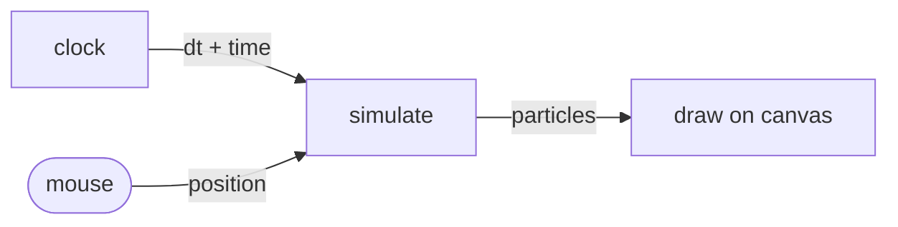

# Reactive particle field in the browser

A page where 200 particles drift across a canvas and lean toward your
cursor. Pure browser, no server, no packs. The whole app is one HTML
file plus a small Reflow graph.

The point of this first tutorial is to make the runtime feel concrete.
You will see what an actor looks like in JavaScript, how a graph wires
them together, and what the runtime does each frame.

## What we are building



Three actors and one DOM event source. The `clock` actor fires once per
animation frame. `simulate` advances each particle one step. `draw`
paints them. The mouse position is read off `mousemove` events that we
inject straight into the graph.

If you have written a simulation before, this is the same loop you
always write. The shape is just declared instead of nested in
`requestAnimationFrame`.

## Setup

Pick any directory and put one file in it.

```html
<!doctype html>
<meta charset="utf-8">
<title>Particle field</title>
<style>
  body { margin: 0; background: #0b1020; color: #c9d2e6; font: 14px system-ui; }
  canvas { display: block; }
  small { position: fixed; bottom: 8px; left: 12px; opacity: .6; }
</style>
<canvas id="stage"></canvas>
<small>move your mouse</small>

<script type="module">
import { ready, Network, Actor, Message, bindInputEvents }
  from "https://esm.sh/@offbit-ai/reflow";

await ready();
// the rest goes here
</script>
```

The `esm.sh` URL fetches the browser build of `@offbit-ai/reflow` as an
ES module. `ready()` initialises the wasm runtime exactly once. Anything
below that line can use `Network`, `Actor`, `Message`.

## The actors

Three small classes. Read them top to bottom; the runtime calls
`run(ctx)` on each one whenever its inputs are ready.

### Clock

Fires every animation frame and emits the elapsed time since the
previous tick.

```js
class Clock extends Actor {
  static inports = ["_trigger"];      // first kick comes in here
  static outports = ["dt", "time"];

  constructor() {
    super();
    this.last = performance.now();
  }

  run(ctx) {
    const now = performance.now();
    const dt = (now - this.last) / 1000;
    this.last = now;
    ctx.send({
      dt:   Message.float(dt),
      time: Message.float(now / 1000),
    });
    requestAnimationFrame(() => ctx.done());  // schedules the next tick
  }
}
```

Two details. The `_trigger` inport is the convention for actors that
need an external kick to fire their first run. We will hand it a
`Flow` message during wiring; from then on the actor self-paces.

The last line of `run` is the trick that ties it to the browser:
`ctx.done()` tells the runtime "this tick is over." Calling it inside
`requestAnimationFrame` paces the actor at the screen's refresh rate.
No timers, no `setInterval`, no drift.

### Simulate

Holds the particle array. Each tick it nudges every particle toward the
mouse, applies a tiny amount of friction, and emits the array.

```js
const N = 200;
class Simulate extends Actor {
  static inports = ["dt", "mouse"];
  static outports = ["particles"];

  constructor(width, height) {
    super();
    this.w = width;
    this.h = height;
    this.target = { x: width / 2, y: height / 2 };
    this.particles = Array.from({ length: N }, () => ({
      x: Math.random() * width,
      y: Math.random() * height,
      vx: 0,
      vy: 0,
    }));
  }

  run(ctx) {
    const dt = ctx.input.dt?.data ?? 0;
    if (ctx.input.mouse) {
      this.target = ctx.input.mouse.data;
    }
    for (const p of this.particles) {
      const fx = (this.target.x - p.x) * 0.6;
      const fy = (this.target.y - p.y) * 0.6;
      p.vx = (p.vx + fx * dt) * 0.96;
      p.vy = (p.vy + fy * dt) * 0.96;
      p.x += p.vx * dt;
      p.y += p.vy * dt;
    }
    ctx.send({ particles: Message.array(this.particles) });
    ctx.done();
  }
}
```

`ctx.input.dt` is a `Message` whose `data` field is the float we sent
from `Clock`. `ctx.input.mouse` may be absent on ticks where the user
hasn't moved, which is why we keep `this.target` from the previous one.

### Draw

Paints the particles onto the canvas.

```js
class Draw extends Actor {
  static inports = ["particles"];
  static outports = [];

  constructor(canvas) {
    super();
    this.ctx2d = canvas.getContext("2d");
    this.canvas = canvas;
  }

  run(ctx) {
    const ps = ctx.input.particles?.data ?? [];
    const c = this.ctx2d;
    c.fillStyle = "rgba(11, 16, 32, 0.35)";        // motion-blur trail
    c.fillRect(0, 0, this.canvas.width, this.canvas.height);
    c.fillStyle = "#79c0ff";
    for (const p of ps) {
      c.fillRect(p.x | 0, p.y | 0, 2, 2);
    }
    ctx.done();
  }
}
```

That semi-transparent fill on every frame is what gives the trails.

## Wiring

Now we declare the graph and start it.

```js
const canvas = document.getElementById("stage");
canvas.width = innerWidth;
canvas.height = innerHeight;

const net = new Network();

net.addNode("clock",  "tpl_clock");
net.addNode("sim",    "tpl_simulate");
net.addNode("draw",   "tpl_draw");
net.addNode("mouse",  "tpl_mouse_input");      // built-in DOM source

net.addConnection("clock", "dt",       "sim",  "dt");
net.addConnection("mouse", "position", "sim",  "mouse");
net.addConnection("sim",   "particles","draw", "particles");

net.registerActor("tpl_clock",    new Clock());
net.registerActor("tpl_simulate", new Simulate(canvas.width, canvas.height));
net.registerActor("tpl_draw",     new Draw(canvas));

bindInputEvents(net, document.body);
net.addInitial("clock", "_trigger", Message.flow());
await net.start();
```

The `addInitial` line is what gets the clock running. It places one
`Flow` packet on the clock's `_trigger` port; the runtime sees an
input ready, calls `run(ctx)` once, and from there
`requestAnimationFrame → ctx.done()` keeps the loop alive. No initial
packet, no first tick, nothing moves.

`bindInputEvents` is the bridge between the DOM and the graph. It
listens for `mousemove` (and a few others; we only care about that one
here) and routes each event through actors of type `tpl_mouse_input`.
Reflow ships that template by default so we just connect it.

## Run it

Any static server works:

```sh
npx serve .
```

Open the page. Move the mouse. The particles follow.

## What Reflow gave us

A vanilla version of the same demo would be one big function with a
particle array, an event listener, a `requestAnimationFrame` callback,
and the drawing code intermingled. Three concerns in one place.

In the Reflow version each actor has one job and one set of inputs and
outputs. Swapping the renderer for a WebGL one means writing a new
`Draw` actor and changing one line in the graph. Adding a second
target, or a force field, or a record-and-replay layer, means adding a
node to the graph. Nothing that already works has to change.

That separation is why graphs are usually authored visually for
anything bigger than this. A 12-actor scene is hard to picture from
code, easy to read on a canvas.

## What is next

The next post takes the same ideas to Python. We will build a LangGraph
agent whose video-summary tool is a Reflow flow, and watch the actor
graph swallow the deterministic data work that does not belong inside
a prompt.

If you want to keep going on the browser side first, swap the `Draw`
actor in this tutorial for one that calls `tpl_sdf_render` from the
GPU pack. The same network, the same wiring, a different visual.
