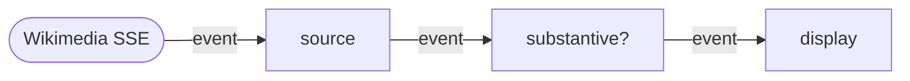

# Live edits over a stream

Tutorial 01 drove a graph at the browser's animation-frame rate. The
clock said "go" 60 times a second, every actor woke up, the canvas
got painted. That is one shape of reactive work.

The other shape is **data arriving when it arrives**. A WebSocket
push, a Server-Sent Events feed, a `fetch` whose body keeps streaming
after the response headers land. The graph still runs only when its
inputs change, but the trigger is the network instead of the clock.

This tutorial wires a Reflow graph to Wikimedia's public stream of
Wikipedia edits. As people edit articles, the graph filters and
displays them. No animation frame, no polling, no `setInterval`. The
network drives the graph.

## What we are building



Three actors. `source` opens an `EventSource` to Wikimedia and emits
each parsed JSON event. `filter` keeps only edits to en.wikipedia
articles by humans whose byte-delta is at least ±200 (skip stubs and
typo fixes). `display` puts each surviving event at the top of a
list on the page.

If you have ever written `fetch().then(r => r.body.getReader())` or
`new EventSource(url)`, you know the input shape already.

## Setup

One file in any directory.

```html
<!doctype html>
<meta charset="utf-8">
<title>Live Wikipedia edits</title>
<style>
  body { margin: 0; background: #0b1020; color: #c9d2e6;
         font: 14px/1.5 system-ui; padding: 24px 32px; }
  ol { list-style: none; padding: 0; max-width: 720px; }
  li { padding: 8px 12px; margin: 6px 0; background: #131a30; border-radius: 4px; }
</style>
<ol id="feed"></ol>

<script type="module">
import { ready, Network, Actor, Message }
  from "https://esm.sh/@offbit-ai/reflow";

await ready();
// the rest goes here
</script>
```

The Wikimedia stream is public and CORS-friendly, so the page does
not need a server beyond a static file server.

## The actors

### Source

The interesting one. Owns an `EventSource` and bridges it into the
graph. The bridge is an internal queue: events arrive whenever the
network pushes them, but the actor only fires `ctx.send` when the
runtime calls `run(ctx)`.

```js
class Source extends Actor {
  static inports = ["_trigger"];
  static outports = ["event"];

  constructor(url) {
    super();
    this.queue = [];
    this.resume = null;
    const es = new EventSource(url);
    es.addEventListener("message", (e) => {
      try {
        this.queue.push(JSON.parse(e.data));
        this.resume?.();
        this.resume = null;
      } catch { /* drop malformed lines */ }
    });
  }

  run(ctx) {
    const send = () => {
      ctx.send({ event: Message.object(this.queue.shift()) });
      ctx.done();
    };
    if (this.queue.length) send();
    else this.resume = send;
  }
}
```

The `_trigger` inport is the same kick we used in tutorial 01 for the
clock — actors with no upstream data dependency declare it so the
runtime has a port to deliver the first `Flow` packet to.

Two run states. If the queue has events, fire one and move on. If the
queue is empty, park the run by stashing the continuation in
`this.resume`; the next inbound EventSource message resumes it.

That pattern — actor-as-source-with-queue — is the canonical way to
plug any push-based input (sockets, EventSource, observers, native
events) into a Reflow graph. The runtime decides how fast to drain
the queue based on what is downstream. If `display` is slow, the
queue grows; the rest of the graph does not stall.

### Filter

A pure transform. Receives an event, checks a predicate, forwards if
it passes.

```js
class Filter extends Actor {
  static inports = ["event"];
  static outports = ["event"];

  constructor(predicate) { super(); this.predicate = predicate; }

  run(ctx) {
    const event = ctx.input.event?.data;
    if (event && this.predicate(event)) {
      ctx.send({ event: Message.object(event) });
    }
    ctx.done();
  }
}
```

The predicate is injected at construction time, which keeps the actor
generic. The same `Filter` class can sit in any pipeline.

### Display

Renders. Each event becomes one `<li>` at the top of the list. Old
entries fade and the list caps at 50.

```js
class Display extends Actor {
  static inports = ["event"];
  static outports = [];

  constructor(list, max = 50) {
    super();
    this.list = list;
    this.max = max;
  }

  run(ctx) {
    const e = ctx.input.event?.data;
    if (e) {
      const li = document.createElement("li");
      const delta = (e.length?.new ?? 0) - (e.length?.old ?? 0);
      li.textContent = `${delta >= 0 ? "+" : ""}${delta}  ${e.title}  — ${e.user}`;
      this.list.prepend(li);
      while (this.list.children.length > this.max) this.list.lastChild.remove();
    }
    ctx.done();
  }
}
```

Same pattern as the `Draw` actor in tutorial 01. The DOM is the
side-effect target; the rest of the graph does not know it exists.

## Wiring

```js
const STREAM = "https://stream.wikimedia.org/v2/stream/recentchange";

const substantive = (e) =>
  e.wiki === "enwiki" &&
  e.namespace === 0 &&
  !e.bot &&
  Math.abs((e.length?.new ?? 0) - (e.length?.old ?? 0)) >= 200;

const net = new Network();

net.addNode("source",  "tpl_wikipedia_source");
net.addNode("filter",  "tpl_substantive");
net.addNode("display", "tpl_display");

net.addConnection("source", "event", "filter",  "event");
net.addConnection("filter", "event", "display", "event");

net.registerActor("tpl_wikipedia_source", new Source(STREAM));
net.registerActor("tpl_substantive",      new Filter(substantive));
net.registerActor("tpl_display",          new Display(document.getElementById("feed")));

net.addInitial("source", "_trigger", Message.flow());
await net.start();
```

The `addInitial` line wakes the source so it can do its first run and
park on `this.resume`. After that the EventSource drives every
subsequent tick. No clock, no mouse, no `requestAnimationFrame`. The
graph is dormant until the network pushes another event.

## Run it

```sh
npx serve .
```

Open the page. Within a few seconds, substantive edits will start
scrolling in. Some are vandalism, most are real work. Click a title
to open the article.

The full example for this tutorial lives at
[sdk/node/examples/tutorial-02-live-edits](https://github.com/offbit-ai/reflow/tree/main/sdk/node/examples/tutorial-02-live-edits)
in the repo, with a slightly nicer style sheet and per-row links.

## What changed from tutorial 01

In tutorial 01 the leftmost actor was a clock — a self-pacing source.
Here the leftmost actor is an EventSource bridge — a network-paced
source. The graph shape and the wiring are the same. What changes is
**who decides when to fire**.

That is the whole point of the actor model carrying its own pacing
information. A clock-driven source picks 60 Hz. A network-driven
source picks "whenever the upstream sends." A user-driven source
picks "whenever a click happens." Each is a different actor; each
slots into the same kind of graph.

If you swap the predicate, the same code shows you whatever subset of
the firehose interests you. Drop the `enwiki` check and you see every
language. Drop the `namespace === 0` check and you see talk-page
arguments and meta edits. Add `e.user.includes("bot")` and you see
only bots. The graph, the actors, the imports — none of it changes.

## What is next

The next post moves languages. We will build a Python tutorial pairing
Reflow with LangGraph: a video summary tool whose deterministic data
work is a Reflow flow, called from inside an LLM agent. The runtime
is the same Rust core; the SDK is what changes.
