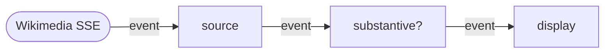

# Live edits over a stream

Tutorial 01 paced a graph at the browser's animation-frame rate.
This one drives a graph from inbound network data — Wikimedia's
public Server-Sent Events feed of Wikipedia edits. Same actor model,
the trigger comes from outside instead of from a local clock.

<iframe src="../../embeds/tutorial-02-live-edits/" loading="lazy"
        style="width:100%;height:480px;border:1px solid #2a3045;border-radius:6px;background:#0b1020;"
        title="Live Wikipedia edits demo"></iframe>

## What we are building



Three actors:

- `source` opens an `EventSource` to Wikimedia and emits each parsed
  JSON event.
- `filter` keeps edits to en.wikipedia articles by humans whose
  byte-delta is at least ±200 (skip stubs and typo fixes).
- `display` puts each surviving event at the top of a list on the
  page.

## Setup

One file in any directory:

```html
<!doctype html>
<meta charset="utf-8">
<title>Live Wikipedia edits</title>
<style>
  body { margin: 0; background: #0b1020; color: #c9d2e6;
         font: 14px/1.5 system-ui; padding: 24px 32px; }
  ol { list-style: none; padding: 0; max-width: 720px; }
  li { padding: 8px 12px; margin: 6px 0; background: #131a30; border-radius: 4px; }
</style>
<ol id="feed"></ol>

<script type="module">
import { ready, Network, Actor, Message }
  from "https://esm.sh/@offbit-ai/reflow";

await ready();
// the rest goes here
</script>
```

The Wikimedia stream serves CORS-permissive headers, so a static
file server is enough.

## The actors

### Source

Owns an `EventSource` and bridges it into the graph via an internal
queue. Events arrive whenever the network pushes them; the actor
emits one per `run(ctx)` call.

```js
class Source extends Actor {
  static inports = ["tick"];
  static outports = ["tick", "event"];

  constructor(url) {
    super();
    this.queue = [];
    this.resume = null;
    const es = new EventSource(url);
    es.addEventListener("message", (e) => {
      try {
        this.queue.push(JSON.parse(e.data));
        this.resume?.();
        this.resume = null;
      } catch { /* drop malformed lines */ }
    });
  }

  run(ctx) {
    const send = () => {
      ctx.send({
        event: Message.object(this.queue.shift()),
        tick:  Message.flow(),
      });
      ctx.done();
    };
    if (this.queue.length) send();
    else this.resume = send;
  }
}
```

The `tick` outport is wired back to the `tick` inport (set up
below), so each successful `run` schedules the next one. We seed
the loop with one initial `Flow` on `tick` at startup.

Two run states. If the queue has events, drain one and emit a fresh
`tick`. If the queue is empty, park the run by stashing the
continuation in `this.resume`; the next inbound EventSource message
calls it. The packed `send({event, tick})` keeps the self-loop alive.

This pattern — actor-as-source with a queue and a `tick` self-loop —
plugs any push-based input (sockets, EventSource, observers, native
events) into a Reflow graph. The runtime drains the queue at the
rate downstream consumers can keep up with. If `display` falls
behind, the queue grows; the rest of the graph keeps running.

### Filter

A pure transform. Receives an event, checks a predicate, forwards if
it passes.

```js
class Filter extends Actor {
  static inports = ["event"];
  static outports = ["event"];

  constructor(predicate) { super(); this.predicate = predicate; }

  run(ctx) {
    const event = ctx.input.event?.data;
    if (event && this.predicate(event)) {
      ctx.send({ event: Message.object(event) });
    }
    ctx.done();
  }
}
```

The predicate is injected at construction. The same `Filter` class
works in any pipeline.

### Display

Renders. Each event becomes one `<li>` at the top of the list,
capped at 50 entries.

```js
class Display extends Actor {
  static inports = ["event"];
  static outports = [];

  constructor(list, max = 50) {
    super();
    this.list = list;
    this.max = max;
  }

  run(ctx) {
    const e = ctx.input.event?.data;
    if (e) {
      const li = document.createElement("li");
      const delta = (e.length?.new ?? 0) - (e.length?.old ?? 0);
      li.textContent = `${delta >= 0 ? "+" : ""}${delta}  ${e.title}  — ${e.user}`;
      this.list.prepend(li);
      while (this.list.children.length > this.max) this.list.lastChild.remove();
    }
    ctx.done();
  }
}
```

## Wiring

```js
const STREAM = "https://stream.wikimedia.org/v2/stream/recentchange";

const substantive = (e) =>
  e.wiki === "enwiki" &&
  e.namespace === 0 &&
  !e.bot &&
  Math.abs((e.length?.new ?? 0) - (e.length?.old ?? 0)) >= 200;

const net = new Network();

net.addNode("source",  "tpl_wikipedia_source");
net.addNode("filter",  "tpl_substantive");
net.addNode("display", "tpl_display");

net.addConnection("source", "tick",  "source",  "tick");    // self-loop
net.addConnection("source", "event", "filter",  "event");
net.addConnection("filter", "event", "display", "event");

net.registerActor("tpl_wikipedia_source", new Source(STREAM));
net.registerActor("tpl_substantive",      new Filter(substantive));
net.registerActor("tpl_display",          new Display(document.getElementById("feed")));

net.addInitial("source", "tick", Message.flow());
await net.start();
```

`addInitial` wakes the source for its first run; the EventSource
drives everything after that.

## Run it

```sh
npx serve .
```

Open the page. Substantive edits scroll in within a few seconds.
Click a title to open the article.

The full runnable example is at
[sdk/node/examples/tutorial-02-live-edits](https://github.com/offbit-ai/reflow/tree/main/sdk/node/examples/tutorial-02-live-edits).

## Notes on the design

- The graph topology is identical to a clock-driven graph; only
  the source actor changes. A user-driven source (click handler
  feeding a queue) follows the same shape.
- Swapping the predicate changes what surfaces. Drop `enwiki` to
  see every language; drop `namespace === 0` to include talk pages;
  add `e.user.includes("bot")` to watch bots. No other code changes.

## What is next

The next tutorial moves to Python. Reflow runs three LLM agents in
parallel against a local Ollama model and a synthesizer combines
their findings — same actor primitives, server-side, with streaming
output through the graph.
