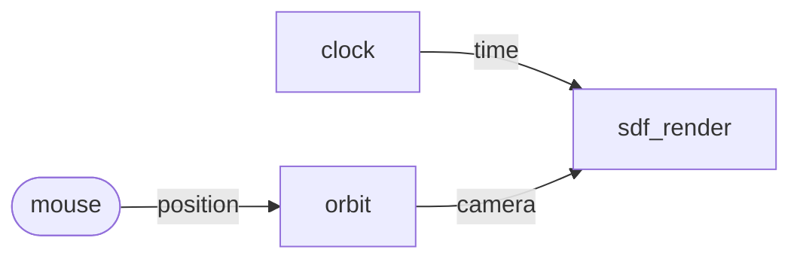

# WebGPU SDF in the browser

Tutorial 01 painted 200 dots with `canvas.getContext("2d")`. This one
keeps the same graph shape but swaps the renderer for **a custom
WebGPU actor**. A ray-marched signed-distance-field scene that
responds to your mouse, drawn straight to the canvas swap chain. Same
HTML-file shape. Same Reflow runtime. The Draw actor is the only
thing that changes.

The point of this tutorial is to show that a graph node can own
arbitrary GPU work. You do not need a pack, a build step, or anything
beyond what the browser already gives you. The actor pattern is a
container; what goes inside is up to you.

## What we are building



Three actors and one DOM event source. Two of them are nearly
identical to tutorial 01 — `clock` ticks once per animation frame,
the mouse is read off `mousemove`. The new piece is `orbit`, which
turns mouse coordinates into spherical camera coordinates, and
`sdf_render`, which owns a WebGPU pipeline and ray-marches an SDF
scene every frame.

## Setup

One file again. Pick any directory.

```html
<!doctype html>
<meta charset="utf-8">
<title>WebGPU SDF</title>
<style>
  body { margin: 0; background: #0b1020; }
  canvas { display: block; }
</style>
<canvas id="stage"></canvas>

<script type="module">
import { ready, Network, Actor, Message, bindInputEvents }
  from "https://esm.sh/@offbit-ai/reflow";

await ready();
// the rest goes here
</script>
```

WebGPU ships in Chrome 113+, Edge, and Safari Technology Preview.
Firefox is behind a flag at the time of writing. If `navigator.gpu`
is missing, bail out early so the user gets a useful message.

```js
if (!navigator.gpu) {
  document.body.textContent = "WebGPU is not enabled in this browser.";
  throw new Error("no webgpu");
}
```

## WebGPU initialisation

WebGPU init lives **outside** the graph. We need an adapter, a
device, a configured canvas context. Then we can pass the device into
the actor that uses it.

```js
const canvas = document.getElementById("stage");
canvas.width = innerWidth;
canvas.height = innerHeight;

const adapter = await navigator.gpu.requestAdapter();
const device  = await adapter.requestDevice();
const ctx     = canvas.getContext("webgpu");
const format  = navigator.gpu.getPreferredCanvasFormat();
ctx.configure({ device, format, alphaMode: "premultiplied" });
```

That is the whole WebGPU side of the boilerplate. Everything below is
Reflow.

## The actors

### Clock

Identical to tutorial 01, minus the `dt` port we no longer need.

```js
class Clock extends Actor {
  static inports = [];
  static outports = ["time"];
  constructor() { super(); this.t0 = performance.now(); }
  run(c) {
    c.send({ time: Message.float((performance.now() - this.t0) / 1000) });
    requestAnimationFrame(() => c.done());
  }
}
```

### Orbit

Maps mouse coordinates to camera position on a sphere of radius 4.5
around the scene origin. Holds the last yaw and pitch so a tick
without a fresh mouse event still produces a camera.

```js
class MouseOrbit extends Actor {
  static inports = ["position"];
  static outports = ["camera"];
  constructor() {
    super();
    this.yaw = 0.6;
    this.pitch = 0.3;
  }
  run(c) {
    const p = c.input.position?.data;
    if (p) {
      this.yaw   = (p.x / innerWidth)  * Math.PI * 2;
      this.pitch = (p.y / innerHeight) * (Math.PI * 0.45) - (Math.PI * 0.1);
    }
    const r = 4.5;
    c.send({ camera: Message.object({
      x: r * Math.cos(this.pitch) * Math.cos(this.yaw),
      y: r * Math.sin(this.pitch),
      z: r * Math.cos(this.pitch) * Math.sin(this.yaw),
    }) });
    c.done();
  }
}
```

### SdfRender

The substantive new actor. Takes ownership of a render pipeline at
construction time, then runs it every tick. The whole shader is one
string of WGSL embedded in JS.

```js
class SdfRender extends Actor {
  static inports = ["time", "camera"];
  static outports = [];

  constructor(device, ctx, format, canvas) {
    super();
    this.device = device;
    this.ctx = ctx;
    this.canvas = canvas;
    const module = device.createShaderModule({ code: SHADER });
    this.pipeline = device.createRenderPipeline({
      layout: "auto",
      vertex:   { module, entryPoint: "vs" },
      fragment: { module, entryPoint: "fs", targets: [{ format }] },
      primitive:{ topology: "triangle-list" },
    });
    this.uniformBuf = device.createBuffer({
      size: 32, usage: GPUBufferUsage.UNIFORM | GPUBufferUsage.COPY_DST,
    });
    this.bindGroup = device.createBindGroup({
      layout: this.pipeline.getBindGroupLayout(0),
      entries: [{ binding: 0, resource: { buffer: this.uniformBuf } }],
    });
    this.uniforms = new Float32Array(8);
  }

  run(c) {
    const t = c.input.time?.data ?? 0;
    const cam = c.input.camera?.data ?? { x: 3, y: 2, z: 4 };
    this.uniforms.set([t, cam.x, cam.y, cam.z, this.canvas.width, this.canvas.height, 0, 0]);
    this.device.queue.writeBuffer(this.uniformBuf, 0, this.uniforms);

    const enc = this.device.createCommandEncoder();
    const pass = enc.beginRenderPass({
      colorAttachments: [{
        view: this.ctx.getCurrentTexture().createView(),
        clearValue: { r: 0, g: 0, b: 0, a: 1 },
        loadOp: "clear", storeOp: "store",
      }],
    });
    pass.setPipeline(this.pipeline);
    pass.setBindGroup(0, this.bindGroup);
    pass.draw(3);
    pass.end();
    this.device.queue.submit([enc.finish()]);
    c.done();
  }
}
```

The constructor pays for the pipeline once. `run(ctx)` only writes
fresh uniform values and submits one draw call. That distinction
matters: keeping pipeline objects alive between ticks is what makes a
60 fps animation cheap. The actor's identity in the graph is the
identity of its GPU resources.

### The shader

A small WGSL fragment program that ray-marches a smooth-union of a
sphere and a box, with a slow time-varying twist. The structure is
the same the GPU pack uses on the native side, just hand-written
instead of generated.

```wgsl
fn smin(a: f32, b: f32, k: f32) -> f32 { /* smooth-min */ }
fn opTwist(p: vec3f, k: f32) -> vec3f  { /* rotate around y by k*p.y */ }
fn sdSphere(p: vec3f, r: f32) -> f32   { return length(p) - r; }
fn sdBox(p: vec3f, b: vec3f) -> f32    { /* axis-aligned box */ }

fn scene(p: vec3f) -> f32 {
  let q = opTwist(p, 0.6 + 0.3*sin(u.time*0.4));
  let s = sdSphere(q - vec3f(0.6, 0.3, 0.0), 0.8);
  let b = sdBox(q,                            vec3f(0.55));
  return smin(s, b, 0.45);
}

@fragment fn fs(@builtin(position) frag: vec4f) -> @location(0) vec4f {
  // ray-march loop, normal estimate, simple shading
}
```

The full file is in the example. Ray-marching SDFs is its own
subject; the whole point of putting it inside an actor is so the
graph does not have to know any of it.

## Wiring

Same shape as tutorial 01, fewer connections.

```js
const net = new Network();

net.addNode("clock",  "tpl_clock");
net.addNode("mouse",  "tpl_mouse_input");
net.addNode("orbit",  "tpl_mouse_orbit");
net.addNode("render", "tpl_sdf_render");

net.addConnection("clock", "time",     "render", "time");
net.addConnection("mouse", "position", "orbit",  "position");
net.addConnection("orbit", "camera",   "render", "camera");

net.registerActor("tpl_clock",       new Clock());
net.registerActor("tpl_mouse_orbit", new MouseOrbit());
net.registerActor("tpl_sdf_render",  new SdfRender(device, ctx, format, canvas));

bindInputEvents(net, document.body);
await net.start();
```

`SdfRender` is constructed with the device and canvas context the
init code produced. The other two actors take no constructor
arguments because they have no GPU dependencies.

## Run it

```sh
npx serve .
```

Open the page. Move the mouse. The camera orbits, the scene twists in
time with the clock. Resize the window and reload — the actor reads
the new resolution from its uniforms.

The full example for this tutorial lives at
[sdk/node/examples/tutorial-02-sdf-canvas](https://github.com/offbit-ai/reflow/tree/main/sdk/node/examples/tutorial-02-sdf-canvas)
in the repo.

## What changed from tutorial 01

Look at the wiring side by side. Same node count. Same `clock`. Same
mouse story. Same `bindInputEvents`. Same `net.start()`. The only
file that changes is the renderer.

That is the actor model paying you back. The SDK does not care that
one actor uses canvas2d and another talks to WebGPU. As long as the
ports match, the graph composes.

You can take this further from here. Add a post-process actor that
runs a second render pipeline reading the SDF render's output as a
texture. Add an ML actor (once that pack lands in browser) that
classifies the rendered scene every N frames. Add a record-and-replay
node that snapshots the camera stream so you can play back interesting
shots.

Each of those is a new actor and a new connection. The thing already
on screen does not have to change.

## What is next

The next post moves languages. We will build a Python tutorial pairing
Reflow with LangGraph: a video summary tool whose deterministic data
work is a Reflow flow, called from inside an LLM agent. The runtime
is the same Rust core; the SDK is what changes.
