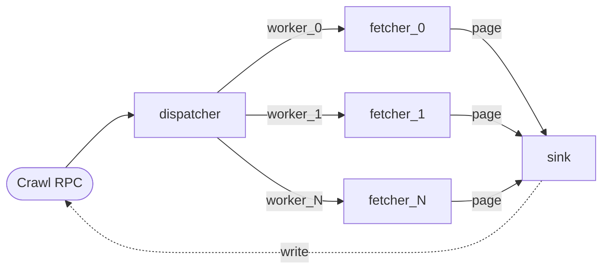

# A concurrent worker pool over gRPC (Go)

A long-running gRPC server with one server-streaming RPC. Each call
spins up a fresh Reflow network laid out as a worker pool — a
dispatcher fans URLs across N fetcher actors, results fan back into
a single sink, the sink writes to the gRPC stream. The canonical
`goroutines + channels` fetcher pool, expressed as a graph.

## What this replaces

The vanilla Go version of this tutorial would be roughly:

```go
func crawl(urls []string, n int) <-chan Page {
    work    := make(chan string, len(urls))
    results := make(chan Page, len(urls))
    var wg sync.WaitGroup
    for i := 0; i < n; i++ {
        wg.Add(1)
        go func() {
            defer wg.Done()
            for url := range work { results <- fetch(url) }
        }()
    }
    for _, u := range urls { work <- u }
    close(work)
    go func() { wg.Wait(); close(results) }()
    return results
}
```

The pieces are familiar: bounded channels, a work generator, N
worker goroutines, a `WaitGroup`, a closer goroutine. Lifecycle,
backpressure, and dispatch are all manual; an unhandled panic or an
unclosed channel turns into a goroutine leak.

The Reflow version is a graph:



Backpressure is built into every connector. Cancellation is one
`net.Close()`. Worker count is `N`, and adding a worker is one
`AddNode` plus two `AddConnection`s.

## Prerequisites

Get the Go SDK and the matching C ABI shared library it loads via cgo:

```sh
go get github.com/offbit-ai/reflow/sdk/go@v0.2.5
cd "$(go env GOMODCACHE)/github.com/offbit-ai/reflow/sdk/go@v0.2.5"
./scripts/install_lib.sh v0.2.5
```

`install_lib.sh` pulls a prebuilt `libreflow_rt_capi` for your
platform from the matching [GitHub Release](https://github.com/offbit-ai/reflow/releases?q=sdk%2Fgo)
and drops it where cgo can find it. No Rust toolchain required.

The example ships pre-generated protobuf stubs. Regenerate them
if you edit `proto/search.proto`:

```sh
go install google.golang.org/protobuf/cmd/protoc-gen-go@v1.34.2
go install google.golang.org/grpc/cmd/protoc-gen-go-grpc@v1.5.1
protoc --go_out=. --go_opt=paths=source_relative \
       --go-grpc_out=. --go-grpc_opt=paths=source_relative \
       proto/search.proto
```

## The proto

```proto
service Crawler {
  rpc Crawl (CrawlRequest) returns (stream Page);
}

message CrawlRequest { repeated string urls = 1; uint32 workers = 2; }
message Page         { string url = 1; uint32 status = 2;
                       string title = 3; uint64 bytes = 4;
                       uint64 took_ms = 5; }
```

Server-streaming. Client sends a list of URLs; server streams back
one `Page` per fetched result.

## Dispatcher

Reads the URL list from its `urls` inport and round-robins each URL
onto one of `N` outports (`worker_0`, `worker_1`, …). Different
load policies — hash-by-host, send-to-idle — are one method away.

```go
type Dispatcher struct {
    reflow.BaseActor
    workers int
}

func NewDispatcher(workers int) *Dispatcher {
    out := make([]string, workers)
    for i := range out {
        out[i] = fmt.Sprintf("worker_%d", i)
    }
    return &Dispatcher{
        BaseActor: reflow.BaseActor{
            ComponentName: "dispatcher",
            InportsList:   []string{"urls"},
            OutportsList:  out,
        },
        workers: workers,
    }
}

func (d *Dispatcher) Run(ctx *reflow.ActorContext) error {
    raw, ok := ctx.Input("urls").Data()
    if !ok {
        return fmt.Errorf("dispatch: missing urls")
    }
    var urls []string
    if err := json.Unmarshal(raw, &urls); err != nil {
        return err
    }
    for i, u := range urls {
        port := fmt.Sprintf("worker_%d", i%d.workers)
        if err := ctx.Emit(port, reflow.MessageString(u)); err != nil {
            return err
        }
    }
    return nil
}
```

`ctx.Input("urls").Data()` is the unwrapped payload — bare JSON
without the `{type, data}` envelope, so `json.Unmarshal` lands
straight in `[]string`. Use `AsJSON()` instead when you actually
want the tagged form (e.g. to round-trip through `MessageFromJSON`).

`ctx.Emit(port, msg)` flushes immediately to the named outport.
Reflow's connector model is broadcast — every connector from a
source fires for every packet on that source's outport — so to
*route* (one URL → one worker), the dispatcher gives each worker
its own outport and emits explicitly.

## Fetcher

One template, many node instances. Each instance has its own
goroutine inside the runtime and an independent inport channel, so
fetches happen concurrently with no shared state.

```go
type Fetcher struct {
    reflow.BaseActor
    client *http.Client
}

func NewFetcher() *Fetcher {
    return &Fetcher{
        BaseActor: reflow.BaseActor{
            ComponentName: "fetcher",
            InportsList:   []string{"url"},
            OutportsList:  []string{"page"},
        },
        client: &http.Client{Timeout: 10 * time.Second},
    }
}

var titleRe = regexp.MustCompile(`(?is)<title[^>]*>(.*?)</title>`)

func (f *Fetcher) Run(ctx *reflow.ActorContext) error {
    url, _ := ctx.Input("url").AsString()
    t0 := time.Now()
    page := map[string]any{
        "url": url, "status": uint32(0), "title": "",
        "bytes": uint64(0), "took_ms": uint64(0),
    }
    defer func() {
        page["took_ms"] = uint64(time.Since(t0).Milliseconds())
        msg, _ := reflow.MessageObject(page)
        _ = ctx.Emit("page", msg)
    }()
    req, err := http.NewRequest("GET", url, nil)
    if err != nil {
        page["title"] = err.Error(); return nil
    }
    req.Header.Set("User-Agent", "reflow-tutorial-04/0.2 (https://github.com/offbit-ai/reflow)")
    resp, err := f.client.Do(req)
    if err != nil {
        page["title"] = err.Error()
        return nil
    }
    defer resp.Body.Close()
    page["status"] = uint32(resp.StatusCode)
    body, err := io.ReadAll(io.LimitReader(resp.Body, 256*1024))
    if err != nil {
        page["title"] = err.Error()
        return nil
    }
    page["bytes"] = uint64(len(body))
    if m := titleRe.FindSubmatch(body); m != nil {
        page["title"] = strings.TrimSpace(string(m[1]))
    }
    return nil
}
```

The `defer` ensures every input — successful or errored — produces
exactly one `page` packet, so the sink can count completions.

## Sink

Holds the gRPC stream handle. Counts completions and signals the
handler when all expected pages have been sent.

```go
type Sink struct {
    reflow.BaseActor
    stream pb.Crawler_CrawlServer
    want   int
    got    int
    done   chan error
}

func NewSink(stream pb.Crawler_CrawlServer, want int) *Sink {
    return &Sink{
        BaseActor: reflow.BaseActor{
            ComponentName: "sink",
            InportsList:   []string{"page"},
        },
        stream: stream,
        want:   want,
        done:   make(chan error, 1),
    }
}

func (s *Sink) Run(ctx *reflow.ActorContext) error {
    raw, ok := ctx.Input("page").Data()
    if !ok { return nil }
    var p struct {
        URL string `json:"url"`; Status uint32 `json:"status"`
        Title string `json:"title"`; Bytes uint64 `json:"bytes"`
        TookMs uint64 `json:"took_ms"`
    }
    json.Unmarshal(raw, &p)
    if err := s.stream.Send(&pb.Page{
        Url: p.URL, Status: p.Status, Title: p.Title,
        Bytes: p.Bytes, TookMs: p.TookMs,
    }); err != nil {
        select { case s.done <- err: default: }
        return nil
    }
    s.got++
    if s.got >= s.want {
        select { case s.done <- nil: default: }
    }
    return nil
}
```

## The handler

One Reflow network per call. Every per-request resource — actors,
goroutines, channels — lives inside the network. `defer rnet.Close()`
tears it all down regardless of how the handler returns.

```go
func (s *server) Crawl(req *pb.CrawlRequest, stream pb.Crawler_CrawlServer) error {
    workers := int(req.Workers)
    if workers == 0 { workers = 4 }

    rnet := reflow.NewNetwork()
    defer rnet.Close()

    dispatcher := NewDispatcher(workers)
    sink := NewSink(stream, len(req.Urls))

    rnet.RegisterGoActor("tpl_dispatcher", dispatcher)
    rnet.RegisterGoActor("tpl_fetcher",    NewFetcher())
    rnet.RegisterGoActor("tpl_sink",       sink)

    rnet.AddNode("dispatch", "tpl_dispatcher", nil)
    rnet.AddNode("collect",  "tpl_sink",       nil)
    for i := 0; i < workers; i++ {
        id := fmt.Sprintf("fetcher_%d", i)
        rnet.AddNode(id, "tpl_fetcher", nil)
        rnet.AddConnection("dispatch", fmt.Sprintf("worker_%d", i), id, "url")
        rnet.AddConnection(id, "page", "collect", "page")
    }

    rnet.AddInitial("dispatch", "urls", map[string]any{
        "type": "Array", "data": req.Urls,
    })

    if err := rnet.Start(); err != nil { return err }

    select {
    case err := <-sink.done:
        return err
    case <-stream.Context().Done():
        return stream.Context().Err()
    }
}
```

Two arms in the `select`. `sink.done` fires when every URL has been
sent or the stream has rejected a write. `stream.Context().Done()`
fires when the gRPC client cancels or the deadline expires. Either
arm returns; `defer rnet.Close()` cleans up.

Bumping the worker count from 4 to 16 is `req.Workers = 16` — the
dispatcher routes accordingly, the runtime spawns 16 fetcher tasks.
No `WaitGroup` resizing, no buffered-channel capacity tuning.

## Run it

```sh
# server (terminal 1)
cd sdk/go/examples/tutorial-04-grpc-search/server
go run .

# client (terminal 2)
cd sdk/go/examples/tutorial-04-grpc-search/client
go run . \
  https://en.wikipedia.org/wiki/Flow-based_programming \
  https://en.wikipedia.org/wiki/Actor_model \
  https://en.wikipedia.org/wiki/Dataflow_programming
```

Output:

```
 105ms  200  Actor model - Wikipedia                              https://en.wikipedia.org/wiki/Actor_model
 114ms  200  Dataflow programming - Wikipedia                     https://en.wikipedia.org/wiki/Dataflow_programming
 201ms  200  Flow-based programming - Wikipedia                   https://en.wikipedia.org/wiki/Flow-based_programming
```

Pages arrive interleaved with fetch latency, not in submission
order — proof the pool is doing its job.

## Notes on the design

- Worker pool. N nodes referencing the same `tpl_fetcher` template,
  each with its own goroutine. Size is `len(req.Urls)` aware via
  `req.Workers`; one config field, no channel-capacity ceremony.
- Routing policy. Round-robin lives in the dispatcher's `Run`. Hash
  by host, sticky session, send-to-idle — replace those few lines.
- Backpressure. Every connector is a bounded flume channel. A slow
  sink throttles the fetchers automatically.
- Cancellation. `defer rnet.Close()` is the entire teardown path.
  No `errgroup`, no goroutine bookkeeping. `stream.Context()`
  cancels propagate through the network when the handler returns.
- Mixed actors. The catalog gives you HTTP, JSON parse, file I/O,
  triggers — drop them in alongside Go actors when the work is
  generic enough.

## What is next

The next post takes the same per-request pattern to the JVM and
wires a Reflow flow into a Micronaut service.
