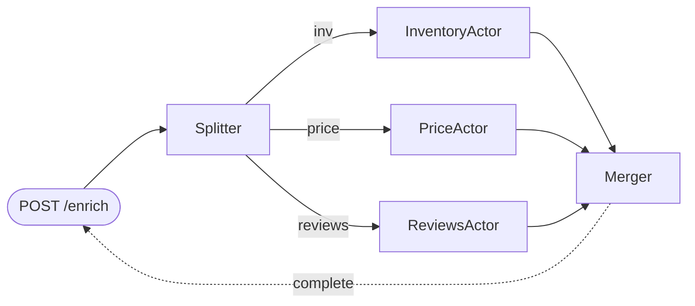

# Parallel data enrichment behind a Spring Boot endpoint (Java)

A REST service that enriches a product SKU by fanning out to three
slow downstream services in parallel, joining the results, and
returning a merged JSON payload. Per-request Reflow network — same
shape as [tutorial 04](04-grpc-service.md), different convergence
point: where the Go gRPC tutorial fans *out* into a streaming
response, this one fans *out and back in* into a single response.

## What this replaces

The vanilla Spring version is the standard `CompletableFuture`
chain:

```java
@PostMapping("/enrich")
public Map<String, Object> enrich(@RequestBody EnrichRequest req) {
    var inv     = CompletableFuture.supplyAsync(() -> inventory(req.sku()));
    var price   = CompletableFuture.supplyAsync(() -> price(req.sku()));
    var reviews = CompletableFuture.supplyAsync(() -> reviews(req.sku()));
    CompletableFuture.allOf(inv, price, reviews).join();
    return Map.of(
        "inventory", inv.join(),
        "price",     price.join(),
        "reviews",   reviews.join());
}
```

It works. But every dependency is implicit in the `allOf` argument
list, the executor is pulled from somewhere — usually the common
ForkJoinPool, which is the wrong choice for blocking I/O — and
adding a fourth service means editing four places.

The Reflow version is a graph:



`Merger` declares `awaitAllInports = true` — it fires once when each
distinct inport has a packet. That's Reflow's `allOf().join()`.
Adding a fourth service is one `AddNode` and two `AddConnection`s.
Backpressure is automatic on every edge.

## Prerequisites

Java 17+ and Gradle. Add the JVM SDK as a Maven dependency — the
published artifact bundles the native runtime for every supported
platform, no manual build:

```kotlin
// build.gradle.kts
plugins {
    java
    id("org.springframework.boot") version "3.3.5"
    id("io.spring.dependency-management") version "1.1.6"
}

dependencies {
    implementation("org.springframework.boot:spring-boot-starter-web")
    implementation("ai.offbit:reflow:0.2.7")
    testImplementation("org.springframework.boot:spring-boot-starter-test")
    testRuntimeOnly("org.junit.platform:junit-platform-launcher")
}
```

## Splitter

Reads the SKU and broadcasts it on three named outports — one per
downstream service. Reflow connectors are broadcast: every connector
from a source fires for every packet on that source's outport. To
*route* the same SKU to three different consumers we declare one
outport per consumer and emit on each.

```java
public class Splitter extends Actor {
    @Override public String component() { return "splitter"; }
    @Override public List<String> inports()  { return List.of("sku"); }
    @Override public List<String> outports() { return List.of("inv", "price", "reviews"); }

    @Override public void run(ActorCallContext ctx) {
        String sku = stripQuotes(ctx.inputDataJson("sku"));
        ctx.emit("inv",     Message.string(sku));
        ctx.emit("price",   Message.string(sku));
        ctx.emit("reviews", Message.string(sku));
        ctx.done();
    }
}
```

`ctx.inputDataJson("sku")` returns the bare JSON payload for the
named inport — a primitive scalar in JSON form (`"WIDGET-42"`),
ready to use without unwrapping the runtime's `{type, data}`
envelope. `stripQuotes` peels the JSON quoting off the string scalar.

## Service stubs

Three stand-ins for slow I/O. Each sleeps for a different duration so
the test can confirm the wall-clock dominator is the slowest branch
(220 ms), not the sum of all three (550 ms).

```java
public class InventoryActor extends Actor {
    @Override public String component() { return "inventory"; }
    @Override public List<String> inports()  { return List.of("sku"); }
    @Override public List<String> outports() { return List.of("out"); }

    @Override public void run(ActorCallContext ctx) {
        String sku = ctx.inputDataJson("sku");
        sleep(150);
        long stock = (long) (stripped(sku).length() * 7);
        String json = String.format("{\"sku\":%s,\"stock\":%d}", sku, stock);
        ctx.emit("out", Message.fromJson(
            "{\"type\":\"Object\",\"data\":" + json + "}"));
        ctx.done();
    }
}
```

`PriceActor` and `ReviewsActor` follow the same shape with different
sleeps and payload fields.

## Merger

Joins the three branches. `awaitAllInports = true` flips the
runtime's tick policy: instead of firing on any input, it waits
until every declared inport has a packet, then fires once. The
controller passes in a `CompletableFuture<String>`; completing it
signals the request handler to return.

```java
public class Merger extends Actor {
    private final CompletableFuture<String> done;

    public Merger(CompletableFuture<String> done) { this.done = done; }

    @Override public String component() { return "merger"; }
    @Override public List<String> inports()  {
        return List.of("inventory", "price", "reviews");
    }
    @Override public List<String> outports() { return List.of(); }
    @Override public boolean awaitAllInports() { return true; }

    @Override public void run(ActorCallContext ctx) {
        String inv     = ctx.inputDataJson("inventory");
        String price   = ctx.inputDataJson("price");
        String reviews = ctx.inputDataJson("reviews");
        String merged = String.format(
            "{\"inventory\":%s,\"price\":%s,\"reviews\":%s}",
            inv, price, reviews);
        done.complete(merged);
        ctx.done();
    }
}
```

`ctx.inputDataJson(port)` is the JVM SDK's per-port JSON accessor —
no need to scan the full `inputsJson()` envelope to find one branch's
data.

## The controller

One handler. Per-request network in a try-with-resources block —
when the response returns or the timeout fires, the network shuts
down cleanly. No shared state between requests.

```java
@RestController
public class EnrichController {

    public record EnrichRequest(String sku) {}

    @PostMapping(value = "/enrich",
                 consumes = MediaType.APPLICATION_JSON_VALUE,
                 produces = MediaType.APPLICATION_JSON_VALUE)
    public String enrich(@RequestBody EnrichRequest req) throws Exception {
        var done = new CompletableFuture<String>();

        try (var net = new Network()) {
            net.registerActor("tpl_split",   new Splitter());
            net.registerActor("tpl_inv",     new InventoryActor());
            net.registerActor("tpl_price",   new PriceActor());
            net.registerActor("tpl_reviews", new ReviewsActor());
            net.registerActor("tpl_merge",   new Merger(done));

            net.addNode("split",   "tpl_split");
            net.addNode("inv",     "tpl_inv");
            net.addNode("price",   "tpl_price");
            net.addNode("reviews", "tpl_reviews");
            net.addNode("merge",   "tpl_merge");

            net.addConnection("split", "inv",     "inv",     "sku");
            net.addConnection("split", "price",   "price",   "sku");
            net.addConnection("split", "reviews", "reviews", "sku");

            net.addConnection("inv",     "out", "merge", "inventory");
            net.addConnection("price",   "out", "merge", "price");
            net.addConnection("reviews", "out", "merge", "reviews");

            net.addInitial("split", "sku",
                "{\"type\":\"String\",\"data\":\"" + req.sku() + "\"}");
            net.start();

            return done.get(5, TimeUnit.SECONDS);
        }
    }
}
```

`Network` implements `AutoCloseable`, so the try-with-resources
wraps the whole graph lifecycle. `done.get(...)` blocks the request
thread until `Merger` completes the future or the timeout fires.

## Run it

```sh
cd sdk/jvm/examples/tutorial-05-spring-enrich
gradle bootRun

# in another terminal
curl -s localhost:8080/enrich \
  -H 'content-type: application/json' \
  -d '{"sku":"WIDGET-42"}' | jq
```

Output:

```json
{
  "inventory": {"sku": "WIDGET-42", "stock": 63},
  "price":     {"amount": 14.49, "currency": "USD", "sku": "WIDGET-42"},
  "reviews":   {"avg": 3.5, "count": 27, "sku": "WIDGET-42"}
}
```

The repo includes an `EnrichTest` that boots the full Spring context
via `@SpringBootTest` and asserts the merged response shape — covers
the full per-request lifecycle:

```sh
gradle test
```

## Notes on the design

- **Per-request lifecycle.** `try (var net = new Network())` makes
  the graph a request-scoped object. No process-wide actor
  state to clean up; no leaks between requests.
- **`awaitAllInports`.** The fan-in barrier. Unlike a
  `CompletableFuture.allOf` join, the merger doesn't have to know
  *how many* upstream sources there are — it just declares the
  ports it cares about, and the runtime tracks completion per
  inport.
- **Backpressure.** Every connector is a bounded channel. If you
  swap one of the stubs for a real downstream and the merger ends
  up faster than the network, the runtime throttles upstream
  automatically.
- **Adding a service.** One `AddNode`, two `AddConnection`s, one
  inport on the merger. The handler shape doesn't change.
- **Routing topology lives in the wiring.** The splitter is a
  template; you can change "fan to all three" to "hash by SKU
  prefix" by editing one method, no controller changes.

## What is next

The [next post](06-kafka-router.md) takes the same SDK to a
long-running shape: a Kafka stream router where the graph stays up
indefinitely, consuming from one topic and routing events into
N output topics by content.
