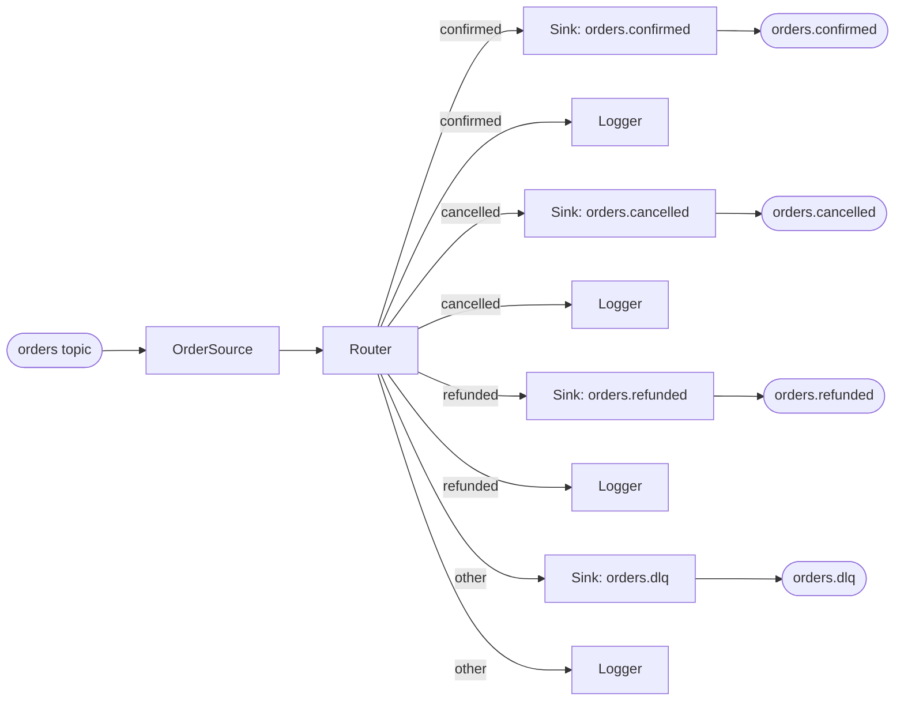

# A long-running Kafka stream router (Java)

A daemon that consumes events from one Kafka topic, routes each one
to a different output topic based on content, and stays up
indefinitely. Same SDK as [tutorial 05](05-spring-enrich.md), opposite
shape: where 05 spins up a fresh per-request graph and tears it
down, this one boots a single long-running graph at startup and
lets the Kafka poll loop drive ticks through it.



Each router outport feeds **two** downstream actors — a KafkaSink
and a Logger. Reflow connectors are broadcast: every connector from
a source fires for every packet on that source's outport, so
adding the logger doesn't take packets away from the sinks.

## What this replaces

Plain Kafka Streams would express this as a topology defined inside
a single `KafkaStreams` builder; routing is `KStream#branch` with
predicates compiled into the topology object. That works, but the
topology and the producers/consumers are coupled — the same
"split into N topics by content" shape on RabbitMQ, NATS, or in
front of a SQS-like service requires a different framework.

Reflow's wiring is independent of the transport. Swap `KafkaSink`
for an HTTP sink, an internal channel sink, or one of the built-in
catalog sinks; the routing topology doesn't change.

## Prerequisites

Java 17+. The published JVM SDK auto-loads the native runtime — no
separate cargo step:

```kotlin
// build.gradle.kts
plugins {
    java
    application
}

dependencies {
    implementation("ai.offbit:reflow:0.2.6")
    implementation("org.apache.kafka:kafka-clients:3.7.1")
    implementation("org.slf4j:slf4j-simple:2.0.13")
}

application {
    mainClass.set("ai.offbit.reflow.tutorial06.Tutorial06Application")
}
```

A local Kafka broker — KRaft, single-node — via
`docker compose up -d`:

```yaml
services:
  kafka:
    image: apache/kafka:3.7.1
    container_name: tut06-kafka
    ports: ["9092:9092"]
    environment:
      KAFKA_NODE_ID: 1
      KAFKA_PROCESS_ROLES: broker,controller
      KAFKA_LISTENERS: PLAINTEXT://0.0.0.0:9092,CONTROLLER://0.0.0.0:9093
      KAFKA_ADVERTISED_LISTENERS: PLAINTEXT://localhost:9092
      KAFKA_LISTENER_SECURITY_PROTOCOL_MAP: PLAINTEXT:PLAINTEXT,CONTROLLER:PLAINTEXT
      KAFKA_CONTROLLER_LISTENER_NAMES: CONTROLLER
      KAFKA_CONTROLLER_QUORUM_VOTERS: 1@localhost:9093
      KAFKA_INTER_BROKER_LISTENER_NAME: PLAINTEXT
      CLUSTER_ID: reflow-tut06-cluster
```

## OrderSource

A long-running consumer that publishes one Reflow message per
inbound record. Two things are different from any actor we've seen
so far in this series:

1. The actor declares a `_trigger` inport even though it has no
   upstream. Reflow's actor model is event-driven on input, so a
   pure source needs an initial `Flow` packet to schedule its
   first run. We add that initial in the network setup.
2. `run()` never returns. The Kafka poll loop runs indefinitely,
   and the actor publishes packets via `ctx.send(port, msg)` —
   not `ctx.emit`.

```java
public class OrderSource extends Actor {
    private final String bootstrap, topic, groupId;
    private volatile boolean stopped = false;

    public OrderSource(String bootstrap, String topic, String groupId) {
        this.bootstrap = bootstrap; this.topic = topic; this.groupId = groupId;
    }
    public void stop() { stopped = true; }

    @Override public String component() { return "order_source"; }
    @Override public List<String> inports()  { return List.of("_trigger"); }
    @Override public List<String> outports() { return List.of("order"); }

    @Override public void run(ActorCallContext ctx) {
        Properties p = new Properties();
        p.put(BOOTSTRAP_SERVERS_CONFIG, bootstrap);
        p.put(GROUP_ID_CONFIG, groupId);
        p.put(KEY_DESERIALIZER_CLASS_CONFIG, StringDeserializer.class.getName());
        p.put(VALUE_DESERIALIZER_CLASS_CONFIG, StringDeserializer.class.getName());
        p.put(AUTO_OFFSET_RESET_CONFIG, "earliest");

        try (KafkaConsumer<String, String> consumer = new KafkaConsumer<>(p)) {
            consumer.subscribe(List.of(topic));
            while (!stopped) {
                var records = consumer.poll(Duration.ofMillis(500));
                for (ConsumerRecord<String, String> r : records) {
                    ctx.send("order", Message.string(r.value()));
                }
            }
        }
        ctx.done();
    }
}
```

### Why `ctx.send`, not `ctx.emit`

`ctx.emit` accumulates packets in a HashMap that drains only when
`ctx.done()` fires. For an actor whose `run()` returns once per
tick that's the right model — it's the bulk-flush pattern. For a
*continuously-publishing* source whose `run()` never returns, emits
would sit in the buffer forever, never reaching downstream
connectors.

`ctx.send(port, msg)` writes straight to the outport channel,
bypassing the done() drain. It's how every long-running
source-actor pattern gets implemented across the SDKs (Python's
`ctx.send`, the new JVM `ctx.send` added in 0.2.6).

## Router

Inspects the order's status field and emits on the matching
outport. Routing policy is one method — swap status-based for
hash-by-customer, geo-by-region, etc., by editing `run()`.

```java
public class Router extends Actor {
    @Override public String component() { return "router"; }
    @Override public List<String> inports()  { return List.of("order"); }
    @Override public List<String> outports() {
        return List.of("confirmed", "cancelled", "refunded", "other");
    }

    @Override public void run(ActorCallContext ctx) {
        String body = stripQuotes(ctx.inputDataJson("order"));
        String status = extractStatus(body);
        String port = switch (status) {
            case "confirmed" -> "confirmed";
            case "cancelled" -> "cancelled";
            case "refunded"  -> "refunded";
            default          -> "other";
        };
        ctx.emit(port, Message.string(body));
        ctx.done();
    }
}
```

`ctx.emit` is fine here because Router fires *per tick* — one input,
one output, done. The bulk-flush model fits.

## Logger

Operational tap that fans off the router's outports in parallel
with the KafkaSinks. Reflow's broadcast-on-source-outport semantics
means we can add this without touching the routing logic — the
connectors do the splitting.

```java
public class Logger extends Actor {
    private final String label;
    public Logger(String label) { this.label = label; }

    @Override public String component() { return "logger_" + label; }
    @Override public List<String> inports()  { return List.of("in"); }
    @Override public List<String> outports() { return List.of(); }

    @Override public void run(ActorCallContext ctx) {
        String body = stripQuotes(ctx.inputDataJson("in"));
        System.out.printf("[%-9s] %s%n", label, body);
        ctx.done();
    }
}
```

Output at the terminal as the router fires:

```
[confirmed] {"id":"a","status":"confirmed"}
[cancelled] {"id":"b","status":"cancelled"}
[refunded ] {"id":"c","status":"refunded"}
[dlq      ] {"id":"d","status":"weird"}
```

## KafkaSink

Three instances, one per output topic. Each holds a Kafka producer
constructed lazily on first tick.

```java
public class KafkaSink extends Actor {
    private final String bootstrap, topic;
    private volatile KafkaProducer<String, String> producer;

    public KafkaSink(String bootstrap, String topic) {
        this.bootstrap = bootstrap; this.topic = topic;
    }
    public void close() { var p = producer; if (p != null) p.close(); }

    @Override public String component() { return "kafka_sink_" + topic; }
    @Override public List<String> inports()  { return List.of("in"); }
    @Override public List<String> outports() { return List.of(); }

    @Override public void run(ActorCallContext ctx) {
        if (producer == null) { producer = makeProducer(); }
        String body = stripQuotes(ctx.inputDataJson("in"));
        producer.send(new ProducerRecord<>(topic, body));
        ctx.done();
    }
}
```

## The wiring

One graph, started once at boot. The shutdown hook stops the source's
poll loop and tears down the network — the JVM exits cleanly when
the consumer/producer threads have drained.

```java
public class Tutorial06Application {
    public static void main(String[] args) throws Exception {
        var bootstrap = System.getenv().getOrDefault("KAFKA_BOOTSTRAP", "localhost:9092");
        var inputTopic = System.getenv().getOrDefault("INPUT_TOPIC", "orders");
        var groupId    = System.getenv().getOrDefault("GROUP_ID", "reflow-tut06");

        var source     = new OrderSource(bootstrap, inputTopic, groupId);
        var confirmed  = new KafkaSink(bootstrap, "orders.confirmed");
        var cancelled  = new KafkaSink(bootstrap, "orders.cancelled");
        var refunded   = new KafkaSink(bootstrap, "orders.refunded");
        var dlq        = new KafkaSink(bootstrap, "orders.dlq");

        Network net = new Network();
        Runtime.getRuntime().addShutdownHook(new Thread(() -> {
            source.stop(); net.shutdown();
            confirmed.close(); cancelled.close(); refunded.close(); dlq.close();
            net.close();
        }));

        net.registerActor("tpl_source",    source);
        net.registerActor("tpl_router",    new Router());
        net.registerActor("tpl_sink_conf", confirmed);
        net.registerActor("tpl_sink_canc", cancelled);
        net.registerActor("tpl_sink_ref",  refunded);
        net.registerActor("tpl_sink_dlq",  dlq);
        net.registerActor("tpl_log_conf",  new Logger("confirmed"));
        net.registerActor("tpl_log_canc",  new Logger("cancelled"));
        net.registerActor("tpl_log_ref",   new Logger("refunded"));
        net.registerActor("tpl_log_dlq",   new Logger("dlq"));

        net.addNode("source",    "tpl_source");
        net.addNode("router",    "tpl_router");
        net.addNode("confirmed", "tpl_sink_conf");
        net.addNode("cancelled", "tpl_sink_canc");
        net.addNode("refunded",  "tpl_sink_ref");
        net.addNode("dlq",       "tpl_sink_dlq");
        net.addNode("log_conf",  "tpl_log_conf");
        net.addNode("log_canc",  "tpl_log_canc");
        net.addNode("log_ref",   "tpl_log_ref");
        net.addNode("log_dlq",   "tpl_log_dlq");

        net.addConnection("source", "order",     "router",    "order");
        net.addConnection("router", "confirmed", "confirmed", "in");
        net.addConnection("router", "cancelled", "cancelled", "in");
        net.addConnection("router", "refunded",  "refunded",  "in");
        net.addConnection("router", "other",     "dlq",       "in");
        // Same outports fan to the loggers in parallel — broadcast
        // means adding these doesn't reduce traffic to the sinks.
        net.addConnection("router", "confirmed", "log_conf",  "in");
        net.addConnection("router", "cancelled", "log_canc",  "in");
        net.addConnection("router", "refunded",  "log_ref",   "in");
        net.addConnection("router", "other",     "log_dlq",   "in");

        // Source has no upstream — kick it with a Flow initial.
        net.addInitial("source", "_trigger", "{\"type\":\"Flow\"}");

        net.start();
        Thread.currentThread().join();   // park until SIGTERM
    }
}
```

## Run it

```sh
docker compose up -d
for t in orders orders.confirmed orders.cancelled orders.refunded orders.dlq; do
  docker exec tut06-kafka /opt/kafka/bin/kafka-topics.sh \
    --bootstrap-server localhost:9092 --create --topic $t \
    --partitions 1 --replication-factor 1
done

gradle run &  # router process

docker exec -i tut06-kafka /opt/kafka/bin/kafka-console-producer.sh \
  --bootstrap-server localhost:9092 --topic orders <<EOF
{"id":"a","status":"confirmed"}
{"id":"b","status":"cancelled"}
{"id":"c","status":"refunded"}
{"id":"d","status":"weird"}
EOF
```

Verify each output topic received its match:

```
=== orders.confirmed ===
{"id":"a","status":"confirmed"}
=== orders.cancelled ===
{"id":"b","status":"cancelled"}
=== orders.refunded ===
{"id":"c","status":"refunded"}
=== orders.dlq ===
{"id":"d","status":"weird"}
```

## Notes on the design

- **Long-running graph.** No per-request setup; `Network.start()`
  fires once at app boot, the source actor's poll loop drives ticks
  forever. Adding a new output topic is one `AddNode`, one
  `AddConnection`, one outport on the Router.
- **`ctx.send` for source actors.** Continuous publishers can't use
  the per-tick `emit`/`done` cycle — `ctx.send` pushes straight to
  the outport channel.
- **Routing topology lives in `Router.run`.** Hash-by-customer,
  geo-by-region, schema-version split — all one-method changes.
  None of them touch the wiring or the sinks.
- **Transport-independence.** `KafkaSink` could be `RabbitSink`,
  `HttpSink`, an in-memory test sink — same graph shape. The Reflow
  contract is "messages on ports", not "Kafka records."
- **Shutdown.** `source.stop()` exits the poll loop on next iteration
  (`while (!stopped)`); `producer.close()` flushes the outbound
  Kafka batch. The JVM exits when both drain.

## What is next

Subsequent posts cover Airflow integration, audio plugins in C++
(showcasing `ctx.pool` for variable-fan-in aggregation), and a
cross-SDK piece running the same graph from three languages.
