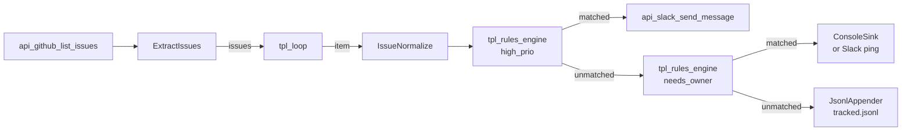

# Composing a workflow from the catalog (Python)

A workflow that reads issues from GitHub, **decides via JSON
rules**, and takes action — Slack alert, follow-up ping, or local
archive. Almost every node in the graph is a catalog template
instantiated by id; the only Python code is small data-shape
adapters and a per-row JSONL appender.

The routing logic itself is **rules in config**, evaluated by the
catalog's `tpl_rules_engine` — no custom decision actor.

This is the third lifecycle in the series:

| Tutorial | Lifecycle | Driver |
|---|---|---|
| [05 (Spring Boot)](05-spring-enrich.md) | Per-request | HTTP request handler |
| [06 (Kafka)](06-kafka-router.md) | Long-running | Continuous Kafka poll loop |
| **07 (this post)** | **Triggered batch** | One-shot or scheduled, runs to completion |

## What this replaces

Hand-rolled Python ETL ends up looking like this:

```python
def triage():
    issues = github.list_issues(state="open", filter="assigned")
    for issue in issues:
        if "priority:high" in labels(issue) or "bug" in labels(issue):
            slack.post(channel="#ops-triage", text=fmt(issue))
        elif issue.assignee is None and age_days(issue) >= 3:
            slack.post(channel="#ops-triage", text=ping(issue))
        else:
            archive.append(issue)
```

You write the if/elif chain, the executor pool, the GitHub/Slack
client wiring. With Reflow:

- The `if/elif` is **two `tpl_rules_engine` actors** with rules in
  JSON config. Adding a new rule is one config dict and one
  connection.
- The Slack/GitHub clients are **catalog API actors** — `template_actor("api_github_list_issues")`,
  `template_actor("api_slack_send_message")`.
- The custom Python is just data adaptation: peel an HTTP envelope,
  flatten labels for the rules engine, append a JSONL row.



## Prerequisites

Python 3.9+ and the published Python SDK plus the `api_services`
pack (matched ABI for your platform):

```sh
pip install 'offbit-reflow>=0.2.8'

PACK=https://github.com/offbit-ai/reflow/releases/download/pack-v0.2.4
TRIPLE=$(uname -m)-apple-darwin   # or x86_64-unknown-linux-gnu, etc.
curl -LO "$PACK/reflow.pack.api_services-0.2.0-$TRIPLE.rflpack"
```

The SDK auto-loads its native runtime; the pack adds the ~6,700
`api_*` templates (GitHub, Slack, OpenAI, Stripe, …).

```python
import offbit_reflow as reflow

reflow.load_pack("./reflow.pack.api_services-0.2.0-…rflpack")
# After this call, template_actor("api_github_list_issues") works.
```

## Rules as data

Each branch of the workflow is a `tpl_rules_engine` actor whose
config holds the rule. The rule's `actions.setProperty` enriches
matched records with a `branch` tag; the engine emits on `matched`
or `unmatched` accordingly. Chain them and you get if/elif/else
without writing a single match arm in Python.

### High-priority rule

```python
HIGH_PRIO_RULE = {
    "rules": {
        "type": "IF",
        "groups": [
            {
                "connector": "OR",
                "rules": [
                    {"field": "labels", "operator": "contains", "value": "priority:high"},
                    {"field": "labels", "operator": "contains", "value": "bug"},
                ],
            },
        ],
        "actions": {
            "setProperty": [{"key": "branch", "value": "high_prio"}],
        },
    },
}
```

Operators the engine recognizes: `is`, `is_not`, `contains`,
`not_contains`, `greater_than`, `less_than`, `greater_equal`,
`less_equal`, `between`, `empty`, `not_empty`. Groups are
AND/OR over flat rules; the top-level `type` is `IF` (all groups
match) or `OR` (any group matches).

### Needs-owner rule

```python
NEEDS_OWNER_RULE = {
    "rules": {
        "type": "IF",
        "groups": [
            {
                "connector": "AND",
                "rules": [
                    {"field": "has_assignee", "operator": "is",            "value": False},
                    {"field": "age_days",     "operator": "greater_equal", "value": 3},
                ],
            },
        ],
        "actions": {
            "setProperty": [{"key": "branch", "value": "needs_owner"}],
        },
    },
}
```

Adding a third rule (e.g. "needs_review" for stale PRs) is another
dict and one `add_connection` to a third sink — no graph
restructuring.

## Custom actors (the part the catalog can't anticipate)

Three small Python actors. Together about 60 lines.

### ExtractIssues — peel the HTTP envelope

`api_github_list_issues` emits `response = {status, headers, body}`.
`tpl_loop` wants a bare array. One small actor bridges them.

```python
class ExtractIssues(Actor):
    component = "extract_issues"
    inports = ["response"]
    outports = ["issues"]

    def run(self, ctx):
        envelope = ctx.inputs["response"]["data"]
        body = envelope.get("body") if isinstance(envelope, dict) else envelope
        ctx.done({"issues": Message.array(body)})
```

### IssueNormalize — flatten for the rules engine

`tpl_rules_engine`'s `contains` operator works on `Value::Array(...)`
against bare values, so labels need to be a list of strings (not
the GitHub object form `[{"name": ..., "color": ..., ...}]`).
Same idea for derived fields (`age_days`, `has_assignee`).

```python
class IssueNormalize(Actor):
    component = "issue_normalize"
    inports = ["item"]
    outports = ["issue"]

    def run(self, ctx):
        wrapper = ctx.inputs["item"]["data"]   # tpl_loop wraps as {value, index}
        issue = wrapper.get("value", wrapper)
        ctx.done({"issue": Message.object({
            "number":       issue.get("number"),
            "title":        issue.get("title"),
            "url":          issue.get("html_url"),
            "labels":       sorted({l.get("name", "") for l in (issue.get("labels") or [])}),
            "comments":     int(issue.get("comments") or 0),
            "has_assignee": issue.get("assignee") is not None,
            "age_days":     _age_days(issue.get("created_at")),
        })})
```

### JsonlAppender — append-mode writer

`tpl_file_save` writes the whole file in one shot. Per-record
audit logs need append semantics. Ten lines.

## Wiring the graph

The graph has no custom routing logic — it's all rules engines
plus connections.

```python
import offbit_reflow as reflow
from offbit_reflow import Network

reflow.load_pack("./reflow.pack.api_services.rflpack")
net = Network()

# Source — real GitHub API
net.register_actor("tpl_source", reflow.template_actor("api_github_list_issues"))
net.add_node("source", "tpl_source", config={"state": "open", "filter": "assigned"})

# Pipeline
net.register_actor("tpl_extract",   ExtractIssues()._build())
net.register_actor("tpl_loop",      reflow.template_actor("tpl_loop"))
net.register_actor("tpl_normalize", IssueNormalize()._build())
net.add_node("extract",   "tpl_extract")
net.add_node("each",      "tpl_loop")
net.add_node("normalize", "tpl_normalize")

# Routing tree (rules-engine chain)
net.register_actor("tpl_rule_high",  reflow.template_actor("tpl_rules_engine"))
net.register_actor("tpl_rule_owner", reflow.template_actor("tpl_rules_engine"))
net.add_node("rule_high",  "tpl_rule_high",  config=HIGH_PRIO_RULE)
net.add_node("rule_owner", "tpl_rule_owner", config=NEEDS_OWNER_RULE)

# Sinks
net.register_actor("tpl_slack", reflow.template_actor("api_slack_send_message"))
net.add_node("sink_high", "tpl_slack", config={"channel": "#ops-triage"})

net.register_actor("tpl_sink_owner", ConsoleSink("needs-owner")._build())
net.add_node("sink_owner", "tpl_sink_owner")

net.register_actor("tpl_archive", JsonlAppender("./out/tracked.jsonl")._build())
net.add_node("archive", "tpl_archive")

# Connections
net.add_connection("source",     "response",  "extract",    "response")
net.add_connection("extract",    "issues",    "each",       "collection")
net.add_connection("each",       "item",      "normalize",  "item")
net.add_connection("normalize",  "issue",     "rule_high",  "data")
net.add_connection("rule_high",  "matched",   "sink_high",  "data")
net.add_connection("rule_high",  "unmatched", "rule_owner", "data")
net.add_connection("rule_owner", "matched",   "sink_owner", "routed")
net.add_connection("rule_owner", "unmatched", "archive",    "data")

net.add_initial("source", "filter", {"type": "String", "data": "assigned"})
net.start()
```

That's the entire workflow. The branch table is the two `RULE`
dicts; adding a third rule is one new dict + one new
`tpl_rules_engine` node + two `add_connection`s (matched →
sink, unmatched → next rule).

## Run it

```sh
export GITHUB_API_KEY=ghp_…              # PAT with repo scope
export SLACK_API_KEY=xoxb-…              # bot token in your workspace
export SLACK_CHANNEL=#ops-triage

cd sdk/python/examples/tutorial-07-issue-triage
python3 pipeline.py
```

The pipeline calls `GET /issues?state=open&filter=assigned`,
routes each returned issue, and posts to Slack / archives
according to the rules. Output:

```
[would-slack] #412 Crashes on startup with Python 3.13   …
[would-slack] #350 Memory leak when streaming huge files …
[needs-owner] #388 Document new ctx.send mid-tick API    …

archive: ./out/tracked.jsonl (1 rows)
```

(The repo also ships a fixture mode that runs the same graph
against `fixtures/issues.json` without credentials — handy for
verifying the wiring before pointing at real APIs. See the
example's `README.md`.)

## Notes on the design

- **The catalog is the workflow runtime.** Of the 9 nodes in the
  graph, 6 are catalog templates (`api_github_list_issues`,
  `tpl_loop`, two `tpl_rules_engine` instances, `api_slack_send_message`,
  and the API source). The custom Python is just three small data
  adapters.
- **Routing is rules, not code.** `tpl_rules_engine` evaluates a
  JSON rule per tick; chaining matched/unmatched gives if/elif/else
  for free. Compare to `tpl_switch` (field equality only): the
  rules engine handles AND/OR over multiple fields, numeric ranges,
  array membership, etc.
- **Triggered batch lifecycle.** No HTTP request, no Kafka stream
  — the network runs once on startup, drains, exits. Wrap with
  `tpl_interval_trigger` or `tpl_cron_trigger` to schedule.
- **Pack model.** The `api_services` pack ships the 6,700
  `api_*` actors out-of-band from the SDK wheel. One
  `reflow.load_pack(...)` call at startup makes them all
  reachable via `template_actor(id)`.

## What is next

The [next post](08-cpp-poly-synth.md) is a small C++ audio
synthesizer that puts `ctx.pool` to work — three voices, a mixer
with one inport (not three), a WAV file. Same idea, different
domain: per-upstream stable-id state in a shared pool the consumer
reads atomically.
