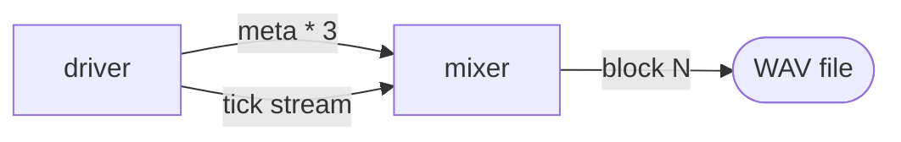

# A polyphonic synthesizer with `ctx.pool` (C++)

A small offline synth: three voices, a mixer, a WAV file at the end.
The mixer is one node — not three — even though it consumes per-voice
state from a variable number of upstreams. **`ctx.pool` is what makes
that possible**: a per-actor `{id: value}` map that persists across
ticks, so the consumer can hold per-upstream state without one
inport per upstream.

The graph also showcases two other patterns that drop out of the
design:

- **Streams** for high-throughput producer messaging — the driver
  pushes 344 tick events through one stream rather than 344 separate
  outport packets, sidestepping the cap-50 outport queue's
  backpressure.
- **`ctx.send`** (mid-tick flush) for publishing several values from
  inside one `run` callback when the per-tick `emit` model would
  collapse them.



## Why pool

Pre-pool, a fan-in graph either had to:

1. Declare one inport per upstream — `voice_0_in`, `voice_1_in`,
   `voice_2_in`, with `awaitAllInports = true` on the consumer.
   Doesn't scale to variable N — adding a fourth voice means editing
   the consumer.
2. Accumulate state in `ctx.state_set("voice_0_freq", ...)`,
   `state_set("voice_1_freq", ...)`, etc. Manual key namespacing,
   no count operation, no clear, no atomic snapshot.

`ctx.pool` is the dedicated tool: namespaced under `_pool:<name>`,
keyed by id, atomic snapshot via `pool_get_json`, count via
`pool_count`. The consumer reads `pool_get_json("voices")` and
gets one JSON object with every active voice's metadata — no matter
how many upstreams produced it.

## Prerequisites

- C++17 toolchain (Apple Clang, GCC, MSVC).
- CMake ≥ 3.16.
- A built `libreflow_rt_capi.{dylib,so,dll}` from the runtime, or a
  release tarball from the [Go SDK GitHub Releases](https://github.com/offbit-ai/reflow/releases?q=sdk%2Fgo)
  — the same binary the Go SDK ships.

```sh
cargo build --release -p reflow_rt_capi
cmake -S sdk/cpp -B build \
    -DREFLOW_CPP_BUILD_EXAMPLES=ON \
    -DREFLOW_RT_CAPI_LIB=$PWD/target/release/libreflow_rt_capi.dylib
cmake --build build --target reflow_cpp_tutorial08
build/reflow_cpp_tutorial08
```

The output `tutorial-08.wav` is 44.1 kHz mono PCM, 1 second long —
play it in any audio app.

## The driver

One actor that fires once on a `Flow` initial. It publishes voice
metadata via `ctx.send` (mid-tick flush — the per-tick `emit`
HashMap would collapse the three updates into one), then opens a
stream for the per-block tick events.

```cpp
auto driver = reflow::Actor::from_callback(
    "driver", /*inports=*/{"_trigger"}, /*outports=*/{"meta", "tick"},
    [](reflow::Context& ctx) {
        // Voice metadata — three small messages, one per voice.
        for (int v = 0; v < kVoiceCount; ++v) {
            char buf[128];
            std::snprintf(buf, sizeof(buf),
                          "{\"voice_id\":%d,\"freq\":%.4f,\"gain\":0.25}",
                          v, kVoiceFreqs[v]);
            ctx.send("meta", reflow::Message::object_from_json(buf));
        }

        // Tick stream — each block index packed as 4 little-endian
        // bytes. The stream's own channel is unbounded
        // (buffer_size = 0), so 344 frames push without blocking.
        auto stream = reflow::StreamProducer::create(
            /*buffer_size=*/0, "driver", "tick");
        for (int b = 0; b < kNumBlocks; ++b) {
            std::uint8_t bytes[4] = { /* le32(b) */ };
            stream.send_bytes(bytes, 4);
        }
        ctx.emit("tick", std::move(stream).into_message());
    });
```

### `emit` vs `send` vs streams

Three ways to publish from inside a callback, each for a different
shape of work:

| When | Tool | Why |
|---|---|---|
| ≤ 1 message per port per tick | `ctx.emit(port, msg)` | Accumulates outputs in a HashMap drained on return. Multiple `emit`s to the same port collapse to the last write. |
| Several messages per port per tick (≤ outport cap) | `ctx.send(port, msg)` | Writes straight to the outport channel, bypassing the per-tick drain. Bounded by the outport's queue capacity (cap 50). |
| Many messages per port per tick | `StreamProducer` | Carries its own channel — bounded or unbounded — independent of the actor's outport queue. The right tool for "publish 100k frames in one callback." |

The driver hits all three modes. `emit` for the StreamHandle (one
message), `send` for the three voice metadata updates, and a
stream for the 344 tick frames.

## The mixer (where pool earns its keep)

Two inports — `meta` and `tick`. The mixer fires whenever either
has input.

```cpp
auto mixer = reflow::Actor::from_callback(
    "mixer", /*inports=*/{"meta", "tick"}, /*outports=*/{"block"},
    [render_block](reflow::Context& ctx) {
        // ── meta: stash voice config in the pool ─────────────────
        if (auto m = ctx.take_input("meta")) {
            auto inner_opt = m->data_json();
            if (inner_opt) {
                int voice_id = static_cast<int>(json_int(*inner_opt, "voice_id"));
                ctx.pool_upsert("voices", std::to_string(voice_id), *inner_opt);
            }
        }

        // ── tick: a StreamHandle that delivers every block index ─
        if (auto t = ctx.take_input("tick")) {
            auto reader = reflow::StreamReader::from_message(*t);
            if (!reader) return;
            while (true) {
                auto frame = reader->recv(5000);
                if (frame.kind != rfl_stream_frame_kind_Data) break;
                int block_idx = decode_le_int32(frame.data);
                render_block(ctx, block_idx);
            }
        }
    });
```

`ctx.pool_upsert("voices", "0", "{voice_id:0, freq:..., gain:...}")`
stores one entry. Three voices = three entries. Adding a fourth
voice means the driver sends one more `meta` message — the mixer
already handles it.

`render_block` is a closure that reads the *whole* pool with
`ctx.pool_get_json("voices")`, walks every entry, generates samples
for each active voice, and accumulates into the output buffer:

```cpp
std::string pool = ctx.pool_get_json("voices");
// {"0": {voice_id:0, freq:261.6256, gain:0.25}, "1": {...}, "2": {...}}

for (each entry) {
    int voice_id = json_int(entry, "voice_id");
    double freq  = json_double(entry, "freq");
    double gain  = json_double(entry, "gain");
    // Generate one block of sine samples at this freq, sum into mixed[].
}
```

The mixer's port count never changes. Adding a voice is one extra
message from the driver — which is exactly the pattern flexible
catalog actors expose to the user (`api_*` HTTP services that scale
to thousands of endpoints with one inport apiece).

### Voice phase across ticks

Pool stores immutable JSON snapshots. For mutable per-tick state
(here: per-voice oscillator phase), we use a **closure capture** —
`std::shared_ptr<std::vector<double>>` — that lives across
invocations of the mixer's callback. Reflow guarantees an actor's
callback isn't invoked concurrently with itself, so plain shared
state without a lock is safe.

```cpp
auto phases = std::make_shared<std::vector<double>>(64, 0.0);

auto render_block = [phases, &sink](reflow::Context& ctx, int block_idx) {
    // ...
    double phase = (*phases)[voice_id];
    for (int i = 0; i < kBlockSize; ++i) {
        mixed[i] += static_cast<float>(std::sin(phase) * gain);
        phase += dphase;
    }
    (*phases)[voice_id] = phase;
};
```

Pool is the right tool for "stable-id state that flows in from
upstream." Captured-shared state is the right tool for "per-id state
the consumer derives itself across ticks." A real synth would keep
both.

## Wiring the network

Two actors, two connections. The driver's `meta` outport feeds the
mixer's `meta` inport (three small messages); the driver's `tick`
outport feeds the mixer's `tick` inport (one StreamHandle that
delivers all 344 frames). A single `Flow` initial on `_trigger`
kicks the driver, which then publishes everything in one `run`.

```cpp
reflow::Network net;
net.register_actor("tpl_driver", std::move(driver));
net.register_actor("tpl_mixer",  std::move(mixer));

net.add_node("driver", "tpl_driver");
net.add_node("mixer",  "tpl_mixer");

net.add_connection("driver", "meta", "mixer", "meta");
net.add_connection("driver", "tick", "mixer", "tick");

// One Flow initial on _trigger — the driver fires once and
// publishes everything (3 metas via ctx.send + 1 tick stream
// via ctx.emit).
net.add_initial("driver", "_trigger", R"({"type":"Flow"})");

net.start();
```

Once started, the network runs asynchronously on the runtime's
Tokio worker pool. Main thread waits for the mixer to render every
expected block:

```cpp
{
    std::unique_lock<std::mutex> lk(sink.mu);
    sink.cv.wait_for(lk, std::chrono::seconds(20), [&] {
        return sink.blocks_seen.load() >= kNumBlocks;
    });
}
net.shutdown();
write_wav_pcm16("tutorial-08.wav", sink.samples, kSampleRate);
```

`net.shutdown()` is non-blocking — it signals the actors to stop;
the destructor `~Network()` (when `net` leaves scope) tears the
runtime down. The condition variable + mutex pattern lets the
mixer's callback flag completion (`blocks_seen.fetch_add(1)` +
`cv.notify_one()`) and the main thread wake up exactly once the
last block lands.

## Run it

```sh
build/reflow_cpp_tutorial08
# reflow runtime 0.2.3
# rendered 344 blocks (344 expected)
# wrote tutorial-08.wav (44032 samples, 1.00 s)
```

`tutorial-08.wav` is a one-second C-major chord (C4 + E4 + G4 sine
voices, soft fade in/out). Open it in any audio player.

## Notes on the design

- **Pool is per-actor, not network-shared.** Each actor has its own
  pools. A pool exposed to user code lives only inside the consumer's
  state — `pool_upsert` from outside is impossible. Upstream
  producers send a message; the consumer takes the message and
  upserts.
- **Pool keys must be stable.** The pool's value when N voices write
  is `{id_0: ..., id_1: ..., ..., id_{N-1}: ...}`. Use deterministic
  per-upstream identifiers (voice id, sensor mac, file path). Random
  ids accumulate forever; use `pool_remove` or `pool_clear` to
  garbage-collect.
- **Pool requires `MemoryState`.** Custom state backends yield
  `InvalidState` from every pool method. The default backend is
  `MemoryState`, so this is only a concern if you've registered a
  custom backend.
- **Streams when you'd otherwise burst the outport.** The C ABI's
  per-actor outport channel has a capacity of 50. Trying to `emit`
  or `send` more than that in one callback dead-locks against the
  forwarder draining the channel. Streams have their own (configurable)
  channel — the right escape hatch for high-throughput producers.

## What is next

Subsequent posts cover Airflow integration on Python, audio plugins
that bridge Reflow to a real DAW host, and a cross-SDK piece running
the same graph from three languages.
