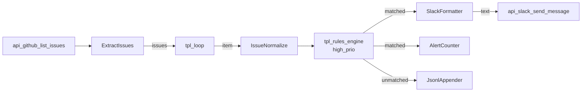

# Reflow inside an Airflow PythonOperator (Python)

A daily issue-triage pipeline. Airflow handles the calendar:
schedule, retries, backfill, the dependency graph, the credentials
store, the duration UI. Reflow handles the actor graph: catalog
templates for the I/O, custom actors for the bits the catalog can't
anticipate. The integration point is one `PythonOperator` whose
body is a regular Reflow `Network` — same lifecycle, same actors,
same `start()` → drain → `shutdown()` flow as a stand-alone script.

| Concern | Owned by |
|---|---|
| Cron / `@daily` schedule | Airflow |
| Backfill (`-s 2024-01-01 -e 2024-01-31`) | Airflow |
| Retry on failure, exponential backoff | Airflow |
| Connections / Variables / Pools (credentials, fleet caps) | Airflow |
| Web UI tied to a calendar | Airflow |
| Per-`ds` summary persistence (Postgres / metrics) | Airflow |
| Actor graph — read GitHub, route via rules, post Slack | Reflow |
| Concurrency & backpressure within the graph | Reflow |
| Catalog of I/O templates (`api_github_*`, `api_slack_*`, `tpl_rules_engine`, `tpl_loop`) | Reflow |

The pairing is intentional. Airflow is the wrong tool for fine-grained
in-graph concurrency (one PythonOperator per actor would be a
30-process meatgrinder). Reflow is the wrong tool for "rerun this
graph for last month" (no concept of a calendar). Use each for
what it's good at.

## What this replaces

Hand-rolled Airflow DAGs that Python their way through fan-out via
`ThreadPoolExecutor` and a pile of `PythonOperator` chains:

```python
@dag(schedule="@daily")
def triage():
    issues = list_issues()                                   # PythonOperator
    classified = classify_concurrent(issues, max_workers=8)  # PythonOperator
    high, low = partition(classified)                        # BranchPythonOperator
    [post_slack(h) for h in high]                            # mapped tasks
    write_jsonl(low)                                         # PythonOperator
```

The mapped-tasks fan-out spawns N task instances per day — each is
a separate process, each runs through Airflow's scheduler-loop
serialization, each gets its own row in the task-instance table.
Fine for handful-of-items workflows. Painful at scale and
overkill for "fan three API lookups out and join them."

The Reflow-inside-Airflow pattern collapses that:

```python
@dag(schedule="@daily")
def triage_pipeline():
    @task(retries=2, retry_exponential_backoff=True)
    def triage(ds: str | None = None, **ctx) -> dict:
        return run_triage(ds=ctx["ds"], ...)        # one Reflow Network here

    triage() >> record_metrics
```

Two task instances per day — one to run the network, one to record.
The fan-out happens *inside* Reflow's actor scheduler, not Airflow's.

## Prerequisites

```sh
pip install 'offbit-reflow>=0.2.9' 'apache-airflow>=2.10' 'apache-airflow-providers-postgres'

# Pack download — same one tutorial 07 uses.
PACK=https://github.com/offbit-ai/reflow/releases/download/pack-v0.2.5
TRIPLE=$(uname -m)-apple-darwin
curl -LO "$PACK/reflow.pack.api_services-0.2.0-$TRIPLE.rflpack"
mv reflow.pack.api_services-0.2.0-*.rflpack reflow.pack.api_services.rflpack
```

In Airflow:

```sh
# Variables (Admin → Variables, or via CLI):
airflow variables set REFLOW_GITHUB_API_KEY ghp_...
airflow variables set REFLOW_SLACK_API_KEY  xoxb-...
airflow variables set REFLOW_PACK_PATH      /opt/airflow/dags/reflow.pack.api_services.rflpack
airflow variables set REFLOW_OUTPUT_DIR     /var/lib/reflow-triage
airflow variables set REFLOW_SLACK_CHANNEL  '#ops-triage'

# Connections:
airflow connections add reflow_metrics --conn-uri 'postgres://user:pw@host:5432/metrics'
```

Variables vs env vars: in dev you can set `GITHUB_API_KEY` /
`SLACK_API_KEY` directly. In production, store creds in Airflow
Variables (encrypted at rest) and bind them to environment variables
inside the operator — `api_github_*` / `api_slack_*` actors read
the env, so this is a one-line `os.environ[...] = Variable.get(...)`
inside the task body.

## The Reflow Network (`pipeline.py`)

This file is identical in topology to tutorial 07 — read GitHub →
loop → rules engine → split outputs to Slack vs JSONL archive — but
it's wrapped in one function the operator calls.

```python
def run_triage(
    ds: str,
    *,
    pack_path: str,
    output_dir: str,
    slack_channel: str,
    timeout_seconds: float = 300.0,
) -> dict[str, Any]:
    reflow.load_pack(pack_path)

    out_path = str(Path(output_dir) / f"{ds}.jsonl")
    Path(out_path).unlink(missing_ok=True)

    counter = {"written": 0, "alerted": 0}
    cv = threading.Condition()

    net = Network()
    # ... register actors, add nodes, add connections ...
    net.start()

    # Wait for the graph to drain. Airflow's task heartbeat handles
    # the longer-running side; the timeout here just guards a stuck
    # network.
    deadline = time.time() + timeout_seconds
    with cv:
        while time.time() < deadline:
            if counter["written"] + counter["alerted"] == 0:
                cv.wait(timeout=2.0)
                continue
            initial = (counter["written"], counter["alerted"])
            cv.wait(timeout=1.5)
            if (counter["written"], counter["alerted"]) == initial:
                break
    net.shutdown()

    return {
        "ds": ds,
        "alerted": counter["alerted"],
        "tracked": counter["written"],
        "output_path": out_path,
    }
```

The graph itself matches tutorial 07's wiring:



Three custom actors:
- `ExtractIssues` peels the `{status, headers, body}` HTTP envelope.
- `IssueNormalize` flattens labels for the rules engine.
- `JsonlAppender` is an append-mode JSONL writer that also bumps a
  completion counter so the operator knows when to return.

Plus two tiny adapters needed for the api-services contracts:
- `SlackFormatter` builds a Slack-formatted text from the matched
  issue (`api_slack_send_message` wants `text`, not the raw object).
- `AlertCounter` taps the same `matched` outport as the formatter
  to bump the alert tally — pure broadcast wiring.

## The DAG (`dags/triage.py`)

One file under `$AIRFLOW_HOME/dags/`. The PythonOperator's
`python_callable` is `run_triage` from above; the only Airflow-
specific work is binding Variables to env vars and chaining a
follow-up task that records the day's summary.

```python
@dag(
    dag_id="reflow_issue_triage",
    schedule="@daily",
    start_date=datetime(2024, 1, 1),
    catchup=True,
    max_active_runs=1,
    tags=["reflow", "triage"],
)
def triage_pipeline():
    @task(retries=2, retry_exponential_backoff=True)
    def triage(ds: str | None = None, **ctx) -> dict:
        os.environ["GITHUB_API_KEY"] = Variable.get("REFLOW_GITHUB_API_KEY")
        os.environ["SLACK_API_KEY"]  = Variable.get("REFLOW_SLACK_API_KEY")
        return run_triage(
            ds=ds or ctx["ds"],
            pack_path=Variable.get("REFLOW_PACK_PATH"),
            output_dir=Variable.get("REFLOW_OUTPUT_DIR"),
            slack_channel=Variable.get("REFLOW_SLACK_CHANNEL"),
            timeout_seconds=600.0,
        )

    record = PostgresOperator(
        task_id="record_run",
        postgres_conn_id="reflow_metrics",
        sql="""
            INSERT INTO triage_runs (ds, alerted, tracked, output_path)
            VALUES ('{{ ds }}',
                    {{ ti.xcom_pull(task_ids='triage')['alerted'] }},
                    {{ ti.xcom_pull(task_ids='triage')['tracked'] }},
                    '{{ ti.xcom_pull(task_ids='triage')['output_path'] }}')
            ON CONFLICT (ds) DO UPDATE SET
              alerted = EXCLUDED.alerted,
              tracked = EXCLUDED.tracked;
        """,
    )

    triage() >> record
```

## What Airflow gives you for free

- **Schedule + catchup.** `schedule="@daily"` + `catchup=True` means
  every missing date since `start_date` runs automatically when the
  DAG first deploys.
- **Backfill.** `airflow dags backfill -s 2024-01-01 -e 2024-01-31`
  fires 31 task instances; each one runs the same Reflow Network
  with its own `ds`. Idempotency is on the operator (the network
  truncates `out/<ds>.jsonl` on entry; the SQL uses
  `ON CONFLICT DO UPDATE`).
- **Retry.** `retries=2, retry_exponential_backoff=True` — if the
  task fails (network exception, timeout, anything), Airflow retries
  with backoff. The Reflow Network gets re-instantiated on each
  retry, fresh state.
- **XCom.** `triage()`'s return dict is automatically pushed to
  XCom. Downstream tasks pull it via Jinja or `ti.xcom_pull`. No
  glue code.
- **Web UI.** Calendar view, task duration histograms, log per task
  instance, manual trigger, mark-as-success, clear-and-rerun.
- **Connections / Variables.** Encrypted credential storage. The
  alternative — `~/.bashrc`-style env vars — doesn't survive
  audits.

## What stays Reflow's job

- **Per-tick scheduling inside the graph.** When the rules engine
  fires `matched`, both the Slack formatter and the alert counter
  fire concurrently. Airflow doesn't see this happen; it sees one
  task instance running for ~5 seconds. Trying to model the
  fan-out as Airflow tasks would burn ~6 task instances per
  matched issue and choke the scheduler.
- **Backpressure.** Bounded channels between actors throttle
  fast producers. `tpl_loop` fans out N issues, but downstream
  pressure prevents the network from saturating Slack.
- **The catalog.** ~6,700 `api_*` actors plus ~30 `tpl_*` flow
  templates. Adding a new branch (e.g., GitHub comment instead of
  Slack) is one rule + one connection — not a new Airflow task.

## Test without Airflow

The `pipeline.py` file ships a `__main__` entry that runs the
network without an Airflow scheduler. Set credentials via env vars
and invoke directly — useful when iterating on the actor graph
before deploying the DAG.

```sh
cd sdk/python/examples/tutorial-09-airflow-triage
export GITHUB_API_KEY=$(gh auth token)
export SLACK_API_KEY=xoxb-...
python3 pipeline.py
# → {"ds": "2026-04-28", "alerted": 2, "tracked": 9, "output_path": "..."}
```

## Notes on the design

- **No Airflow dependency in the network code.** `pipeline.py`
  imports only `offbit_reflow`. The DAG file imports `pipeline.py`
  and the Airflow surface, then wires them. Swap Airflow for
  Prefect / Dagster / a `cron` script and `pipeline.py` is
  unchanged.
- **One Network per task instance.** Each retry, backfill run, or
  manual trigger gets a fresh Reflow Network. No leaked state
  between days.
- **Variables → env vars binding inside the operator.** Two-line
  pattern that lets the api-services catalog read its standard
  env vars. The same pipeline runs identically in dev (env vars
  set in shell), staging (Airflow Variables), and production
  (KubernetesExecutor with sealed secrets).
- **Idempotent JSONL output.** Every operator entry truncates
  `out/<ds>.jsonl` so reruns produce the same file regardless of
  retry count. Downstream Postgres uses `ON CONFLICT` for the same
  property.

## What's next

The [next post](10-distributed-bridge.md) takes Reflow across the
process boundary: two peers federated through the bundled
`reflow-discovery` server, the same approach that works for two
machines.
