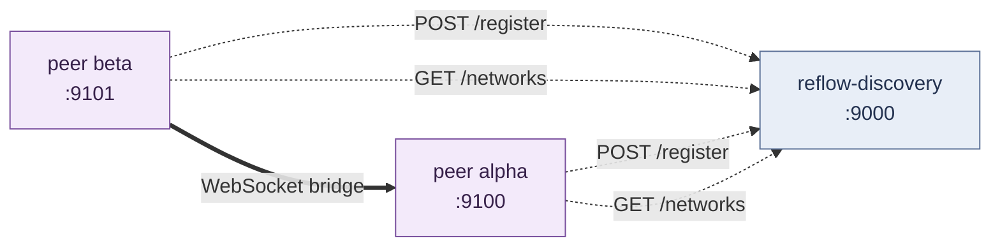

# A graph that spans two processes

Tutorial 09 closed the in-process series. This is the follow-up:
two Reflow networks running as separate processes — the same
shape works for two machines, two pods, two regions — federated
through the `reflow-discovery` server. Messages sent on one peer
land in an actor running on the other.

## What this is for

In-process Reflow handles per-tick concurrency inside one address
space — perfect for a CLI tool, a daemon, an embedded worker.
Crossing the process boundary means a different set of constraints:

| Concern | Solved by |
|---|---|
| Where is the other peer? | Discovery server (`reflow-discovery`) |
| Auth — is this a peer I should talk to? | Shared `auth_token` |
| What if the peer dies? | Heartbeat eviction + auto-reconnect with backoff |
| What if the network blips? | Same — reconnect transparent to the actor graph |
| Addressing remote actors | `<actor_id>@<network_id>` proxy in the local graph |

The `reflow-peer` CLI bundles all of that. The actor authoring side
is unchanged from earlier tutorials — the same `Actor` trait, the
same lifecycle. Everything new lives in the bridge.



## Prerequisites

Build the binaries:

```sh
cargo build --release -p reflow_distributed
ls target/release/reflow-{discovery,peer}
```

Both binaries are self-contained — no shared state files, no
runtime dependencies beyond a TCP port.

## The discovery server

Run it on whichever host every peer can reach. For local dev that
means `127.0.0.1`; in production it sits on an internal network
behind your usual TLS-terminating proxy.

```sh
target/release/reflow-discovery --bind 127.0.0.1:9000
# 2026-04-28T22:48:32Z INFO  reflow distributed server listening on http://127.0.0.1:9000
```

The server is HTTP-only. The contract is two endpoints:

```
POST /register   {network_id, instance_id, endpoint, capabilities}
GET  /networks   → [{network_id, instance_id, endpoint, capabilities, last_seen}, …]
```

Peers re-register on every refresh tick (default 15s). Entries
older than `--entry-ttl-secs` (default 60s) get pruned.

## Peer alpha

`alpha.toml`:

```toml
network_id   = "alpha"
instance_id  = "alpha-1"
bind_address = "127.0.0.1"
bind_port    = 9100
discovery_endpoints = ["http://127.0.0.1:9000"]
auth_token   = "shared-secret"
```

`alpha` doesn't need to dial anyone — `beta` will dial *it*.
Run it:

```sh
target/release/reflow-peer --config alpha.toml
# INFO starting peer: network_id=alpha, instance_id=alpha-1, bind=127.0.0.1:9100
# INFO Registered with discovery endpoint: http://127.0.0.1:9000
# INFO peer ready, awaiting messages (Ctrl-C to stop)
```

The CLI registers a built-in `recorder` actor — it logs every
inbound message on `recorder.in`. That's enough for a smoke target;
swap in your own actor by writing a small Rust binary that reuses
`reflow_distributed::peer_config::PeerConfig` to load the same
TOML.

## Peer beta

`beta.toml`:

```toml
network_id   = "beta"
instance_id  = "beta-1"
bind_address = "127.0.0.1"
bind_port    = 9101
discovery_endpoints = ["http://127.0.0.1:9000"]
auth_token   = "shared-secret"

[[connect]]
endpoint = "127.0.0.1:9100"
```

`[[connect]]` tells beta to dial alpha on startup. Discovery would
eventually surface alpha's endpoint anyway, but for the first
message you don't want to wait one refresh cycle.

```sh
target/release/reflow-peer --config beta.toml \
    --send 'alpha:recorder:in:hello-from-beta'
# INFO connected to peer at 127.0.0.1:9100
# INFO sent test message to alpha/recorder.in: "hello-from-beta"
# INFO peer ready, awaiting messages (Ctrl-C to stop)
```

Watch alpha:

```
INFO Established connection with network: beta
INFO 🌐 BRIDGE: Received remote message from beta to alpha::recorder
INFO ✅ ROUTER: Successfully routed message to local actor recorder
INFO recorder.in: String("hello-from-beta")
```

That's the full federation: beta → bridge → alpha → local
`recorder` actor's `in` port. The `Actor::run` callback fires the
same way it would for an in-process message.

## Crossing the bridge from your own code

The CLI is fine for ops scripts and integration tests, but a real
service writes its own binary. The shape:

```rust
use reflow_distributed::peer_config::PeerConfig;
use reflow_network::distributed_network::DistributedNetwork;

let cfg = PeerConfig::from_path(&args.config)?.to_distributed_config();
let mut net = DistributedNetwork::new(cfg).await?;

// Your own actors here.
net.register_local_actor("transcoder", TranscoderActor::new(), None)?;
net.start().await?;

// Register a proxy for the actor we want to talk to.
net.register_remote_actor("recorder", "alpha").await?;

// Push messages through the local network — the proxy forwards
// across the bridge.
{
    let local = net.get_local_network();
    let net = local.read();
    net.send_to_actor("recorder@alpha", "in",
        Message::String(Arc::new("from-my-binary".into())))?;
}
```

`reflow_network::distributed_network` is the public API; the
`reflow-peer` binary is a thin wrapper around it. Mixing your own
actors with peer-CLI infra is just "use the same TOML config and
add `register_local_actor` calls."

## Auth tokens

The bridge enforces token equality on the accept side. With
`auth_token = "shared-secret"` on both peers:

```
beta  → handshake { auth_token: "shared-secret" }
alpha → handshake response { success: true }
```

With a mismatch:

```
beta  → handshake { auth_token: "wrong" }
alpha → handshake response { success: false, error: "auth_token mismatch" }
beta  → connect_to_network returns Err("handshake refused: auth_token mismatch")
```

If `alpha` has no `auth_token` set, anyone can connect — sensible
for loopback dev, not for anything that talks to a public IP.

## Surviving a peer restart

Kill alpha while beta is running:

```sh
^C alpha
```

Beta's heartbeat catches it within `3 × heartbeat_interval_ms`
(3s by default). The connection map drops `alpha`. The reconnect
dispatcher starts retrying with capped exponential backoff —
200ms → 400ms → 800ms → 1.6s → 3.2s, give-up after five
attempts.

Restart alpha within that window:

```sh
target/release/reflow-peer --config alpha.toml
```

Beta logs:

```
WARN Reconnect attempt 1/5 for alpha failed: Connection refused
WARN Reconnect attempt 2/5 for alpha failed: Connection refused
INFO Reconnected to alpha (endpoint 127.0.0.1:9100) on attempt 3
```

No state replay, no message redelivery — anything sent during the
gap was dropped. The bridge's job ends at delivery; durability is
something you build *on top* of it (an outbox actor, a Kafka
log, retry-with-idempotency-keys). That's deliberate: the bridge
stays simple and the persistence policy stays in your hands.

## Discovery refresh

Every 15s (configurable on the `DiscoveryService`) each peer
re-registers and re-reads `/networks`. When a new peer joins:

```rust
let mut events = net.discovery().subscribe();
while let Ok(ev) = events.recv().await {
    match ev {
        DiscoveryEvent::Added(info)   => /* a new peer is up */,
        DiscoveryEvent::Removed(id)   => /* a peer is gone */,
        DiscoveryEvent::Updated(info) => /* same id, new endpoint */,
    }
}
```

Use this if you want to auto-register remote-actor proxies the
moment a peer comes online — saves a round-trip vs. the
configuration approach.

## Production shape

- **Run discovery as its own service.** Behind a TLS-terminating
  proxy if it crosses an untrusted boundary. The library
  (`reflow_distributed::router`) lets you mount the contract
  inside your existing axum app if you want auth in front of
  it.
- **Use a `--bind 0.0.0.0:<port>` peer + private network.** The
  bridge speaks plain WebSocket today; put it behind your usual
  network controls (VPC, mesh, mTLS termination) instead of
  building auth into the protocol.
- **`auth_token` is a shared secret, not a JWT.** Rotate by
  re-deploying both sides with the new token. For finer-grained
  authorization, add it at the actor level — the recorder actor
  can inspect message metadata before processing.
- **One peer per failure domain.** Each `DistributedNetwork` is
  one bridge process. Run multiple per host if you want isolation
  by trust boundary or cgroups.
- **Heartbeat tuning.** Default `heartbeat_interval_ms = 1000`
  means timeout in 3s. Lower it for chatty local-network setups,
  raise it if you're crossing a slow link and don't want false
  positives.

## What stays in-process

Everything inside one peer is the same Reflow you already know.
Backpressure, `ctx.send`, `ctx.pool`, streams, await rules, the
catalog — all unchanged. The bridge only sits between *peers*,
never between actors inside a peer. Two consequences:

- **No latency tax for local fan-out.** A 10-actor pipeline on
  one peer runs at memory speed; only the cross-peer hop pays
  the WebSocket cost.
- **Failure granularity matches the peer boundary.** A crashing
  peer drops only the actors it was hosting; everyone else's
  graphs keep running and pick up reconnects automatically.

## What's next

The series stops here for now. The distributed transport works
end-to-end and ships with the binaries you need to run it; the
gaps that remain (message persistence, ack semantics, backpressure
across the bridge) are real but out of scope for the runtime
itself — they belong in the actors that sit on either side.
