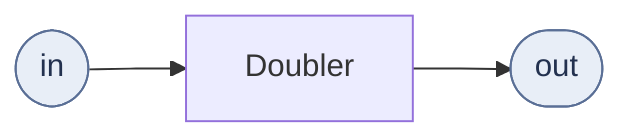
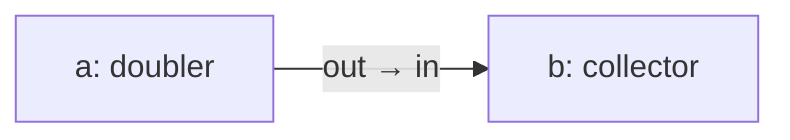
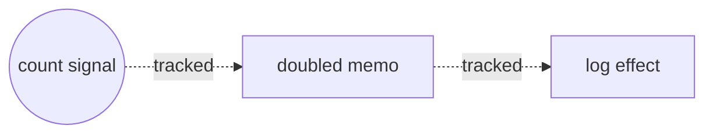
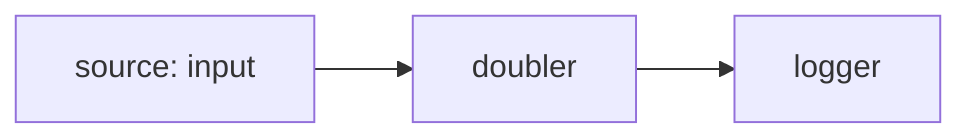
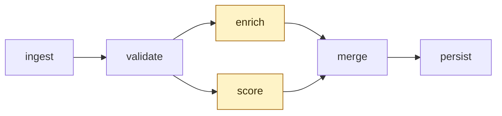

# Real-world Reflow

A tutorial series that teaches Reflow through small runnable
projects. Each post solves one problem in one domain with one SDK,
in under 200 lines of code, with at most one library beyond the SDK
itself.

## What Reflow is

Reflow is a runtime for **reactive flow graphs**. You declare nodes
and the edges between them; Reflow runs each node when one of its
inputs changes.

- **Reactive.** A node only does work when something asks it to.
- **Graph.** Connections are explicit data, not buried inside
  function calls.

The actor model, multi-language SDKs, pack format, and wasm runtime
all serve those two ideas.

## The shape

Three concepts cover most of what you write.

**Actor.** A unit of work with named inports and outports. The
runtime calls `run` when messages arrive on its inputs; the actor
emits messages on its outputs.



```js
class Doubler extends Actor {
  static inports = ["in"];
  static outports = ["out"];
  run(ctx) {
    ctx.send({ out: Message.integer(2 * ctx.input.in.data) });
    ctx.done();
  }
}
```

**Graph.** A description of which actors exist and which ports
connect to which. Plain JSON. The same graph runs from any SDK.



```js
const g = new Graph("demo");
g.addNode("a", "tpl_doubler");
g.addNode("b", "tpl_collector");
g.addConnection("a", "out", "b", "in");
```

**Network.** The runtime that ticks the graph. You hand it a
`Graph`, register the actor implementations the graph references,
and call `start`.

```js
const net = new Network(g);
net.registerActor("tpl_doubler", new Doubler());
await net.start();
```

## Comparison to a UI signal library

A SolidJS signal recomputes whenever its tracked dependencies
change:

```js
const [count, setCount] = createSignal(1);
const doubled = createMemo(() => count() * 2);
createEffect(() => console.log(doubled()));
setCount(5); // logs 10
```



The same pipeline in Reflow:



```js
g.addNode("source", "tpl_input");
g.addNode("doubler", "tpl_doubler");
g.addNode("logger", "tpl_log");
g.addConnection("source", "out", "doubler", "in");
g.addConnection("doubler", "out", "logger", "in");
```

The graph is the dependency graph. Solid infers it from code;
Reflow asks you to write it down. The trade pays back at the scale
where graphs are usually authored visually in
[Zeal](https://github.com/offbit-ai/zeal) and exported as JSON.

## Async reactivity

Solid's reactivity is synchronous and in-process. Reflow's is
asynchronous: actors return `Future`s, messages travel over
channels (in-memory, cross-process, or across the network), and the
runtime schedules execution.



The two highlighted nodes have no dependency between them, so the
runtime runs them concurrently. The shape of the graph implies the
parallelism — no `Promise.all`.

What this gives you:

1. **Concurrency.** Independent actors run in parallel; no manual
   `Promise.all`.
2. **Back-pressure.** Channels are bounded; a slow consumer throttles
   its producer.
3. **Streams.** A port can carry a byte stream (audio, video, large
   blobs) alongside discrete-message ports.
4. **Replayability.** An actor's input is a sequence of messages; the
   same inputs reproduce the same run.
5. **Portability.** The graph is JSON. The same graph runs from
   Node, Python, Go, JVM, C++, or a browser tab — same Rust core
   compiled per target.

## When Reflow fits

Use Reflow when the work is shaped like a pipeline:

- Stream of inputs to stream of outputs.
- Mixed I/O and CPU work that benefits from concurrent stages.
- The pipeline body changes over time and you want it as data, not
  code.
- You want the same logic to run in the browser and on a server.

Skip Reflow when the work is shaped like a request:

- One input, one output, no fan-out.
- A page of imperative code with no reusable stages.
- A CRUD endpoint where the framework you already use is fine.

## Series outline

1. [**Reactive particle field**](01-particle-field.md) (Browser, Node
   SDK). Animation-frame driven graph rendering 200 spring-physics
   particles to canvas2D. Introduces actors, the graph, and the
   runtime contract.
2. [**Live edits over a stream**](02-live-edits.md) (Browser, Node
   SDK). Wikipedia's public SSE feed driving a Reflow graph. Same
   actor primitives, network-paced source.
3. [**Multi-agent orchestration**](03-multi-agent.md) (Python). Three
   LLM agents run in parallel against a local Ollama model; a
   synthesizer combines their findings; per-token streaming through
   the graph.
4. [**A concurrent worker pool over gRPC**](04-grpc-service.md) (Go).
   The canonical `goroutines + channels` fan-out fetcher pool
   expressed as a graph: a long-running gRPC server where each call
   spins up a fresh per-request network — Dispatcher → N Fetchers
   → Sink — and streams pages back over server-streaming RPC.
5. [**Parallel data enrichment behind Spring Boot**](05-spring-enrich.md)
   (Java). Per-request graph behind a REST endpoint: Splitter fans
   the SKU out to three slow downstream services, the Merger
   awaits all three (`awaitAllInports`) and returns a merged JSON
   payload — Reflow's `CompletableFuture.allOf().join()`.
6. [**A long-running Kafka stream router**](06-kafka-router.md)
   (Java). Daemon graph driven by the Kafka poll loop: `OrderSource`
   publishes records via `ctx.send`, `Router` picks one of four
   outports based on status, sinks fan in parallel with loggers
   for operational visibility.
7. [**Composing a workflow from the catalog**](07-issue-triage.md)
   (Python). Issue triage that reads, decides, and acts. Almost
   every node is a catalog template instantiated by id —
   `api_github_list_issues`, `tpl_loop`, `tpl_switch`,
   `api_slack_send_message`. Three small custom actors fill the
   gaps. Demonstrates the third lifecycle (triggered batch),
   conditional routing as configuration, and the api_services
   pack model.
8. [**A polyphonic synthesizer with `ctx.pool`**](08-cpp-poly-synth.md)
   (C++). Three voices, a mixer, a WAV file. The mixer holds a
   `voices` pool — one inport, variable-N upstreams, no port-per-
   voice explosion. Also showcases `StreamProducer` for
   high-throughput producer messaging and `ctx.send` for mid-tick
   flush.
9. [**Reflow inside an Airflow PythonOperator**](09-airflow-triage.md)
   (Python). Daily triage with Airflow owning the calendar
   (schedule, backfill, retry, UI, credentials store) and Reflow
   owning the actor graph. The integration boundary is one
   `python_callable` whose body is a regular Reflow Network.

The in-process series ends here. The next body of work is on
Reflow's **distributed transport** — bundled discovery, end-to-end
integration tests, standalone peer flow, auth verification — at
which point a tutorial covering a graph that genuinely spans
multiple machines will be writable. Until then, anything
cross-machine in the catalog story is a roadmap item rather than
a runnable post.

After tutorial 01 you will know enough Reflow to read the others
in any order.
