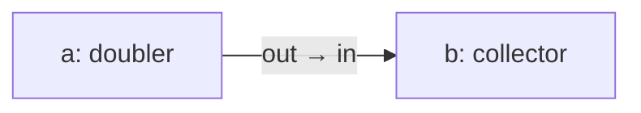
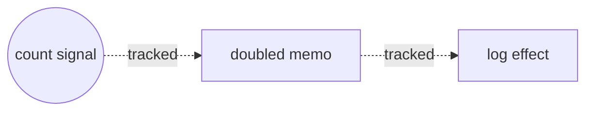
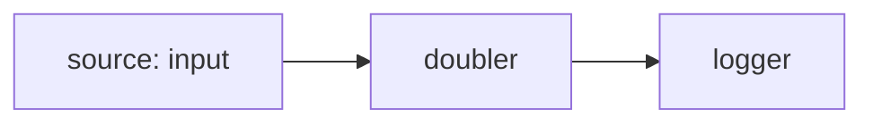
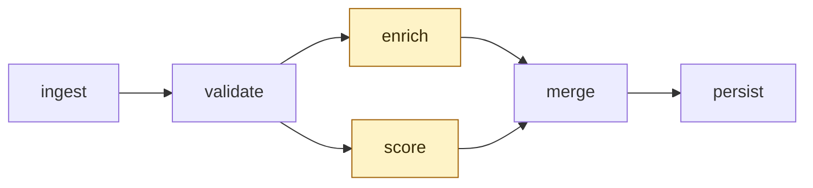

# Real-world Reflow

A tutorial series that teaches Reflow through small, runnable projects. Each
post solves one problem in one domain with one SDK, in under 200 lines of
code, with at most one library beyond the SDK itself.

This page is the on-ramp. If you have written a JavaScript app with signals,
a Python script that calls an LLM, or a Go service behind a load balancer,
you already know enough to start. The rest is vocabulary.

## What Reflow is

Reflow is a runtime for **reactive flow graphs**. You declare nodes and the
edges between them; Reflow runs the nodes whenever their inputs change.

Two parts of that sentence carry weight:

- **Reactive.** A node only does work when something asks it to.
- **Graph.** Connections are explicit data, not buried inside function calls.

Everything else (the actor model, the multi-language SDKs, the pack format,
the wasm runtime) is in service of those two ideas.

## The shape

Three concepts cover most of what you write.

**Actor.** A unit of work. It has named input ports and named output ports.
When messages arrive on its inputs, its `run` function is called. It returns
messages on its outputs.


```js
class Doubler extends Actor {
  static inports = ["in"];
  static outports = ["out"];
  run(ctx) {
    ctx.send({ out: Message.integer(2 * ctx.input.in.data) });
    ctx.done();
  }
}
```

**Graph.** A description of which actors exist and which ports connect to
which. Just data. The same JSON runs from any SDK.



```js
const g = new Graph("demo");
g.addNode("a", "tpl_doubler");
g.addNode("b", "tpl_collector");
g.addConnection("a", "out", "b", "in");
```

**Network.** The runtime that ticks the graph. You hand it a `Graph`, you
register the actor implementations the graph references, you call `start`.

```js
const net = new Network(g);
net.registerActor("tpl_doubler", new Doubler());
await net.start();
```

If you have written reactive UI code, this is familiar in one direction and
strange in another. The next two sections explain both.

## Familiar shape: reactivity

A SolidJS signal recomputes whenever its tracked dependencies change.

```js
const [count, setCount] = createSignal(1);
const doubled = createMemo(() => count() * 2);
createEffect(() => console.log(doubled()));
setCount(5); // logs 10
```

Three ideas: a value (`count`), a derived value (`doubled`), and a side
effect that consumes the derived value. Solid figures out the dependency
graph by watching which signals each function reads:



The same pipeline in Reflow:



```js
g.addNode("source", "tpl_input");
g.addNode("doubler", "tpl_doubler");
g.addNode("logger", "tpl_log");
g.addConnection("source", "out", "doubler", "in");
g.addConnection("doubler", "out", "logger", "in");
```

Three nodes, two edges. The graph is the dependency graph. Solid infers it
from your code; Reflow asks you to write it down.

That trade looks like extra work for small examples. It pays back at the
scale where most real graphs are anyway authored visually, in a graph
editor like [Zeal](https://github.com/offbit-ai/zeal-ide), and exported as
JSON. The handwritten code above is the long form of one tiny corner of a
flow you would normally see laid out on a canvas.

## What changes when reactivity is async

SolidJS reactivity is synchronous and stays inside one process. A signal
update propagates immediately, in the same tick.

Reflow reactivity is asynchronous. An actor returns a `Future`, not a
value. Messages travel over channels, which can be in-memory, in another
process, or across the network. The runtime decides when to schedule each
actor.



The two highlighted nodes have no dependency between them, so the
runtime runs them concurrently. You did not write `Promise.all`; the
shape of the graph implied it.

That single difference unlocks a lot:

1. **Concurrency.** Two actors with no dependency between them run at the
   same time. No `Promise.all` ceremony.
2. **Back-pressure.** Channels are bounded. A slow consumer slows down
   its producer instead of buffering forever.
3. **Streams.** A port can carry a stream of bytes (audio, video, large
   blobs) alongside the discrete-message ports. The runtime moves bytes
   without copying them through the message bus.
4. **Replayability.** Because each actor's input is just a sequence of
   messages, the same inputs always produce the same outputs. You can
   record a run and replay it.
5. **Portability.** The graph is JSON. The same graph runs from Node,
   Python, Go, the JVM, C++, or a browser tab. The runtime is the same
   Rust core compiled to whichever target you need.

A SolidJS app cannot do any of those things. It is not supposed to. The
two tools live at different scales and that is fine.

## When Reflow fits, when it does not

Reach for Reflow when the work is shaped like a pipeline:

- Stream of inputs to stream of outputs.
- Mixed I/O and CPU work that benefits from concurrent stages.
- The pipeline body changes over time and you want it as data, not code.
- You want the same logic to run in the browser and on a server.

Skip Reflow when the work is shaped like a request:

- One input, one output, no fan-out.
- A page worth of imperative code with no reusable stages.
- A CRUD endpoint where the framework you already use is fine.

The rest of this series is the first kind of work, in the SDKs each is
best at.

## What is in this series

The first three are the strongest place to start.

1. **Browser SDF playground (Node + wasm).** A page with three sliders
   that drives a live signed-distance-field render through the GPU pack.
   Shows the wasm runtime, the pack loader, and the GPU on WebGPU story.
2. **LangGraph + Reflow (Python).** A LangGraph agent whose video-summary
   tool is a Reflow flow. Shows Reflow as a deterministic engine inside
   another framework.
3. **gRPC service (Go).** A backend that runs a per-request `Network`.
   The canonical recipe for everything else built on Reflow as a server.

Later posts cover Airflow integration, Micronaut integration, audio
plugins in C++, Kafka stream routing on the JVM, and a cross-SDK piece
that runs the same graph from three languages.

When you finish the first tutorial, you will know enough Reflow to read
the others in any order.
